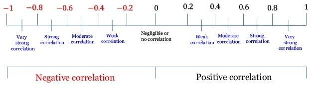
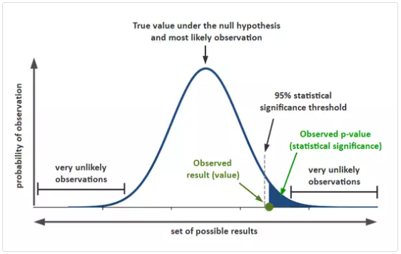

```{=html}
<style>
body {
text-align: justify
}
</style>
```
```{r setup, include=FALSE}
# clear-up the environment
rm(list = ls())

# chunk options
knitr::opts_chunk$set(
  message = FALSE,
  warning = FALSE,
  fig.align = "center",
  comment = "#>"
)

options(scipen = 999)
```

# Practical Statistics

Practical Statistics berisi kaidah statistika yang banyak diterapkan
dalam praktik data science agar dapat **memahami dan mengolah data
dengan tepat**. Secara umum, Practical Statistics terbagi 2, berdasarkan
kegunaannya:

-   **Descriptive Statistics**: menggambarkan keadaan dari sebuah data
    yang kita miliki.
-   **Inferential Statistics**: menyimpulkan sesuatu tentang kondisi
    data populasi di lapangan, berdasarkan sampel data yang kita punya.

Berikut adalah mindmap dari Practical Statistics yang akan kita
pelajari:

```{r, out.width = "100%", echo = FALSE, fig.align = "center"}
knitr::include_graphics("assets/PS.png")
```

# Study Case: Supermarket Analysis

**1. Business Question**

Pertumbuhan supermarket di kota-kota besar meningkat setiap tahunnya dan
kompetisi pasar juga tinggi. Kita sebagai tim data diminta untuk
**menganalisa performa supermarket** milik perusahaan. Data tersimpan
dalam `supermarket.RDS` berisi data transaksi selama periode Januari -
Maret 2019. Data bersumber dari
[Kaggle](https://www.kaggle.com/aungpyaeap/supermarket-sales).

**2. Read Data**

Fungsi `readRDS()` untuk membaca file ekstensi RDS, yaitu object di R
yang disimpan ke dalam sebuah file. Cara menyimpan object menjadi file
RDS dengan fungsi `saveRDS()`

```{r}
# read data
supermarket <- readRDS("data_input/supermarket.RDS")
str(supermarket)
```

Deskripsi kolom:

-   `invoice_id`: slip invoice id
-   `branch`: branch supermarket (A, B, C)
-   `city`: lokasi supermarket
-   `customer_type`: tipe pelanggan (Member/Normal)
-   `gender`: gender pelanggan
-   `product_line`: kategorisasi produk (Electronic accessories, Fashion
    accessories, Food and beverages, Health and beauty, Home and
    lifestyle, Sports and travel)
-   `unit_price`: harga produk dalam dollar
-   `quantity`: jumlah produk yang dibeli pelanggan
-   `tax_5`: harga pajak 5% untuk pembelian produk
-   `total`: harga total termasuk pajak
-   `date`: tanggal pembelian
-   `purchase_hour`: jam pembelian
-   `payment`: mode pembayaran (Cash, Credit card, Ewallet)
-   `cogs`: harga pokok penjualan (cost of goods sold)
-   `gross_marginpct`: persentase margin penjualan
-   `gross_income`: gross_income dari penjualan produk
-   `rating`: rating pengalaman berbelanja pelanggan (1-10)

Kita akan analisis data `supermarket` dengan Descriptive Statistics dan
Inferential Statistics.

# Descriptive Statistics (DAY 1)

Descriptive Statistics membantu kita **menggambarkan karakteristik**
dari data, sehingga berguna dalam proses **Exploratory Data Analysis
(EDA)**.

-   Ukuran pemusatan data (Measure of Central Tendency)
-   Ukuran penyebaran data (Measure of Spread)
-   Hubungan antar data (Variable Relationship)

## Measure of Central Tendency

Ukuran pemusatan data adalah **suatu nilai yang cukup untuk mewakili
seluruh nilai pada data**.

### Mean

Cara paling umum untuk membuat perkiraan nilai tunggal dari data yang
banyak adalah dengan merata-ratakannya.

-   Formula:

$$\frac{\sum{x_i}}{n}$$

-   Fungsi pada R: `mean()`

**Contoh:**

Berapa perkiraan `rating` untuk 1 transaksi di supermarket ini?

```{r}

mean(supermarket$rating)
```

```{r}
# opsional: untuk membulatkan

```

-   Sifat nilai mean: **sensitif terhadap outlier**

> Outlier adalah nilai ekstrim yang jauh dari observasi lainnya. Kurang
> tepat apabila menggunakan nilai mean yang diketahui ada data
> outliernya.

**Contoh lain:**

Ada sebuah supermarket lain di Indonesia yang merekap jumlah profit
bulanan, dalam satuan jutaan. Mereka ingin menargetkan profit bulan ke
11 dengan menggunakan data profit 10 bulan terakhir.

Dengan nilai mean:

```{r}
profit <- c(55, 50, 40, 70, 60, 45, 35, 35, 60, 1000)
mean(profit)
```

Apakah nilai mean di atas dapat diandalkan?

> Tidak, karena tidak mewaklili kebanyakan nilai profit nya.

Masalah ini dapat diatasi oleh nilai median ataupun trimmed mean.

### Median

Median atau nilai tengah diperoleh dengan mengurutkan data terlebih
dahulu kemudian mencari nilai tengah dari data.

-   Baik untuk data yang memiliki **outlier** atau berdistribusi
    **skewed** (condong kiri/kanan)
-   Fungsi pada R: `median()`

Mari hitung ulang nilai pusat data `profit` dengan median:

```{r}
median(profit)

```

> Nilai media lebih menggambarkan keadaan data dibandingkan nilai mean.

Cek distribusi data (histogram akan dibahas lebih dalam di course Data
Visualization):

```{r fig.height=4}
# run chunk keseluruhan secara bersamaan
hist(profit, breaks = 25)
abline(v = mean(profit), col = "red")
abline(v = median(profit), col = "blue")
```

Kesimpulan:

Pilihan lain bila dengan menggunakan **trimmed mean**, yaitu rata-rata
dengan terlebih dahulu memotong `x` persen nilai terkecil dan terbesar
dari data:

Misal kita menggunakan trimmed mean 10%, artinya: data yang sudah
diurutkan akan dipotong sebesar 10% di ujung kiri dan 10% di ujung
kanan. Kemudian dihitung rata-ratanya.

```{r}
mean(profit, trim=0.1)
```

> Penentuan nilai % trim tidak ada aturan khusus. namun untuk
> mempertahankan informasi dari data, penggunaan %trim sebaiknya di
> bawah 20%.

### Modus (Mode)

Modus berguna untuk mencari nilai yang paling sering muncul (frekuensi
tertinggi).

-   Modus digunakan untuk data kategorik
-   R tidak memiliki fungsi built-in

**Contoh:**

Tipe `product_line` apa yang merepresentasikan data `supermarket`?

Dengan kata lain: untuk masing-masing `product_line` ada berapa
transaksi yang terjadi?

```{r}
sort(table(supermarket$product_line))
```

> Modus untuk product_line adalah Fashion accessories

Kita juga dapat membuat **fungsi custom** untuk mendapatkan nilai modus:

```{r}
# run chunk keseluruhan secara bersamaan
most <- function(x){
  table_x <- table(x) # membuat tabel frekuensi
  name <- names(sort(table_x, decreasing = TRUE)) # mengurutkan tabel frekuensi secara decreasing
  name[1] # mengambil kategori dengan frekuensi terbesar
}
```

Menggunakan fungsi `most()`:

```{r}
most(supermarket$product_line)
```

### (Additional) Central of tendency for missing value imputation

Salah satu cara menangani missing value adalah melakukan imputation atau
mengisi missing value dengan suatu nilai. Nilai yang dimaksud bisa
berupa **konstanta** ataupun **pusat data**.

```{r}
customer_age <- c(20, 24, 25, NA, 19, 24, NA)
customer_age

```

```{r}
mean(customer_age)

```

Gunakan parameter `na.rm = T` (na.remove) agar missing value di-remove
saat menghitung nilai pusat data.

```{r}
mean(customer_age, na.rm = T)
```

```{r}
customer_age[is.na(customer_age)] <- mean(customer_age, na.rm = T)
customer_age
```

> Catatan: Pemilihan cara imputasi missing value tergantung dengan kasus
> bisnis yang dihadapi.

### Knowledge Check

Dari pernyataan berikut, jawablah benar atau salah. Apabila salah,
tuliskan pernyataan yang benar.

1.  Mean (tanpa trimmed) adalah pusat data yang hanya melibatkan
    sebagian data dalam perhitungannya.

> False

2.  Median adalah pusat data yang sensitif terhadap outlier.

> False

3.  Nilai pusat data yang cocok untuk tipe data kategorik adalah modus.

> True

4.  Salah satu cara mengimputasi (mengisi) missing value adalah dengan
    menggunakan nilai pusat data.

> True

## Measure of Spread

Ukuran penyebaran data mewakili seberapa menyebar atau beragam data
kita.

### Variance

Variance menggambarkan seberapa beragam suatu data numerik tunggal
menyebar dari pusat datanya.

-   Formula variance:

$$var = \frac{\sum(X_i - \bar{X})^2}{n-1}$$

-   Fungsi di R: `var()`

**Contoh:**

Supermarket ini sedang menyeleksi daerah mana yang cocok untuk cabang
baru mereka. Mereka mengumpulkan informasi harga sewa bagnunan di daerah
A dan B sebagai berikut:

```{r}
harga_A <- c(400,410,420,400,410,420,400,410,420,400,410,420,400)
harga_B <- c(130,430,650,540,460,320,380,550,650,470,330,140,270)
```

Setelah dibandingkan, rata-rata harga bangunan kedua daerah sama:

```{r}
mean(harga_A)
mean(harga_B)
```

Mari bandingkan dari sisi lain, yaitu tingkat keberagaman data
(variance). Daerah manakah yang harganya lebih bervariansi?

```{r}
var(harga_A)
var(harga_B)
```

> Insight: Harga di daerah B lebih beragam dibanding wilayah A.

**Karakteristik**:

-   Skala variance dari 0 sampai tak hingga. Semakin besar nilainya maka
    artinya semakin menyebar dari pusat data (mean).

-   Variance memiliki satuan kuadrat, sehingga tidak dapat langsung
    diinterpretasikan. Biasanya digunakan untuk membandingkan dengan
    nilai var lain dengan satuan yang sama.

-   Nilai variansi sangat bergantung dengan skala data

**Kasus:** Di bawah ini, data mana yang lebih bervariasi?

```{r}
profit_usd <- supermarket$gross_income
profit_idr <- supermarket$gross_income * 14000
```

```{r}
# cek variance
var(profit_usd)
var(profit_idr)
```

Diskusi: Apakah bisa kita simpulkan `profit_idr` lebih bervariasi
daripada `profit_usd`?

> Tidak ada, karena skala nilai nya berbeda.

### Standard Deviation

Standard deviation menggambarkan **seberapa jauh simpangan nilai yang
dianggap umum, dihitung dari titik pusat (mean) nya.** Kita dapat
menentukan apakah suatu nilai dikatakan menyimpang dari rata-rata namun
masih dikatakan umum, atau sudah tidak umum.

Standard deviation dapat diinterpretasikan karena satuannya sudah sama
seperti satuan data aslinya.

-   Formula standar deviasi:

$$sd = \sqrt{var}$$

-   Fungsi di R: `sd()`

```{r}
# standar deviasi harga_A & harga_B
sd(harga_A)
sd(harga_B)
```

```{r}
mean(harga_A)
mean(harga_B)
```

Interpretasi: mean +- sd (karena satuan mean dan sd sama, yaitu jutaan
rupiah)

-   Harga sewa pada daerah A umumnya jatuh pada interval 409.2308 +-
    8.623165
-   Harga sewa pada daerah B umumnya jatuh pada interval 409.2308 +-
    169.4334

Apabila kita ditawarkan suatu bangungan di daerah B dengan harga 800,
apakah harga tersebut masih digolongkan wajar?

```{r}
# hitung batas bawah dan atas dari harga wajar daerah B
409.2308 - 169.4334
409.2308 + 169.4334
```

> Tidak wajar, karena sudah melewati batas atas dan bawah harga sewa.

**DIVE DEEPER: Diskusi**

1.  Standar deviasi umum digunakan untuk mengukur volatilitas
    (fluktuasi) nilai saham. Dikumpulkan harga `saham_A` dan `saham_B`
    selama 20 periode terakhir.

```{r}
saham_A <- c(1000,1200,1150,1000,950,900,1200,1300,1400,1450,1500,1600,1400,1250,1400,1600,1700,1300,1400,1300)
saham_B <- c(1300,1350,1320,1310,1280,1230,1250,1260,1280,1300,1320,1340,1300,1270,1280,1300,1320,1400,1300,1290)
```

Lita adalah seorang investor pemula. Bantulah Lita untuk menentukan
saham mana yang lebih baik dia pilih untuk investasi! Gunakan nilai
**mean** dan **standar deviasi**.

Berapa rata-rata harga tiap saham?

```{r}
mean(saham_A)
mean(saham_B)
```

Saham mana yang memiliki volatilitas lebih tinggi?

Note: Volatilitas menunjukkan seberapa fluktuatif (naik/turunnya) sebuah
nilai saham

```{r}
sd(saham_A)
sd(saham_B)
```

-   sd yang lebih tinggi = saham_A (Lebih fluktuatif)
-   sd yang lebih rendah = saham_B (Tidak sefluktuatif saham_A)

> Kesimpulan: Kalau mau main aman, ambil saham B. Kalau engga, ambil
> yang saham_B.

2.  Untuk masing-masing kasus di bawah, tentukan bagaimana kondisi ideal
    untuk nilai mean dan variancenya (tinggi/rendah):

**a.** Saya sebagai investor pemula tidak memiliki modal yang banyak
untuk membeli saham dan ingin memilih saham dengan resiko rendah.
Bagaimana keadaan harga saham yang saya harapkan?

-   Mean: Rendah
-   Variansi: Rendah

**b.** Saya sebagai tim marketing di suatu supermarket tentunya ingin
memperoleh profit semaksimal mungkin. Bagaimana keadaan profit yang saya
harapkan?

-   Mean: Tinggi
-   Variansi: Rendah

**c.** Saya sebagai student di Algoritma yang akan mengerjakan quiz
untuk keseluruhan course. Bagaimana keadaan score quiz yang saya
harapkan?

-   Mean: Tinggi
-   Variansi: Rendah

### Range and IQR (Five Number Summary)

Five number summary (ringkasan lima angka) adalah satu set statistika
deskriptif numerik yang terdiri dari lima angka:

-   Minimum: nilai terkecil
-   Kuartil 1 (Q1): nilai ke 25%
-   Kuartil 2 (Q2 atau median): nilai ke 50% (nilai tengah)
-   Kuartil 3 (Q3): nilai ke 75%
-   Maksimum: nilai terbesar

Gunakan fungsi `summary()` untuk merangkum nilai sebaran data tersebut.

**Contoh:**

Deskripsikan distribusi `rating` dari data `supermarket`

```{r}
summary(supermarket$rating)
```

Dari summary tersebut, kita bisa mengetahui nilai sebaran:

-   Range: selisih antara nilai maksimum dan minimum

```{r}
range(supermarket$rating)
```

Range dari rating adalah 10 - 4 = 6

-   Interquartile Range (IQR): selisih antara Q3 (data ke 75%) dan Q1
    (data ke 25%)

```{r}
IQR(supermarket$rating)
```

IQR = 8.5 - 5.5 = 3 (50% data saya rangenya 3)

### Boxplot

Distribusi data numerik pada umumnya divisualisasikan dengan
**boxplot**, yang meliputi komponen:

-   Box: menggambarkan Q1, Q2 (median), dan Q3
-   Whisker: pagar bawah dan atas (PENTING: hati-hati, nilai ini bukan
    nilai minimum dan maksimum data)
-   Data outliers: nilai ekstrim data yang berada di luar pagar bawah
    dan atas

```{r, out.width = "100%", echo = FALSE, fig.align = "center"}
knitr::include_graphics("assets/boxplot.png")
```

Beberapa hal yang harus diperhatikan dalam boxplot:

-   Banyaknya data dari Q1 ke nilai minimum (bukan pagar bawah) adalah
    25%
-   Banyaknya data dari Q1 ke Q2 adalah 25%
-   Banyaknya data dari Q2 ke Q3 adalah 25%
-   Banyaknya data dari Q1 ke Q3 (IQR) adalah 50%
-   Banyaknya data dari Q3 ke nilai maksimum (bukan pagar atas) adalah
    25%

Insight yang dapat diperoleh dari boxplot:

1.  Pusat data dengan median (Q2)
2.  Sebaran data dengan IQR (lebar kotak)
3.  Outlier, nilai ekstrim pada data
4.  Bentuk distribusi data:

-   box yang berada ditengah = distribusi normal (memadat di tengah)
-   box yang mendekati daerah kiri/kanan (bawah/atas) = distribusi
    skewed
-   bila median mendekati Q1 maka nilai pada data cenderung rendah.

**Contoh:**

Visualisasikan sebaran data `gross_income` dari data `supermarket`!
Analisis informasi yang didapatkan.

```{r}
boxplot(supermarket$gross_income)

```

```{r}

boxplot_gross_income <- boxplot(supermarket$gross_income)
supermarket[supermarket$gross_income %in% boxplot_gross_income$out,] 
```

-   Apakah data memiliki outlier?

> Ya

-   Central tendency mana yang cocok dipakai untuk data ini?

> median

-   Bagaimana bentuk distribusi data?

> Right-skewed / positively skewed

**Contoh lain:**

Analisis sebaran data `gross_income` di tiap `purchase_hour` berikut.
Distribusi data yang paling diharapkan jatuh pada jam berapa?

```{r}

#agg_gross_hour <- aggregate(formula=gross_income ~ #purchase_hour, data=supermarket, FUN=mean)
boxplot(formula= gross_income ~ purchase_hour, data=supermarket)
```

Insight:

-   Distribusi yang paling diharapkan adalah pada jam 14 dan 19.

-   Pembelian pada jam 11 sebarannya sangat bervariasi.

-   Pembelian pada jam 20 memiliki sebarang yang kecil

-   Terdapat observasi dengan income yang tidak biasa dengan kondisi
    umum yaitu pada jam 10, 13, 16, 17, 18, dan 20.

### Knowledge Check

Dari pernyataan berikut, jawablah benar atau salah. Apabila salah,
tuliskan pernyataan yang benar.

1.  Variance dan standard deviation keduanya merupakan nilai persebaran
    data yang bisa langsung diinterpretasi.

> False, variance tidak bisa langsung di interpretasi, kalau std bisa.

Misal:

-   mean = 55 juta rupiah
-   var = 900 juta rupiah kuadrat
-   sd = 30 juta rupiah, artinya data saya umum menyebar di interval 55
    +- 30 juta rupiah

2.  Salah satu cara mendeteksi nilai outlier adalah dengan menggunakan
    visualisasi boxplot.

> True

## Variable Relationship

Ukuran yang digunakan untuk melihat **hubungan linear** antara dua
variabel numerik.

### Covariance

Covariance menunjukkan bagaimana variansi 2 data (variable yang berbeda)
bergerak bersamaan.

-   Formula Covariance:

$$Cov(X, Y) = \frac{1}{n-1}\sum\limits^n_{i=1}(X_i - \mu_X)(Y_i - \mu_Y)$$

-   Fungsi di R: `cov()`

```{r, out.width = "100%", echo = FALSE, fig.align = "center"}
knitr::include_graphics("assets/cov-f.png")
```

-   Nilai covariance positif mengindikasikan pergerakan nilai yang
    searah / berbanding lurus.
-   Nilai covariance negatif mengindikasikan pergerakan nilai yang
    berbalik arah.

**Contoh:**

Hitunglah covariance antara `saham_A` dan `saham_B`! Bagaimana
hubungannya?

```{r}
cov(saham_A, saham_B)
```

Interpretasi nilai: Nilai covariance menunjukkan hubungan yang positif

-   Ketika nilai saham A naik, nilai saham B naik
-   Ketika nilai saham A turun, nilai saham B turun

> Kelemahan: Seperti variance, covariance tidak memiliki batasan nilai
> untuk mengukur kekuatan hubungan antar dua variabel (-inf s.d inf),
> sehingga kita hanya bisa mengetahui apakah hubungannya positif atau
> negatif. Oleh karena itu, hadir **correlation**.

### Correlation

Correlation memampatkan nilai covariance yang dari -inf s.d inf menjadi
**-1 s.d 1** sehingga bisa diukur kekuatan hubungan antar data
(variable).

-   Formula Correlation:

$$Cor(X,Y) = \frac{Cov(X,Y)}{\sqrt{Var(X)Var(Y)}}$$ \* Fungsi di R:
`cor()`

-   Nilai korelasi mengindikasikan kekuatan hubungan antara dua variable
    numerik sebagai berikut:

```{r, out.width = "100%", echo = FALSE, fig.align = "center"}

```

Bila korelasi dua variable numerik mendekati: \* -1 artinya korelasi
negatif kuat \* 0 artinya tidak berkorelasi \* 1 artinya korelasi
positif kuat

**Contoh:**

Adakah korelasi antara `saham_A` dan `saham_B`, bagaimana hubungan dan
kekuatannya?

```{r}
cor(saham_A, saham_B)
```

Jawaban:

Visualisasi korelasi dengan scatter plot:

```{r}
# scatter plot
plot(saham_A, saham_B)
```

Ilustrasi correlation:

```{r, out.width = "100%", echo = FALSE, fig.align = "center"}
knitr::include_graphics("assets/correlation.png")
```

**Dive Deeper!**

Hafiz adalah seorang investor dan memiliki modal untuk membeli dua saham
sekaligus. Hafiz telah mengumpulkan data historis 5 saham potensial dan
melihat pergerakannya:

```{r echo=F}
# mengunci random sampling agar tidak berubah setiap kali run
RNGkind(sample.kind = "Rounding")
set.seed(100)

# generate random data
saham_C <- rnorm(n = 20, mean = 1000, sd = 8)
saham_D <- sample(saham_B)
saham_E <- saham_A + 50

saham <- data.frame(saham_A, saham_B, saham_C, saham_D, saham_E)

saham
```

```{r}
# inspect data
head(saham)
```

Melihat matriks korelasi antar saham dengan fungsi `cor()`

```{r}
# buat matriks korelasi data
cor(saham)
```

Visualisasi korelasi dapat menggunakan fungsi `ggcorr()` (visualisasi
heatmap) dari package **GGally**:

```{r fig.height = 4}
# install package di console:
# install.packages("GGally")

# load library:
library(GGally)

# visualisasi:
ggcorr(saham, label=T)
```

Diskusi: Berdasarkan korelasi di atas, dua saham mana yang akan Hafiz
beli sekaligus?

> ...

### (Additional) Correlation != Causation

Jika kedua variabel berkorelasi, belum tentu kedua variabel tersebut
menunjukkan hubungan sebab akibat.

Pada contoh sebelumnya, `saham_A` dan `saham_E` memiliki perfect
positive correlation. Namun belum tentu `saham_A` yang mengakibatkan
naik atau turunnya harga `saham_E`, maupun sebaliknya. Kedua variabel
memiliki korelasi kuat namun belum tentu menunjukkan hubungan sebab
akibat.

> Contoh lainnya yang menarik:
> <https://www.tylervigen.com/spurious-correlations>

### Knowledge Check

Dari pernyataan berikut, jawablah benar atau salah. Apabila salah,
tuliskan pernyataan yang benar.

1.  Nilai correlation dihitung dari nilai covariance, keduanya untuk
    menunjukkan hubungan antar dua variabel numerik.

> TRUE

2.  Ketika korelasi variabel A dan B bernilai -1 artinya ketika nilai A
    turun, nilai B juga pasti turun.

> FALSE

3.  Scatter plot dapat digunakan untuk menggambarkan hubungan antara dua
    variabel numerik.

> TRUE

# Inferential Statistics

Inferential Statistics membantu kita **menarik kesimpulan tentang
keseluruhan data (populasi) dengan menggunakan sebagian informasinya
saja (sampel)**. Aplikasi inferensial statistik misalnya pada prediksi
hasil pemilu dengan quick count.

```{r, out.width = "75%", echo = FALSE, fig.align = "center"}

```

Setiap data memiliki distribusi. Distribusi data yang spesial dan
berperan dalam inferential statistics adalah **distribusi normal**.

## Normal Distribution

```{r, out.width = "100%", echo = FALSE, fig.align = "center"}
knitr::include_graphics("assets/normal-distribution.jpg")
```

Karakteristik:

-   Kurva berbentuk lonceng simetris, artinya puncaknya adalah titik
    pusat (mean = median)

-   Luas area di bawah kurva = 1 (menyatakan probabilitas)

-   Persebaran data:

    -   68% data berada di rentang +- 1 standar deviasi dari mean
    -   95% data berada di rentang +- 2 standar deviasi dari mean
    -   99.7% data berada di rentang +- 3 standar deviasi dari mean

-   **Standar normal baku** adalah distribusi normal dimana mean = 0 dan
    standar deviasi = 1.

Distribusi normal banyak digunakan pada inferensial statistik karena
dicetuskannya **Central Limit Theorem**. Semakin bertambahnya jumlah
sampel yang diambil secara acak (random), maka **distribusi rata-rata
sampel** akan mengikuti distribusi normal.

> Kunjungi link berikut untuk mengerti lebih dalam terkait Central Limit
> Theorem melalui animasi:
> <https://seeing-theory.brown.edu/probability-distributions/index.html>

Karakteristik distribusi normal inilah yang dimanfaatkan untuk
penghitungan inferensial statistik:

-   Menghitung Probabilitas:

    -   Probability Mass Function -> diskrit/kategorik
    -   Probability Density Function -> kontinu/numerik

-   Membuat Confidence Interval

-   Uji Hipotesis

## Probability Mass Function

-   Menghitung peluang untuk data diskrit, contoh:

    -   peluang pesawat delay
    -   peluang produk yang terjual

-   Formula: jumlah kejadian terjadi dibagi dengan jumlah kejadian total

**Contoh sederhana:**

Misal dari data historis produk di supermarket menunjukkan bahwa 100
unit terjual dan 50 unit tidak terjual. Berapa peluang produk terjual?

> peluang(terjual): 100 / (100 + 50) = 100 / 150 = 2/3 (66.67%)

**Contoh:**

Dari data `supermarket`, berapa peluang pelanggan membeli produk dari
`product_line` Health and Beauty?

```{r}
prop.table(table(supermarket$product_line))
```

-   `table()` membuat tabel frekuensi (count)
-   `prop.table()` membuat tabel proporsi dari tabel frekuensi

\[Quick Summary\]

-   Statistika deskriptif: Digunakan untuk menggambarkan karakteristik
    dari sampel
-   Statistika inferensial: Digunakan untuk menyimpulkan sesuatu tentang
    kondisi data populasi dari data sampel
-   Distribusi normal: Distribusi yang digambarkan dengan kurva
    berbentuk lonceng yang simetris
-   Central limit theorm: Semakin bertambahnya jumlah sampel yang
    diambil secara acak (random), maka distribusi rata-rata sampel akan
    mengikuti distribusi normal

## Probability Density Function

-   Menghitung probability data kontinu, contohnya:

    -   tinggi badan
    -   curah hujan
    -   pendapatan/keuntungan

-   Tahapan:

    1.  Hitung Z-score (ubah nilai data asli ke standar normal baku =
        Z-score standardization)
    2.  hitung peluang (area di bawah kurva) berdasarkan Z-score

-   Formula Z-score:

$$Z = \frac{x-\mu}{\sigma}$$

Keterangan:

-   Z = Z-score
-   x = titik data
-   $\mu$ = mean
-   $\sigma$ = standar deviasi

> Z-score merupakan sebuah nilai yang merepresentasikan **berapa
> standard deviasi data tersebut menyimpang dari rata-ratanya**

**Contoh**

Tinggi badan pria dewasa di Indonesia berdistribusi normal dengan
rata-rata 165 cm dan standar deviasi 10 cm. Berapa peluang pria dewasa
di Indonesia memiliki tinggi badan \> 180 cm?

Diketahui:

-   mean = 165
-   stdev = 10
-   titik data = 180

```{r}
# cara 1: hitung Z-score lalu ubah jadi peluang
z <- (180 - 165)/10
pnorm(z, lower.tail = F)
```

```{r}
# cara 2: langsung dengan pnorm
pnorm(180, mean=165, sd=10, lower.tail = F)
```

Jawaban:

**DIVE DEEPER**

Mari manfaatkan data `supermarket` yang kita punya.

1.  Setelah 3 bulan beroperasi, ingin dimanfaatkan data historis untuk
    keperluan budget planning. Perusahaan berniat untuk **memperkirakan
    kemungkinan keluarnya nilai Harga Pokok Penjualan (HPP) `cogs`
    tertentu**.

Jawablah pertanyaan berikut apabila diasumsikan `cogs` berdistribusi
secara normal:

-   Berapa peluang nilai `cogs` lebih dari 500?

Langkah:

1.  Hitung mean dan sd cogs
2.  Hitung Z-score
3.  Ubah Z-score menjadi peluang

```{r}
# hitung mean
mean_cogs <- mean(supermarket$cogs)

# hitung standar deviasi
sd_cogs <- sd(supermarket$cogs)
z <- (500 - mean_cogs) / sd_cogs
#pnorm(z, lower.tail = F)
z
```

```{r}
# hitung peluang cogs > 500
pnorm(500, mean = mean_cogs, sd=sd_cogs, lower.tail = F)
```

Jawaban: Peluang cogs \> 500 adalah 0.2

## Confidence Interval (CI)

Confidence interval (selang kepercayaan) berguna untuk menduga nilai
mean populasi dengan sebuah interval. Menebak dengan sebuah interval
akan meminimalisir error dibandingkan hanya dengan menebak satu nilai.

-   Formula:

$$CI = \bar{x} \pm Z_{\frac{\alpha}{2}}*SE$$

-   Keterangan:

    -   $\bar{x}$ = rata-rata sampel
    -   $Z_{\frac{\alpha}{2}}$ = Z-score ketika alpha/2
    -   $\alpha$ = tingkat error yang ditolerasi
    -   tingkat kepercayaan = 1-$\alpha$
    -   SE = standard error

SE mengukur kebaikan sampel dalam mewakilkan populasi. Semakin kecil,
maka sampel semakin representatif (baik).

$$SE = \frac{\sigma}{\sqrt n}$$

-   Ket:

    -   $\sigma$ = standar deviasi populasi
    -   $n$ = jumlah sampel

-   Tahapan:

    1.  Hitung nilai mean sampel dan standar deviasi populasi
    2.  Hitung standar error (SE)
    3.  Tentukan tingkat kepercayaan dan $\alpha$ (biasanya $\alpha$ =
        5%)
    4.  Tentukan nilai $Z_{\frac{\alpha}{2}}$
    5.  Hitung confidence interval

**Contoh:**

Tomy seorang pemilik supermarket memiliki ratusan cabang di Indonesia.
Ia ingin menetapkan target profit bulanan dengan mengambil data dari
**25 cabang** yang standar deviasi populasinya sebesar **350**. Ternyata
didapatkan rata-rata sampel profit sebesar **5000**.

Berapakah confidence interval untuk rata-rata profit seluruh cabang?
Gunakan tingkat kepercayaan 95%

1.  Diketahui:

-   mean sampel = 5000
-   stdev populasi = 350
-   jumlah sampel (n) = 25

2.  Hitung nilai SE

```{r}
# stdev populasi dibagi akar n
SE <- 350 / sqrt(25)
SE
```

2.  Tentukan tingkat kepercayaan dan alpha

-   Tingkat kepercayaan = 95%
-   alpha (tingkat error) = 100% - 95% = 5%, artinya ada kemungkinan 5%
    dari cabang saya yang nantinya rata-rata profitnya jatuh di luar
    confidence interval

```{r}

alpha <- 0.05
```

3.  Hitung Z alpha/2

alpha dibagi 2 karena ingin membuat batas bawah dan batas atas (dalam
dunia statistika dikenal sebagai two-tailed)

```{r}
Z <- qnorm(alpha / 2, lower.tail = F)
Z
```

**Notes:**

-   `pnorm()` untuk mencari peluang (p) dari sebuah titik di normal
    baku (q)
-   `qnorm()` untuk mencari titik di normal baku (q) dari sebuah
    peluang (p)

4.  Hitung confidence interval

```{r}
# batas bawah
mean <- 5000
batas_bawah <- mean - (Z*SE)
# batas atas
batas_atas <- mean + (Z*SE)

```

```{r}
batas_bawah

```

```{r}
batas_atas

```

Kesimpulan:

lower.tail = T, akan kita gunakan untuk mencari sisi sebelah kiri curve
lower.tail = F, akan kita gunakan untuk mencari sisi sebelah kanan curve
untuk two.tailed gunakan lower.tail = F

## Hypothesis Testing

Uji hipotesis bertujuan untuk menguji **dugaan**. Uji hipotesis sering
disebut juga sebagai **uji signifikansi** yang digunakan untuk menguji
apakah suatu treatment memberikan perubahan/pengaruh signifikan terhadap
suatu kondisi.

Istilah-istilah:

-   Hipotesis: dugaan sementara terhadap populasi yang harus diuji
    kebenarannya
-   $H_0$ / hipotesis nul: dugaan awal sebelum dilakukan pengujian,
    selalu memiliki unsur tanda kesamaan (=, >=, \<=)
-   $H_1$ / hipotesis alternatif: dugaan yang berlawan dari $H_0$
-   $\alpha$: tingkat signifikansi yaitu tingkat kesalahan yang masih
    bisa ditoleransi\
-   $1-\alpha$: tingkat kepercayaan (confidence level)
-   $p-value$: hasil perhitungan statistik yang menunjukkan peluang data
    sampel terjadi dengan kondisi H0.

Pengambilan kesimpulan:

-   Jika $p-value$ \< $\alpha$, maka tolak $H_0$
-   Jika $p-value$ > $\alpha$, maka gagal tolak $H_0$

**Contoh hipotesis:**

1.  Hipotesis dua arah (!=)

-   $H_0$: Pemakaian masker tidak memberikan pengaruh pada laju
    penyebaran virus corona (=)
-   $H_1$: Pemakaian masker memberikan pengaruh pada laju penyebaran
    virus corona (!=)

2.  Hipotesis satu arah (\<)

-   $H_0$: Penambahan kasir tidak memberikan perbedaan durasi pembayaran
    (>=)
-   $H_1$: Penambahan kasir menurunkan durasi pembayaran (\<)

3.  Hipotesis satu arah (>)

-   $H_0$: Penerapan diskon tidak memberikan perbedaan jumlah pembelian
    produk (\<=)
-   $H_1$: Penerapan diskon meningkatkan jumlah pembelian produk (>)

### Z-test

Uji hipotesis yang menggunakan Z-test bila:

-   standar deviasi populasi diketahui
-   jumlah sampel banyak (n > 30)

**KASUS 1**

Lozy merupakan sebuah bisnis online yang bergerak di bidang fashion.
Bila diketahui rata-rata likes dari suatu post di platform mereka
sebesar **14000** likes dengan standar deviasi **5000** likes.

Demi meningkatkan likes dari tiap post, Lozy memutuskan untuk
menggunakan influencer sebagai model pemasaran produk. Setelah
menggunakan influencer, diambil **50** postingan acak yang ternyata
memiliki rata-rata likes **15500**.

Sebagai tim marketing, analisis apakah influencer tersebut meningkatkan
customer engagement (dari segi rata-rata likes) secara signifikan, atau
tidak? Gunakan tingkat kepercayaan **95%**.

Jawaban:

**I. Tentukan hipotesis**

-   $H_0$: rata-rata likes = 14000 (Penggunaan influencer tidak
    memberikan peningkatan terhadap rata-rata likes)
-   $H_1$: rata-rata likes > 14000 (Penggunaan influencer memberikan
    peningkatan terhadap rata-rata likes)

**II. Hitung nilai statistik**

Diketahui:

Deskriptif statistikanya: \* mean populasi = \* stdev populasi = \* n =
\* mean sampel =

Ditentukan oleh user: \* tingkat kepercayaan = 95% \* alpha = 5%

$$Z = \frac{\bar X-\mu}{SE}$$

Z = (rata2 sampel - rata2 populasi) / standar error

$$SE = \frac{\sigma}{\sqrt n}$$

```{r}
# z-hitung
SE <- 5000 / sqrt(50)
Z <- (15500 - 14000) / SE

```

```{r}
# p-value 
pnorm(Z, lower.tail = F)
```

p_value menunjukkan probabilitas kita mendapatkan rata-rata sampel lebih
ekstrim (>) dari 15500 likes sebesar 0.01694743 (Tolak H0)

```{r, out.width = "100%", echo = FALSE, fig.align = "center"}

```

**III. Bandingkan P-value dengan alpha**

Pengambilan kesimpulan:

-   Jika $p-value$ \< $\alpha$, maka tolak $H_0$
-   Jika $p-value$ > $\alpha$, maka gagal tolak $H_0$

**IV. Kesimpulan**

\[Quick Summary\]

1.  Uji Hipotesis : H0 : Dugaan awal sebelum dilakukan pengujian.
    Identik dengan tanda (=) H1 : Hipotesis alternatif. Berlawanan
    dengan H0

2.  Nilai alpha umumnya adalah 5%

-   apabila nilai p-value \< alpha (0.05) maka Tolak H0
-   apabila nilai p-value > alpha (0.05) maka Gagal Tolak H0

**KASUS 2**

Sebuah pabrik susu bubuk melakukan pengecekan terhadap berat produk
mereka. Sebelumnya diketahui bahwa rata-rata berat bersih susu adalah
**1000 gram** (tertera pada label produk) dan standar deviasi sebesar
**30 gram**.

Diambil sampel sebanyak **100 kaleng** dari yang beredar di pasaran dan
diperoleh rata-rata berat bersih sebesar **995 gram**.

Apakah benar bahwa berat bersih susu bubuk sudah sesuai dengan kriteria?
Ujilah dengan **tingkat signifikansi 5%**.

Jawab:

**I. Tentukan hipotesis**

-   $H_0$: Rata-rata berat bersih susu sesuai dengan kriteria
-   $H_1$: Rata-rata berat bersih susu tidak sesuai dengan kriteria

**II. Hitung nilai statistik**

Diketahui:

-   mean populasi = 1000
-   stdev populasi = 30
-   n = 100
-   mean sampel = 995
-   alpha: 0.05

```{r}
# cari Z-hitung
SE <- 30 / sqrt(100)
Z <- (995 - 1000) / SE
```

```{r}
# cari P-value
pnorm(Z, lower.tail = T)
```

Kesimpulan: p-value \> alpha / 2, sehingga H0 diterima. Jadi, rata-rata
berat bersih susu sesuai kriteria

**III. Bandingkan P-value dengan alpha**

```{r, out.width = "100%", echo = FALSE, fig.align = "center"}
knitr::include_graphics("assets/two-tailed.png")
```

Uji dua arah, sehingga alpha dibagi dua menjadi 0.025

**d. Kesimpulan**

Karena H0 gagal tolak, maka rata-rata berat bersih susu sesuai kriteria

### t-test

Uji hipotesis yang menggunakan t-test bila:

-   standar deviasi populasi tidak diketahui
-   jumlah sampel sedikit (n \<= 30)

Bentuk t-distribution mirip dengan normal distribution, hanya saja lebih
landai ketika jumlah sampel sedikit:

```{r, out.width = "75%", echo = FALSE, fig.align = "center"}
knitr::include_graphics("assets/t-distribution.jpg")
```

**Contoh:**

Quicker merupakan startup yang bertugas untuk membantu para startup lain
mendapatkan dana hibah dari pemerintah. Umumnya, lama proses penyerahan
berkas hingga dana dicairkan adalah **215 hari**.

Dikumpulkan data durasi proses pencairan dana dari **10** perusahaan
startup yang menggunakan jasa Quicker sebagai berikut:

```{r}
duration <- c(201, 200, 215, 212, 246, 220, 205, 195, 190, 200)
```

Apakah Quicker bisa secara signifikan mempercepat durasi pencairan dana
hibah Gunakan tingkat kepercayaan 95%.

Jawab:

**I. Tentukan hipotesis**

-   $H_0$: Quicker tidak secara signifikan mempercepat durasi pencairan.
-   $H_1$: Quicker secara signifikan mempercepat durasi pencairan (Mean
    durasi pencairan \< 215).

**II. Hitung P-value dengan `t.test()`**

```{r}
# t.test(data_sampel, mu = mean, alternative = arah_pengujian_di_H1)
t.test(x=duration, mu=215, alternative = "less")
```

**III. Bandingkan P-value dengan alpha**

p-value \> alpha, gagal tolak H0

**d. Kesimpulan**

Dengan menggunakan tingkat kepercayaan 95%, jasa quicker tidak
mempercepat pencairan dana hibah.

# Further Readings

-   Descriptive Statistics:
    <https://courses.lumenlearning.com/suny-natural-resources-biometrics/chapter/chapter-1-descriptive-statistics-and-the-normal-distribution/>

-   Dealing with small data set: <https://measuringu.com/small-n/>

-   t-Distribution and some case examples:
    <https://stattrek.com/probability-distributions/t-distribution.aspx>
