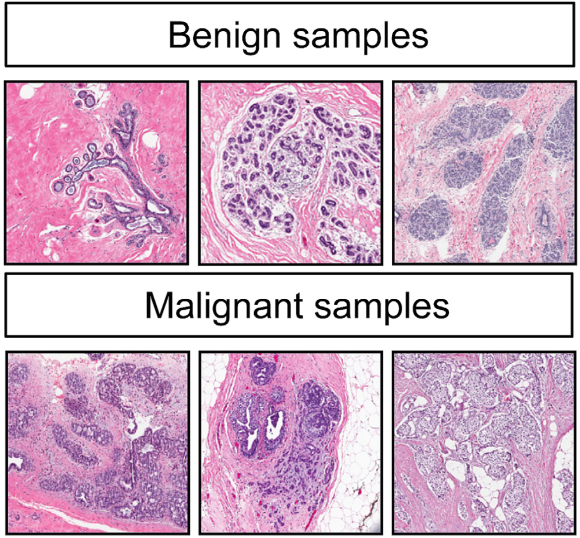

```{r setup, include=FALSE}
# clear-up the environment
rm(list = ls())

# chunk options
knitr::opts_chunk$set(
  message = FALSE,
  warning = FALSE,
  fig.align = "center",
  comment = "#>"
)
options(scipen = 9999)

# libraries
library(readr)
library(tidyverse)
library(gtools)
```

# Course Map

<center>

```{r, echo=FALSE}

```

</center>

# ML: Classification 1

Dalam machine learning dan statistik, **classification** / klasifikasi
adalah bentuk pendekatan supervised learning untuk memprediksi **label**
dari suatu data dengan tipe **kategorikal**.

**Contoh prediksi:**\
- Spam/no spam?\
- Loan default/no default?\
- Customer churn/non churn?\
- ...\
- Yes/no?\
- 1/0? (Positive/Negative?)

non churn churn

karyawan A : peluang untuk churn brp? 0.6 - \> churn

0 hingga 1

range tebakan kita Regression : \[-inf, inf\] classification : \[0, 1\]

# Introduction to (Binary) Classification using Logistic Regression

Tujuan dari logistik regression adalah dengan menggunakan model regresi
linier untuk memprediksi probability(yang dapat digunakan untuk
klasifikasi).

## Linear Regression vs Logistic Regression

<center>

```{r, echo=FALSE}
knitr::include_graphics("img/download.png")
```

</center>

### Probability v.s. Linear Regression

Ide dari logistic regression mulanya berangkat dari model linear
regression. Bedanya:\
- **Linear regression:** digunakan untuk memprediksi angka kontinyu
dengan range `-Inf to Inf`\
- **Logistic regression:** digunakan untuk memprediksi probability
dengan range: `0 to 1`

Range regression: -Inf to Inf\
Range probability: 0 to 1

### Probability

Pada dasarnya, ketika kita melakukan klasifikasi, kita akan menghitung
**peluang**.

$$P(yes) = \frac{n(yes)}{n(yes) + n(no)}$$

Case study: Saat H-2 Lebaran, terdapat 100 penerbangan di Soekarno-Hatta
airport, dari 100 penerbangan tersebut, terdapat 20 penerbangan delay.
Berapakah probability suatu penerbangan delay di Soekarno-Hatta?

```{r}
p_delay <- 20/100
p_delay
```

Peluang penerbangan tidak delay

```{r}
p_no_delay <- (100-20)/100
p_no_delay
```

range dari probability 0 to 1 -inf to inf

### Odds

Odds adalah bentuk lain dari peluang yang memiliki rumus sebagai berikut
$\frac{p}{(1-p)}$ dimana `p` adalah peluang suatu kejadian terjadi. Odds
adalah **peluang kejadian terjadi/peluang kejadian tidak terjadi**.

$$Odds(yes) = \frac{P(yes)}{1-P(yes)}$$ Berapakah odds penerbangan
terbang tepat waktu?

```{r}
# peluang tepat waktu dibandingkan dengan peluang delay
p_no_delay/(1 - p_no_delay)
```

Interpetasi:

> Penerbangan di soetta 4 kali lebih mungkin berangkat tepat waktu
> dibanding delay

```{r}
p_delay / (1- p_delay)
```

odds = 1 odds \> 1 kemungkinan lebih odds \< 1 lebih tidak mungkin

Berapa range nilai dari odds?

```{r}
# max
peluang <- 0.99
peluang/(1-peluang)


# min
peluang <- 0
peluang/(1-peluang)
```

-   Probability: 0 0.5 1
-   Odds : 0 to inf

```{r}
#logit(0.4)
```

### Log of Odds

Log of odds adalah nilai odds yang dilogaritmikan (logit(p) =
log(\frac{p}{1-p})) :

Berapakah log(odds) dari penerbangan tepat waktu?

```{r}
log(4)
```

range: -inf to inf

**Nilai log of odds tidak bisa diinterpretasikan**. Log of Odds
dihasilkan oleh **Logistic Regression**. Nilai log of odds dapat
dikembalikan ke bentuk odds dan peluang sehingga dapat digunakan untuk
klasifikasi.

*Discussion:* Bagaimana cara untuk mengembalikan nilai log(odds) ke
peluang?

log(odds) -> odds

```{r}
exp(1.386294)
```

odds -> probability

$$p = \frac{odds}{1+odds}$$

```{r}
4/(1+4)
```

### Logit dan Inverse Logit

Terdapat cara lain untuk mengubah peluang ke log of odds dengan fungsi
`logit()` dan mengubah log of odds ke peluang dengan fungsi
`inv.logit()`. Fungsi `inv.logit()` yang biasa disebut *sigmoidal
logistic function*.

```{r}
library(gtools)
logit(0.8) #mengubah probability menjadi log of odds
inv.logit(1.386294) # mengubah log of odds menjadi probability
```

## Logistic Regression dengan `glm()`

Business question:

Sebagai seorang analis di suatu universitas, anda ditugaskan untuk
memprediksi apakah siswa akan lulus dengan honors(cumlaude) atau tidak.

Read data `sample.csv`

```{r}
honors <- read.csv("data_input/sample.csv") %>% 
          select(-femalexmath)
head(honors)
```

Deskripsi variabel:

-   `female`: gender of student (1 for female, 0 for male)

-   `read`: score in reading test

-   `write`: score in writing test

-   `math`: score in math test

-   `hon`: status of graduating in honors (1 for honors, 0 for not
    honors)

-   cek missing value

```{r}
colSums( is.na(honors))
```

cek struktur data, kolom mana yang memiliki tipe data yang salah

```{r}
str(honors)
```

ubah tipe data yang masih salah

```{r}
# cara dplyr
honors <- honors %>% 
  mutate(female = as.factor(female), 
         hon = as.factor(hon))

# cara base
honors$female <- as.factor(honors$female)
honors$hon <- as.factor(honors$hon)

```

```{r}
summary(honors)
```

Buatlah sebuah model tanpa prediktor

untuk membuat model logistic regression bisa menggunakan fungsi `glm()`
terdapat 3 paramater yang kita gunakan yaitu formula : tempat
mendefinisikan target dan predictor (y\~x) data : data yang digunakan
untuk membuat model family : gunakan "binomial" bila ingin menggunakan
logistic regression pada pemodelan ini

target variabel tidak harus bernilai 0 atau 1, bisa dalam bentk lainnya
seperti "yes" dan "no"

```{r}
model_null <- glm(formula = hon ~ 1, data = honors, family = "binomial")
summary(model_null)
```

y = B0 + B1*X1 +B2*X2 + .... y = B0 : tanpa predictor B0 = -1.1255
probability, odds, log of odds?log of odds

Kenapa didapati nilai koefisien sebesar -1.1255?

```{r}
library(gtools)
table(honors$hon)
```

```{r}
# peluang
p_0 <- 151/(151+49)
p_0
```

```{r}
# log of odds dari tidak dapat honor
logit(p_0) # mengubah peluang menjadi log of odds
```

```{r}
p_1 <- 49/(151+49)
p_1
logit(p_1)
```

**Interpretasi:**

> Nilai intercept -1.1255, yakni merupakan nilai log of odds dari target
> variabel (hon). Log of odds tidak dapat diinterpretasikan. Untuk
> interpretasi, nilai log of odds kita ubah ke odds/peluang.

```{r}
# log of odds -> odds 
odds <- exp(-1.1255)
odds
# log of odds -> prob
inv.logit(-1.1255)
```

> Kejadian student lulus dengan predikat honors 0.32 KALI lebih mungkin
> dibandingkan student lulus tanpa predikat honors.

> Peluang student lulus dengan predikat honors adalah 0.24.

> Student lebih mungkin untuk lulus tanpa predikat honors.

**Note:**\
Nilai log of odds tidak dapat diinterpretasi, untuk menginterpretasikan
nilai *log(odds)*:\
- dikembalikan ke odds dengan `exp()`\
- dikembalikan ke p dengan inv.logit

### Model dengan 1 prediktor kategorik

Buatlah sebuah model dengan 1 prediktor, yakni female

```{r}
model_f <- glm(formula = hon ~ female, data = honors, family = "binomial")  
summary(model_f)
```

Y = B0 + B1*X1 hon = -1.4709 + 0.5928* female

-   yang diubah menjadi odds adalah koefisien, supaya nilai koefisien
    bisa di interpretasikan

```{r}
# log of odds -> odds
exp(0.5928)
```

> Kemungkinan perempuan memperoleh honors adalah 1.8 kali lebih mungkin
> bila dibandingkan pria mendapatkan honor

-   yang di ubah menjadi probability adalah hasilnya (y)

```{r}
hon  <-  -1.4709 + 0.5928 * 1
hon # log of odds
```

```{r}
inv.logit(hon) # peluang 
```

peluang dia mendapatkan honors 0.29. bisa dibilang dia diprediksi tidak
mendapatkan honor

Coefficient **Female** menjelaskan log of odds dari *female mendapat
honor* dibandingkan *male mendapat honor*.

**Bagaimana cara menginterpretasikan koefisien female?**

```{r}
# lakukan eksponen pada koef female

```

> Kemungkinan perempuan memperoleh honors dibandingkan adalah 1.8 kali
> lebih mungkin bila dibandingkan pria mendapatkan honor

**\[OPTIONAL\] Bagaimana cara mendapatkan nilai log of odds female?**

```{r}
table(honors = honors$hon, female = honors$female)
```

1.  Hitung peluang untuk female dan male

```{r}
# peluang female dapat honors
honf <- 32/(77+32)
# peluang male dapat honors
honm <- 17/(17+74)

```

2.  Hitung nilai odds female dan male

```{r}
# odds
oddsf <- honf/(1-honf)
oddsm <- honm/(1-honm)
```

3.  Hitung nilai odds ratio

```{r}
oddsf/oddsm
```

4.  Hitung nilai log of odds ratio

```{r}
log(oddsf/oddsm)
```

**Question**

Bila diketahui seorang siswi bernama Ajeng (female) masuk kedalam kelas
berapa peluang dia mendapatkan penghargaan ketika lulus (honor = 1)?

```{r}

```

### Model dengan 1 prediktor numerik

Buat model untuk memprediksi `honors` berdasarkan nilai `math`:

```{r}
model_math <- glm(formula = hon ~ math, data = honors, family = "binomial")
summary(model_math)
```

hon = -9.79394 + 0.15634 \* math

**Interpretasi:**

```{r}
# log of odds -> odds
exp(0.15634)
```

> Setiap kenaikan 1 nilai pada math maka odds seseorang mendapatkan
> honor naik sebesar 1.17 KALI.

**Intercept**: Log of odds dari student yang nilai mathnya 0.

**Math**: Peningkatan log of odds setiap peningkatan 1 nilai di math.

contoh:

`hon = -9.79394 + 0.15634 * math`

Student ke-1 memiliki nilai math 52, student kedua 53. Hitung
masing-masing log of oddsnya, berapa selisihnya?

```{r}
# log of odds
hon52 <- -9.79394 + 0.15634 * 52
hon53 <- -9.79394 + 0.15634 * 53

hon53 - hon52
```

```{r}
exp(hon53)/exp(hon52)
```

berapa peluang siswa yang mendapatkan honors bila siswa tersebut
mendapatkan nilai math 52

```{r}
inv.logit(hon52)
```

Peluang siswa mendapatkan honors bila diketahui nilai math nya sebesar
52 adalah 0.15. bisa kita bilang siswa tersebut tidak mendapatkan honors

```{r}
summary(model_math)
summary(model_f)
```

> Siswa dengan nilai 53 akan 1.17 KALI lebih mungkin mendapatkan honors
> dibandingkan yang mendapat nilai 52.

> Memiliki nilai math yang lebih tinggi meningkatkan peluang student
> mendapatkan honors.

-------------------End of Day 1--------------------------

## Dive deeper

1.  pembuatan model
2.  interpretasi koef
3.  prediksi secara manual

Buatlah model yang dapat memprediksi seseorang akan lulus dengan
predikat honors berdasarkan gender dan nilai math nya, kemudian jawablah
pertanyaan berikut:

1.  Interpretasi dari coefficient yang peroleh

2.  Wulan memperoleh nilai math sebesar 60, berapa peluang Wulan
    mendapatkan honors?

3.  Handoyo memperoleh nilai math sebesar 70, berapa peluang Handoyo
    mendapatkan honors?

```{r}
model_gm <- glm(formula = hon ~ math + female, data = honors,family = "binomial")
summary(model_gm)
```

Jawab:

1.  Interpretasi coefficient

fungsi `coef()` untuk mengambil nilai koefisien dari model

```{r}
# cara 1 Pak Sunarto
exp(model_gm$coefficients) 

# cara 2
exp(coef(model_gm)) 

```

hasilnya adalah log of odds dari y probability

0 1

> coefficient math:

Setiap kenaikan 1 nilai pada math maka odds seseorang mendapatkan honor
naik sebesar 1.17 KALI dibandingkan nilai dibawahnya. dengan asumsi
variabel lain tetap/konstan

> coefficient female

Kemungkinan perempuan memperoleh honors adalah 2.62 kali lebih mungkin
bila dibandingkan pria mendapatkan honor. dengan asumsi variabel lain
tetap/konstan

2.  Wulan memperoleh nilai math sebesar 60, berapa peluang Wulan
    mendapatkan honors?

```{r}
wulan_score <- -10.8060 + 0.1642 * 60 + 0.9653 * 1
wulan_score # log of odds
```

3.  Handoyo memperoleh nilai math sebesar 70, berapa peluang Handoyo
    mendapatkan honors?

```{r}
handoyo_score <- -10.8060  + 0.1642  * 70 + 0.9653 * 0
handoyo_score
```

```{r}
library(gtools)
```

```{r}
prob_dd <- inv.logit(c(wulan_score, handoyo_score))
prob_dd
```

convert peluang ke kategorik

```{r}
ifelse(prob_dd > 0.5, "1","0")
```

```{r}
str(honors)
```

"0" "1" ? ? 0 1

yes no churn stay dog cat

no yes yes no 0 1

jadi R akan mengurutkan secara alfabet (yes, no) -> (no, yes) karena
huruf n lebih dahulu daripada y

no yes 0 1

churn stay 0 1

```{r}
# cara mengubah urutan levels pada data
factor(honors$hon, levels = c("1", "0"))
```

```{r}
summary(model_gm)
```

### Null & Residual Deviance

Deviance is defined as the difference of likelihoods between the fitted
model and the perfect (saturated) model.

-   **Null deviance**: Null deviance menunjukkan error ketika model
    tanpa prediktor
-   **Residual deviance**: residual deviance menunjukkan error ketika
    model dengan seluruh prediktor
-   **Num of iteration** : iterasi/perulangan untuk mendapatkan model
    terbaik

Ambilah model dengan nilai residual deviance paling rendah.

```{r}
model_null$deviance # tanpa predictor
model_f$deviance # female sebagai predictor
model_math$deviance # math sebagai predictor
model_gm$deviance # female dan math sebagai predictor
```

nilai deviance tidak bisa di interpretasikan secara langsung, nilai ini
harus dibandingkan dengan model lainnya.

Reference: <https://bookdown.org/egarpor/SSS2-UC3M/logreg-deviance.html>

Selanjutnya kita akan coba membuat model honors menggunakan semua
variabel prediktor:

```{r, eval = FALSE}
model_all <- glm(formula = hon ~ . , data = honors, family = "binomial")
summary (model_all)
```

-   Nadif : residual deviance mendekati 0
-   Sigit : P-Value tidak ada yang signifikan (nilainya besar semua)

Untuk cek proporsi nilai write terhadap variabel honors

```{r}
table(honors$hon, honors$write)
```

> Dari tabel di atas, dapat disimpulkan bahwa ketika nilai write \< 61,
> maka dia not honors, sisanya honors. Variabel write ini membagi kelas
> target secara sempurna, variabel write ini disebut perfect separator.

## Perfect Separation

**Perfect Separation** adalah sebuah kondisi dimana ada 1 variabel yang
dapat memisahkan kelas target secara sempurna. pada kasus ini adalah
nilai write dapat memisahkan kelas honor dengan baik (kalau nilai write
lebih dari 60 maka mendapatkan honor).

ada 2 hal yg bisa kita lakukan

1.  Jika kasus seperti ini kita terima, tidak usah membuat machine
    learning cukup ifelse saja

2.  Jika kasus ini tidak kita terima, maka jgn gunakan variabel ini
    sebagai predictor

untuk mendeteksi ada atau tidaknya perfect separation:

1.  Dilihat dari koefisien dari model yg dibuat, apabila ada nilai koef
    yang sangat besar dan P-value dari semua variabel cenderung tidak
    signifikan maka ada kondisi perfect separator dalam model kita.

2.  Nilai pada Residual Deviances mendekati 0

Membuat model tanpa variabel write

```{r}
honors_no_write <- honors %>% 
  select(-write)
mod_all_w <-  glm(formula = hon ~ ., data = honors_no_write, family = "binomial")
summary(mod_all_w)

# cara ke2 : Sunarto
mod_all_w <-  glm(formula = hon ~ . -write , data = honors, family = "binomial")
```

Interpretasi koefisien female

```{r}
# ubah dalam bentuk odds
exp(mod_all_w$coefficients[2])

```

> Nilai odds ratio pada female 2.664, artinya ketika seseorang adalah
> female, ia lebih mungkin 2.664 KALI menjadi honors dibanding ketika
> dia male. Dengan catatan, variabel prediktor lain konstan

### AIC

AIC mengestimasi jumlah informasi yang hilang dari suatu model. Semakin
kecil AIC, semakin baik model.

```{r, eval=FALSE}
model_null$aic # model tanpa predictor
model_f$aic # model dengan female sebagai predictor
model_math$aic # model dengan math sebagai predictor
mod_all_w$aic  # model dengan semua predictor tanpa write
```

Kapan kita menggunakan AIC dibandingkan deviance? kita bisa menggunakan
AIC ketika kita akan melakukan stepwise (feature selection)

model parametric : model yang menghasilkan koefisien koefisien tersebut
bisa di interpretasikan

y = B0 + B1 \*x1 + ....

## Assumption

Logistic Regression menganut 3 asumsi:

-   **Multicollinearity**: antar prediktor tidak saling berpengaruh
-   **Independence of Observations**: antar observasi independent
-   **Linearity of Predictor & Log of Odds**: nilai prediktor
    berkorelasi linear dengan log of odds

Berikut data penerbangan pesawat dalam `flight_sm.csv`:

```{r}
flights <- read.csv("data_input/flight_sm.csv")
head(flights)
```

1.  Buat model `flight.model` untuk memprediksi `DepDel15` berdasarkan
    `Month` + `DayofWeek`, kemudian tampilkan hasil summary

```{r}
flight.model <- glm(formula = DepDel15 ~ Month + DayofWeek, data = flights, family = "binomial")
summary(flight.model)
```

2.  Interpretasi koefisien tiap variabel!

```{r}
exp(flight.model$coefficients[2])
exp(flight.model$coefficients[3])
```

> Nilai odds kurang dari 1 artinya pada bulan berikutnya akan
> memperkecil kemungkinan untuk delay

> Nilai odds kurang dari 1 artinya pada hari berikutnya akan memperkecil
> kemungkinan untuk delay

```{r}
summary(flights$DayofWeek)
```

```{r}
flights
```

3.  apakah terdapat multicolinearity pada model?

ada ga sih hubungan antar predictor?

```{r}
library(car)
vif(flight.model)
```

Jawab : dari hasil diatas nilai VIF tiap predictor dibawah 10, berarti
pada model ini tidak terjadi multicolinearity

```{r}

flights <- flights %>% 
  mutate(DayofWeek  = as.factor(DayofWeek), 
         Month = as.factor(Month))
```

```{r}
flights
```

```{r}
flight.model <- glm(formula = DepDel15 ~ Month + DayofWeek, data = flights, family = "binomial")
summary(flight.model)
```

multicolinearity itu terjadi karena ada hubungan kuat (korelasi) antar
predictor. korelasi mendekati -1 atau 1. bila terjadi multicol ambil
salah satu predictor saja. remove VIF yang besar (>10)

# Classification Workflow

1.  Read Data + Data understanding
2.  Data Wrangling
3.  EDA
4.  Cross Validation
5.  Data Pre-Processing
6.  Build Model
7.  Predict
8.  Evaluation
9.  Model Tuning
10. Final Model

# Credit Risk Analysis

## 1. Read data

```{r}
loans <- read.csv("data_input/loan2017Q4.csv")
head(loans)
```

Descriptions:

-   `initial_list_status`: Either `w` (whole) or `f` (fractional). This
    variable indicates if the loan was a whole loan or fractional loan.
    For background: Some institutional investors have a preference to
    purchase loans in their entirety to obtain legal and accounting
    treatment specific to their situation - with the added benefit of
    "instant funding" to borrowers\
-   `purpose`: Simplified from the original data; One of: `credit_card`,
    `debt_consolidation`, `home_improvement`, `major_purchase` and
    `small_business`\
-   `int_rate`: Interest rate in percentages\
-   `installment`: Monthly payment owed by the borrower\
-   `annual_inc`: Self-reported annual income provided by the borrower /
    co-borrowers during application\
-   `dti`: A ratio of the borrower's total monthly debt payments on
    his/her total obligations to the self-reported monthly income\
-   `verification_status`: is the reported income verified, not
    verified, or if the income source was verified\
-   `grade`: software-assigned loan grade\
-   `revol_bal`: total credit revolving balance (in the case of credit
    card, it refers to the portion of credit card spending that goes
    unpaid at the end of a billing cycle)\
-   `inq_last_12m`: number of credit inquiries in the last 12 months\
-   `delinq_2yrs`: number of 30+ days past-due incidences of delinquency
    in the borrower's credit file for the past 2 years\
-   `home_ownership`: one of `MORTGAGE`, `OWN` and `RENT`\
-   `not_paid`: 0 for fully-paid loans, 1 for charged-off, past-due /
    grace period or defaulted\
-   `log_inc`: log of `annual_inc`\
-   `verified`: 0 for "Not verified" under `verification_status`, 1
    otherwise\
-   `grdCtoA`: 1 for a `grade` of A, B or C, 0 otherwise

## 2. Data Wrangling

```{r}
# cek struktur data
str(loans)

```

-   Apa target variabel dari data diatas? not_paid

-   variabel apa yang belum memiliki tipe data yang tepat? harusnya
    factor

initial_list_status not_paid purpose home_ownership verified grdCtoA

-   **Indikasi multicollinearity**

Cek adanya indikasi multicollinearity berdasarkan pengetahuan bisnis
(lihat deskripsi kolom).

```{r}
table(loans$grade, loans$grdCtoA)
```

-   verified
-   grCtoA
-   annual_inc

Notes: membuang log_inc, verification status, grade karena sudah
dijelaskan oleh annual_inc, verified, dan grdCtoA.

ubah jadi factor initial_list_status not_paid purpose home_ownership
verified grdCtoA

```{r}
library(dplyr)
# lakukan data cleansing 
loans_clean <-  loans %>% 
  select(-c(log_inc, verification_status, grade)) %>% 
  mutate_if(is.character, as.factor) %>% 
  mutate(grdCtoA = as.factor(grdCtoA), 
         verified = as.factor(verified), 
         not_paid = as.factor(not_paid))
loans_clean
```

## 3. Eksploratory Data Analysis

-   **Check missing value**

```{r}
colSums(is.na(loans_clean)) # cek missing value di tiap kolom
anyNA(loans_clean)

```

-   **Analisis persebaran data**

```{r}
# cek sebaran data
summary(loans_clean)

```

**Discussion:**

Dilihat dari hasil delinq_2yrs dominan berada di nilai 0, apakah kita
akan tetap memasukannya ke dalam model?

```{r}
nrow(loans_clean)
```

```{r}
table(loans_clean$delinq_2yrs)
```

```{r}
1254/1556
```

```{r}
loans_clean <- loans_clean %>% 
  select(- delinq_2yrs)
loans_clean
```

-   **Check Class Imbalance**

```{r}
loans_clean$not_paid %>% 
  table() %>% 
  prop.table()
```

0 : 1 0.8 0.2

data yyang digunakan pada pembuatan model sebaiknya seimbang

Proporsi yang seimbang penting agar model klasifikasi mempelajari
karakteristik kelas positif maupun negatif secara seimbang, tidak dari
satu kelas saja. Hal ini mencegah model dari *hanya baik memprediksi 1
kelas saja*.

Proporsi yang imbalance umumnya 90/10 atau 95/5.

-------------------End of Day 2--------------------------

#### Cross Validation

Jika kita ingin melakukan sebuah prediksi, maka kita tidak disarankan
melihat nilai error pada data yang digunakan untuk melatih model, karena
itu hanya menunjukkan bahwa model dapat memprediksi data lama tetapi
belum tentu dapat memprediksi data baru. Data yang digunakan untuk
melatih model kita sebut dengan `data train`, sedangkan data yang
digunakan untuk mengevaluasi model disebut dengan `data test`.

Berikut beberapa kondisi yang dapat terjadi pada model:

-   Overfitting: Model terlalu bagus dalam mengikuti pola di data train,
    menyebabkan model kurang mampu memprediksi data baru
-   Underfitting: Model kurang bisa menangkap pola di data train
-   Optimum: Model mampu mengikui pola data train tetapi masih memiliki
    kemampuan yang baik dalam memprediksi data baru

Untuk mengevaluasi model dan melihat kemampuannya memprediksi data baru,
data kita bagi menjadi 2: data train dan data test. Proses ini kita
sebut dengan `cross-validation`.

Misalkan saya menggunakan 80% dari seluruh data yang saya miliki menjadi
data train dan sisanya akan digunakan sebagai data test.

Analogi:

-   100 soal
-   80 soal saya pakai untuk belajar (data train)
-   20 soal saya pakai untuk ujian (data test)

tujuan dari cross validation adalah untuk mengetahui seberapa baik model
yg sudah kita buat.

> `set.seed()` digunakan untuk mengunci sifat random dari fungsi sampel.

```{r}
# RNGkind agar hasil yang dikeluarkan pada R versi 3.x sama dengan 4.x
RNGkind(sample.kind = "Rounding")
set.seed(417)

index_loan <- sample(x = nrow(loans_clean), size = nrow(loans_clean) * 0.8)

loan_train <- loans_clean[index_loan, ]
loan_test <- loans_clean[-index_loan, ]
```

NOTE: Proporsi 0.8/0.2 tidak mutlak, tergantung kebutuhan kita.

```{r}
# re-check class imbalance

loan_train$not_paid %>% 
  table() %>% 
  prop.table()
```

proporsi kelas yang balance penting untuk data train karena kita akan
melatih model menggunakan data train.

#### Build Model

Membuat model berdasarkan business knowledge dan arahan yang sudah ada:

```{r }
creditrisk <- glm(formula = not_paid ~ ., data = loan_train, family = "binomial")

summary(creditrisk)
```

```{r}
levels(loan_train$purpose)
```

Interpretasi:

Mengubah log off odds ke nilai odds

```{r}
exp(coef(creditrisk))
```

Interpretasi untuk parameter:

> purpose small business: Kemungkinan nasabah dengan purpose small
> business 1.91 KALI lebih mungkin untuk not paid dibandingkan dengan
> purpose credit card, dengan catatan variabel lainnya memiliki nilai
> yang sama

> int_rate: Setiap kenaikan int_rate sebesar 1 unit maka kecenderungan
> nasabah untuk gagal bayar naik sebesar 1.01 kali dengan catatan
> variabel lainnya konstan

Lakukan feature selection menggunakan stepwise

```{r}
# logistic regression juga dapat menggunakan step
creditrisk2 <- step(object = creditrisk, 
                    scope = , 
                    direction =  )
```

#### Predict

`predict(model, newdata, type)`

type memiliki 2 nilai yaitu `response` dan `link`:

-   `type = link`: memberikan output berupa nilai `log of odds`
-   `type = response`: memberikan output berupa nilai peluang

```{r}
# predict data test menggunakan model yang sudah dibuat

```

```{r}
# ubah probability menjadi label 

```

#### Model Evaluation

Setelah dilakukan prediksi menggunakan model, masih ada saja prediksi
yang salah. Pada klasifikasi, selain menggunakan AIC, kita mengevaluasi
model berdasarkan confusion matrix:

-   TP (True Positive) = Ketika kita memprediksi kelas positive, dan itu
    benar
-   TN (True Negative) = Ketika kita memprediksi kelas negative, dan itu
    benar
-   FP (False Positive) = Ketika kita memprediksi kelas positive, dan
    itu salah
-   FN (False Negative) = Ketika kita memprediksi kelas negative, dan
    itu salah

```{r}
knitr::include_graphics("img/tnfp.PNG")
```

```{r}
# confusion matrix sederhana
table(predicted = loans.test$pred.Label,
      actual = loans.test$not_paid)
```

4 metrics performa model: Accuracy, Sensitivity/Recall, Precision,
Specificity

```{r}
library(caret)


```

-   Accuracy: seberapa tepat model kita memprediksi kelas target (secara
    global)\
-   Sensitivity/ Recall: ukuran kebaikan model terhadap kelas `positif`\
-   Specificity: ukuran kebaikan model terhadap kelas `negatif`\
-   Pos Pred Value/Precision: seberapa presisi model memprediksi kelas
    positif

**6.1 Accuracy**

seberapa baik model kita memprediksi kelas target (positif maupun
negatif). dipakai ketika *kelas positif dan negatif sama pentingnya*
atau ketika proporsi kelas seimbang.

(TP+TN/TOTAL)

```{r}
(87+94)/312
```

Dalam bisnis/real-case, tak selamanya kita hanya mementingkan metric
accuracy. Sering kali harus memilih antara meninggikan
**recall/precision**. Hal ini tergantung pada kasus bisnis/efek yang
ditimbulkan dari hasil prediksi tersebut.

**6.2 Sensitivity/Recall**

seberapa banyak yang **benar diprediksi positif**, dari yang
**re**ality-nya positif. (TP/(TP+FN))

```{r}
94/(94+57)
```

**6.3 Pos Pred Value/Precision**

seberapa banyak yang **benar diprediksi positif**, dari yang
di**pre**diksi positif.

(TP/(TP+FP))

```{r}
94/(94+74)
```

ROLE PLAY:

1.  Seorang dokter ingin mendiagnosa pasien kanker menggunakan model
    machine learning. Pasien yang kanker akan diarahkan untuk
    pemeriksaan lanjutan. Untuk melihat kebaikan model, metrics mana
    yang lebih kita utamakan?

-   Target variabel = kanker/non-kanker
-   Kelas positif = kanker
-   Metrics =

2.  Kita ingin membuat model prediksi untuk mengklasifikasikan e-mail
    spam/ham. Metrics mana yang lebih kita utamakan?

-   Target variabel = spam/ham
-   Kelas positif = spam
-   Metrics =

3.  Bila ada seorang **seller** dan **bos**nya yang hendak menawarkan
    produk perusahaan ke 1000 calon pelanggan. Ingin dibuat model
    prediksi dimana positive = pelanggan membeli produk. Maka siapa yang
    mementingkan recall, siapa yang mementingkan precision?

**Bos**:

**Seller**:

**Recall/Precision amat bergantung dengan pandangan bisnis kita dan
akibat yang ditimbulkan.**

4.  Untuk kasus deteksi covid-19, metrics mana yang akan diutamakan?

5.  Untuk kasus pengajuan kredit cicilan rumah, metrics mana yang akan
    diutamakan

*NOTE: pandangan bisnis di atas tidak mutlak.*

Untuk menaikkan/menurunkan recall/precision dapat diubah treshold
prediksinya:

-   recall tinggi: geser ke arah nol
-   precision tinggi: geser ke arah 1

**6.4 Specificity**

ukuran kebaikan model terhadap kelas `negatif`. seberapa banyak yang
**tepat diprediksi negatif**, dari yang **reality-nya negatif**. Metrics
ini tidak menjadi fokus karena umumnya kita fokus pada kelas positif.

(TN/(TN+FP))

```{r}
87/(87+74)
```

# k-NN

k-NN adalah *K-nearest neighboor*. Metode ini akan mengkasifikasi data
baru dengan membandingkan karakteristik data baru (data test) dengan
data yang ada (data train). Kedekatan karakteristik tersebut diukur
dengan **Euclidean Distance**. Kemudian akan dipilih **k** tetangga
terdekat dari data baru tersebut, kemudian ditentukan kelasnya
menggunakan majority voting.

```{r}
knitr::include_graphics("img/KNN.png")
```

## Picking Optimum k

-   jangan terlalu besar: pemilihan kelas hanya berdasarkan kelas yang
    dominan dan mengabaikan pola kecil yang ternyata penting.
-   jangan terlalu kecil: rentan mengklasifikasikan data baru ke kelas
    outlier.
-   **k optimum** adalah akar dari jumlah data kita: `sqrt(nrow(data))`
-   k harus ganjil bila jumlah kelas target genap, dan k harus genap
    bila jumlah kelas target ganjil. Hal ini untuk menghindari seri
    ketika majority voting

## Karakteristik k-NN

-   tidak membuat model: langsung mengklasifikasi *saat itu juga*, tidak
    belajar dari data, setiap ingin mengklasifikasi harus menyediakan
    data train lagi.
-   tidak ada asumsi
-   dapat memprediksi multiclass
-   baik untuk prediktor numerik (karena mengklasifikasikan berdasarkan
    jarak), tidak baik untuk prediktor kategorik

## Breast Cancer Prediction

### Business Question

Kanker payudara adalah kanker yang paling umum menyerang wanita di
dunia. Kanker payudara dapat berupa kanker jinak (benign) atau sudah
ganas (malignant). Kanker ganas dapat menyebar ke organ-organ tubuh
lainnya. Ingin dibuat model prediksi untuk memprediksi:

-   Variabel target: diagnosis (Malignant/Benign, kelas positif =
    Malignant)
-   Variable prediktor: karakteristik sel kanker

```{r}

```

### Read Data

```{r}


```

```{r}
# inspect data


```
