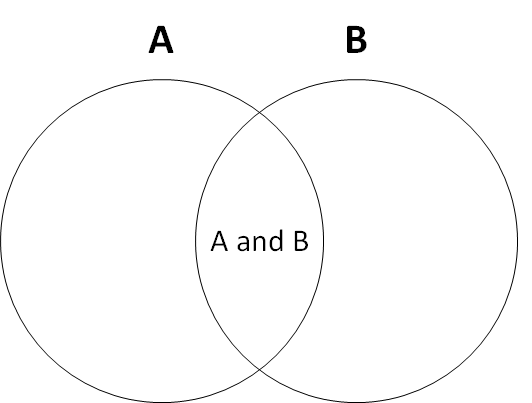
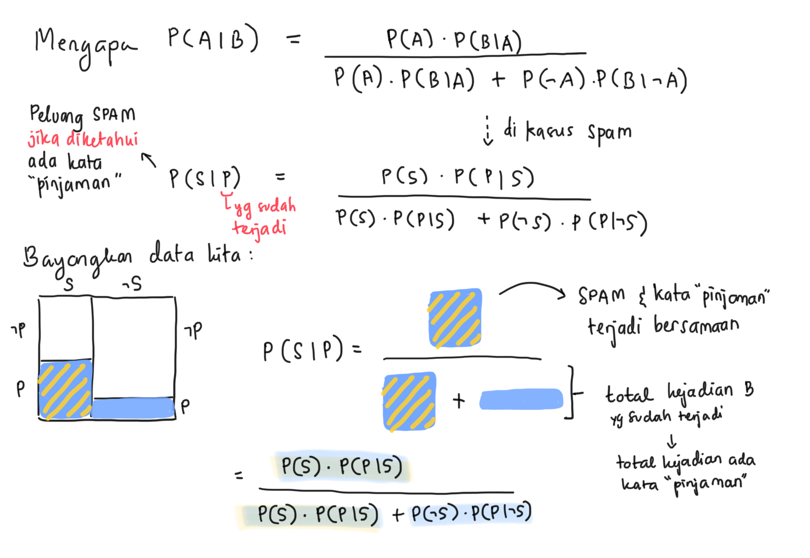
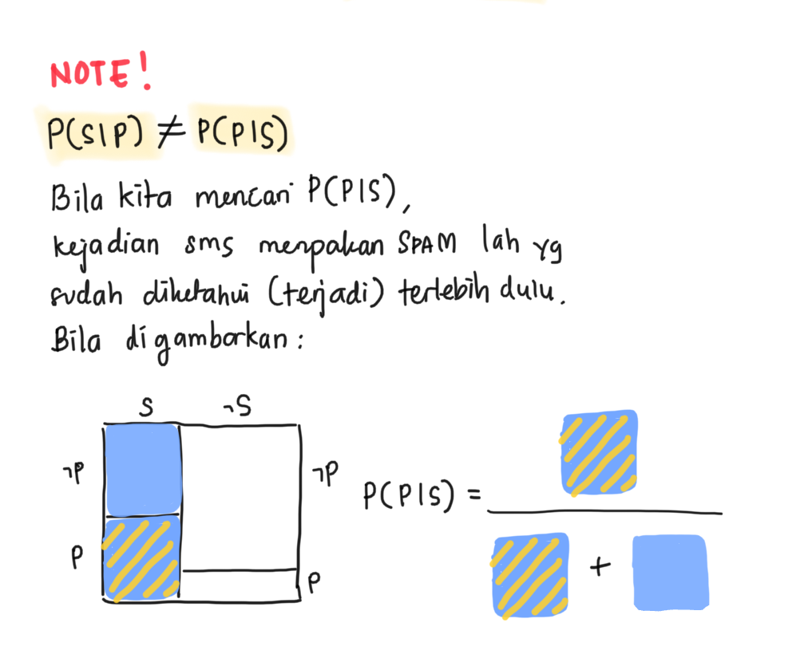
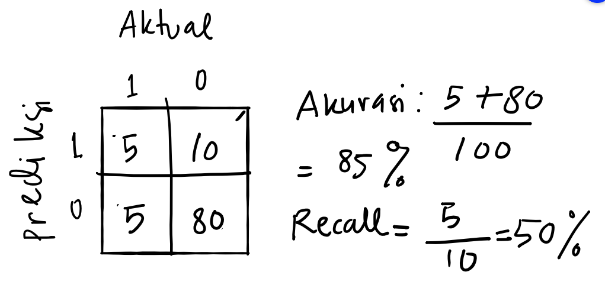

```{r setup, include=FALSE}
# clear-up the environment
rm(list = ls())

# chunk options
knitr::opts_chunk$set(
  message = FALSE,
  warning = FALSE,
  fig.align = "center",
  comment = "#>"
)

options(scipen = 999)
```

```{=html}
<style>
body {
text-align: justify}
</style>
```
# Mindmap

```{r, out.width = "100%", echo = FALSE, fig.align = "center"}
knitr::include_graphics("img/C2.png")
```

# 📑 Naive Bayes Classifier

Naive Bayes adalah suatu algoritma klasifikasi yang didasari oleh
**Bayes' Theorem of Probability**. Faktanya, teorema Bayes amat sering
digunakan pada kehidupan sehari-hari.

## 📌 Theory of Probability

Saat kita menghitung peluang 2 atau lebih kejadian terjadi bersamaan,
kita dapat menghitungnya dengan 2 cara:

-   **Independent Event**: Peluang kejadian A tidak mempengaruhi peluang
    kejadian B. Contoh:

    -   Peluang dadu keluar angka 4 pada lemparan pertama **dan**
        peluang keluar angka 6 pada lemparan kedua
    -   Peluang saya menaiki busway ke kantor dan peluang terjadi banjir
        di Tangerang
    -   Peluang student Algoritma membeli jumpstart coffee dan peluang
        instruktor Algoritma membeli chicken karage

Peluang 2 kejadian independen yang dapat terjadi secara bersamaan adalah
hasil perkalian peluang masing-masing kejadian tersebut.

$$P(A \cap B) = P(A) \times P(B)$$

```{r echo=FALSE, out.width="50%"}
knitr::include_graphics("img/venn.png")
```

**Contoh:**

Peluang dadu keluar angka 4 pada lemparan pertama = P(A) = 1/6 Peluang
dadu keluar angka 4 pada lemparan kedua = P(B) = 1/6

$$P(A \cap B) = P(A) \times P(B) = \frac{1}{6} \times \frac{1}{6} = \frac{1}{36}$$
Jadi, peluang dadu keluar angka 4 pada lemparan pertama dan peluang
keluar angka 6 pada lemparan kedua = 1/36

-   **Dependent Event**: Peluang kejadian A dipengaruhi oleh peluang
    kejadian B (informasi tentang kejadian B). Contoh:

    -   Peluang banjir di Jakarta **jika diketahui** peluang hujan deras
        di Bogor
    -   Peluang kelas Algoritma online jika diketahui PSBB diterapkan di
        Jakarta
    -   Peluang pelanggan memberi rating rendah jika diketahui terdapat
        kata "Buruk" pada form feedback

Untuk menghitung peluangnya, kita menggunakan **Bayes Theorem**:

```{r echo=FALSE, out.width="50%"}

```

P(sakit perut\|pagi makan sambel)

$$P(A|B) = \frac{P(B|A) P(A)}{P(B|A) P(A)\ +\  P(B|\neg A) P(\neg A)}$$
$P(A|B)$ = Peluang terjadi A jika diketahui B telah terjadi.

$P(B|\neg A)$ = Peluang tidak terjadi A jika diketahui B telah terjadi.

$P(A)$ = Peluang terjadi A

$P(\neg A)$ = Peluang tidak terjadi A

**Study Case: SPAM Classifier**

Sebagai seorang analis di salah satu provider jaringan di Indonesia,
fokus perusahaan saat ini tertuju pada banyaknya keluhan pelanggan
terkait sms SPAM. Perusahaan khawatir apabila hal ini tidak ditangani,
maka akan berpotensi menyebabkan terjadinya churn atau perpindahan
pelanggan ke provider kompetitor karena pelanggan terganggu dengan SPAM
tersebut.

Dikumpulkan sebanyak **1000 sms** yang diantaranya terapat **250 sms
SPAM**. Dengan melakukan text mining, diketahui bahwa dari seluruh sms
SPAM, terdapat **100 sms** dengan kata *Pinjaman* di dalamnya, dan hanya
terdapat **30 sms** yang memiliki kata *Pinjaman* namun bukan merupakan
SPAM.

Cika adalah seorang pelanggan dari provider tersebut. Bila Cika hari ini
menerima sms dengan kata *Pinjaman* di dalamnya, apakah sms tersebut
diperkirakan sebagai SPAM?

**Dicari:** Peluang sms termasuk **SPAM** jika diketahui terdapat kata
**Pinjaman** di dalamnya

**Diketahui:**

$$\begin {matrix}
 & Spam & \neg Spam \\
\hline
Pinjam & 100 & 30 \\
\neg Pinjam & 150 & 720
\end{matrix}$$

Jika kita menggunakan rumus kejadian independen untuk menghitung peluang
kejadian dependen, hasilnya akan terlalu optimistik:

$$ Peluang= \frac{250}{1000}\ \times \frac{130}{1000}\ = 0.0325 \ ?!? $$

Bila disimpulkan: sms yang terdapat kata *Pinjaman* di dalamnya bukan
merupakan SPAM -- peluang termasuk SPAM amat kecil (=.=)

Mari kita hitung menggunakan rumus kejadian dependen:

$$ P(Spam\ |\ Pinjam) = \frac{P(Spam)\ P(Pinjam\ |\ Spam)}{P(Spam)\ P(Pinjam\ |\ Spam) + P(\neg Spam)\ P(Pinjam\ |\neg Spam)} $$

\[NOTES: Pahami intuisinya saja tidak apa-apa\]

```{r echo=FALSE, out.width="60%"}

```

Kita cari satu per satu peluang yang dibutuhkan:

-   Peluang sms adalah SPAM: $P(Spam) = \frac{250}{1000} = 0.25$
-   Peluang muncul kata Pinjaman di sms SPAM:
    $P(Pinjam\ |\ Spam) = \frac{100}{250} = 0.4$
-   Peluang sms bukan SPAM: $P(\neg Spam) = 750/1000 = 0.75$
-   Peluang muncul kata Pinjaman di sms yang bukan SPAM:
    $P(Pinjam\ |\neg Spam) = \frac{30}{750} = 0.04$

Kita masukkan angka peluang yang sudah kita hitung:

$$P(Spam\ |\ Pinjam) = \frac{0.25 \times 0.4}{0.25 \times 0.4\ +\ 0.75 \times 0.04} = 0.7692$$

```{r}
(0.25*0.4)/((0.25*0.4)+(0.75*0.04))
```

Peluang sms yang diterima Cika adalah SPAM sebesar 0.7692. Apabila kita
menentukan threshold treshold 0.5, kita bisa anggap bahwa sms tersebut
adalah SPAM.

⚠️ **NOTE:**: $P(Spam\ |\ Pinjaman) \neq P(Pinjaman\ |\ Spam)$

```{r echo=FALSE, out.width="60%"}
# 
```

#### (OPTIONAL) Penurunan Rumus Bayes Theorem

1.  Diketahui rumus joint probability untuk dependent event. Ilustrasi
    lihat animasi diagram venn pada tab pertama.

$$P(A|B) = \frac{P(A \cap B)}{P(B)}$$

2.  Event $A$ dan $B$ bisa ditukar, yang tadinya hipotesis menjadi
    evidence, begitupun sebaliknya:

$$P(B|A) = \frac{P(B \cap A)}{P(A)}$$

3.  $P(A \cap B) = P(B \cap A)$ karena sifatnya komutatif. Contoh:
    peluang muncul mata dadu 4 pada pelemparan pertama dan 6 pada
    pelemparan kedua **SAMA SAJA** dengan peluang muncul mata dadu 6
    pada pelemparan kedua dan 4 pada pelemparan pertama. Maka dari itu,
    kedua persamaan di atas dapat dibentuk menjadi:

$$P(A \cap B) = P(A|B) \times P(B)$$

$$P(A \cap B) = P(B|A) \times P(A)$$

4.  Kedua persamaan di atas mengacu pada nilai $P(A \cap B)$ yang sama
    sehingga:

$$P(A|B) \times P(B) = P(B|A) \times P(A)$$

5.  Terakhir, pindahkan $P(B)$ ke ruas kanan persamaan:

$$P(A|B) = \frac{P(B|A) \times P(A)}{P(B)}$$ ## Naive Bayes

Naive Bayes adalah model machine learning yang memanfaatkan Bayes
Theorem untuk melakukan klasifikasi. Hubungan antara prediktor dengan
target variabel dianggap saling dependen. Namun, Naive Bayes
mengasumsikan **tiap prediktor saling independen** (tidak berhubungan
satu sama lain) dan **memiliki bobot yang sama** untuk menghasilkan
prediksi--oleh karena itu dinamakan *"Naive"*. Hal ini untuk memudahkan
kalkulasi dan mengurangi beban komputasi.

Secara umum, Naive Bayes dapat dibedakan berdasarkan tipe data
predictornya:

1.  Bernoulli/Binomial NB: predictor kategorikal, 2 kelas (contoh case:
    Text Mining Spam Classifier)
2.  Multinomial NB: predictor kategorikal, multi kelas (contoh case:
    Market Analysis)
3.  Gaussian NB: predictor numerikal, asumsi distribusi normal (tidak
    dibahas pada course ini, silahkan mengacu pada [askalgo:
    C2](https://askalgo.netlify.app/#classification-2) pertanyaan
    nomor 4)

### **Study Case: Market Analysis** {.tabset}

**Business Question:** Sebagai seorang marketing analyst, kita ingin
meningkatkan penjualan dengan menargetkan customer dengan karakteristik
tertentu. Dari **400 customer** yang sudah kita prospek, kita dapatkan
informasi tentang gender, umur, dan kategori gaji serta apakah dia
membeli produk kita atau tidak.

-   Positive Class: membeli
-   Negative Class: tidak membeli

```{r, message=FALSE, warning=FALSE}
library(dplyr)

# read data Customer_Behaviour.csv
customer <- read.csv("data_input/Customer_Behaviour.csv", stringsAsFactors = T)
# cek data
head(customer)
```

Deskripsi data:

-   **Gender**: Jenis Kelamin (Male, Female)
-   **Age**: Range usia (\<30, 30-50, > 50)
-   **Estimated Salary**: Kategori Gaji Customer (Low, Medium, High)
-   **Purchased**: Apakah klien membeli produk kita atau tidak (Yes, No)

Apakah terdapat tipe data yang perlu diperbaiki?

-   Semuanya jadi factor

```{r}
# your code
str(customer)
```

Klien kita berikutnya adalah Eca, seorang **wanita** berusia **24
tahun** dengan **gaji yang tinggi**. Berapa peluang Eca akan membeli
produk kita?

Kita formulakan:

$$P(Purchase\ | Gender = Female\ \cap\ Age<30\ \cap\ Salary = High) = P(Purchase| A\ \cap\ B\ \cap\ C)$$
Untuk mempersingkat notasi, kita simbolkan kejadian $A, B, C$
(prediktornya) sebagai:

-   $A$: Gender = Female
-   $B$: Age \< 30
-   $C$: Salary = High

Sehingga:

$$P(Purchase| A\ \cap\ B\ \cap\ C) = \frac{P(Purchase) \ P(A\ \cap\ B\ \cap\ C\ |\ Purchase)}{P(Purchase) \ P(A\ \cap\ B\ \cap\ C\ |\ Purchase)\ + \ P(\neg Purchase) \ P(A\ \cap\ B\ \cap\ C\ |\ \neg Purchase)}$$

**Asumsi Independensi Antar Variable Prediktor**

Naive Bayes mengasumsikan bahwa tiap prediktor saling independen atau
tidak berkaitan satu sama lain. Karena feature kita adalah
$A\ \cap\ B\ \cap\ C$, dapat diubah menjadi seperti berikut:

$$P(A\ \cap\ B\ \cap\ C\ |\ Purchase) = P(A\ |\ Purchase)\ P(B\ |\ Purchase)\ P(C\ |\ Purchase)\ $$

Sehingga:

$$= \frac{P(Purchase) \ P(A\ |\ Purchase)\ P(B\ |\ Purchase)\ P(C\ |\ Purchase)}{P(Purchase) \ P(A\ |\ Purchase)\ P(B\ |\ Purchase)\ P(C\ |\ Purchase)\ +\ P(\neg Purchase) \ P(A\ |\neg Purchase)\ P(B\ |\neg Purchase)\ P(C\ |\neg Purchase)}$$

#### Perhitungan Manual

Kita cari satu per satu peluang yang dibutuhkan:

-   Peluang seseorang membeli produk kita ($P(Purchase)$)

```{r}
# table frekuensi
prop.table(table(customer$Purchased))
table(customer$Purchased)
```

Jika dihitung dengan cara manual :

```{r}
p_yes <- 143/nrow(customer)
p_no <- 257/nrow(customer)
p_yes
```

-   Table Frekuensi Gender vs Purchase

```{r}
table("Gender" = customer$Gender, "Purchased" = customer$Purchased)
```

a.  Peluang seseorang adalah **wanita** ($A$) jika diketahui dia membeli
    produk kita ($P(A\ |\ Purchase)$)

```{r}
p_female_yes <- 77/(77+66)
```

b.  Peluang seseorang adalah **wanita** ($A$) jika diketahui dia tidak
    membeli produk kita ($P(A\ |\neg Purchase)$)

```{r}
p_female_no <- 127/(127+130)
```

-   Tabel Frekuensi Age vs Purchase

```{r}
table("Age" = customer$Age, "Purchased" = customer$Purchased)
```

a.  Peluang seseorang berumur \< 30 ($B$) jika diketahui dia membeli
    produk kita ($P(B\ |\ Purchase)$)

```{r}
p_30_yes <- 4/(4+45+94)
```

b.  Peluang seseorang berumur \< 30 ($B$) jika diketahui dia tidak
    membeli produk kita ($P(B\ |\neg Purchase)$)

```{r}
p_30_no <- 96/(96+4+157)
```

-   Tabel Frekuensi Salary vs Purchase

```{r}
table("Salary" = customer$Salary, "Purchased" = customer$Purchased)
```

a.  Peluang seseorang salary tinggi ($C$) jika diketahui dia membeli
    produk kita ($P(C\ |\ Purchase)$)

```{r}
p_high_yes <- 75/(75+39+29)
```

b.  Peluang seseorang salary tinggi ($C$) jika diketahui dia tidak
    membeli produk kita ($P(C\ |\neg Purchase)$)

```{r}
p_high_no <- 19/(19+56+182)
```

Kita kembali pada perhitungan peluang Eca purchase ketika diketahui
kondisi-kondisinya:

$$= \frac{P(Purchase) \ P(A\ |\ Purchase)\ P(B\ |\ Purchase)\ P(C\ |\ Purchase)}{P(Purchase) \ P(A\ |\ Purchase)\ P(B\ |\ Purchase)\ P(C\ |\ Purchase)\ +\ P(\neg Purchase) \ P(A\ |\neg Purchase)\ P(B\ |\neg Purchase)\ P(C\ |\neg Purchase)}$$

```{r}
(p_yes*p_female_yes*p_30_yes*p_high_yes)/((p_yes*p_female_yes*p_30_yes*p_high_yes)+
                                            p_no*p_female_no*p_30_no*p_high_no)

```

Kesimpulan:

Strategi apa yang harus dipersiapkan?

#### `naiveBayes()` function

Pada R kita dapat menggunakan function `naiveBayes()` dari package
`e1071` untuk membuat model Naive Bayes.

Terdapat 2 cara dalam membuat model menggunakan function `naiveBayes()`
:

1.  Menggunakan argumen `naiveBayes(formula, data)`

-   `formula`: formula y\~x, dimana y: target variabel, x: prediktor
    variabel
-   `data`: data yang digunakan untuk target dan prediktor variabel

2.  Menggunakan argumen `naiveBayes(x, y)`

-   `x`: prediktor variabel dari data yang digunakan
-   `y`: target variabel dari data yang digunakan

```{r}
# install.packages("e1071")
library(e1071)

# Train Model
model_customer <- naiveBayes(formula = Purchased ~ ., data = customer)
  
# check model
model_customer
```

```{r}
(0.3575*0.5384615*0.02797203*0.52447552)/((0.3575*0.5384615*0.02797203*0.52447552)+
                                            (0.6425*0.4941634*0.37354086*0.07392996))
```

Model Naive Bayes menyimpan informasi tentang nilai peluang dependen
antara target dengan setiap feature. Kita bisa periksa nilainya dengan
perhitungan manual.

-   `margin`: perhitungan proporsi berdasarkan 1 = baris, 2 = kolom

```{r}
prop.table(table(Gender = customer$Gender, Purchased = customer$Purchased),
           margin = 2) # penghitungan proporsi per baris
```

Prediksi wanita dengan gaji tinggi dan berusia di bawah 30 tahun.
`type = raw` mengembalikan nilai peluang kelasnya. `type = class`
mengembalikan nilai prediksi kelasnya, default function `predict()`
dalam model Naive Bayes.

Parameter `type`:

-   `type = "raw"` mengembalikan nilai peluang untuk masing-masing kelas
-   `type = "class"` mengembalikan label kelasnya (default threshold
    0.5)

```{r}

eca <- data.frame(Gender = "Female", 
                    Age = "< 30",
                    Salary = "High")
# predict
predict(object = model_customer,newdata = eca, type = "class")
```

💡 **IMPORTANT POINTS**

-   Naive Bayes mengklasifikasi berdasarkan peluang dependen antara
    prediktor dengan target variabel

-   Naive Bayes mengasumsikan:

    -   setiap prediktor memiliki bobot yang sama (sama-sama dianggap
        penting)
    -   antar prediktor saling independen

-   Kelebihan:

    -   waktu training model lebih cepat dikarenakan asumsi setiap
        prediktor memiliki bobot yang sama
    -   model naive bayes biasanya dijadikan sebagai *base classifier*
        atau benchmark model untuk acuan pembanding model yang lebih
        kompleks

## Laplace Smoothing

Pada beberapa kasus, dapat terjadi data scarcity dimana *salah satu
prediktor memiliki nilai yang tidak ada sama sekali di salah satu
kelas*. Misalnya kita modifikasi dari data Customer Behaviour
sebelumnya, pada golongan orang-orang yang *Purchase* sama sekali tidak
ada yang berjenis kelamin wanita sehingga table frekuensinya menjadi
sebagai berikut:

```{r echo=FALSE}
matrix(c(127, 130, 0, 143), nrow = 2, dimnames = list(c("Female", "Male"), c("No Purchase", "Purchase")))
```

Apabila tabel frekuensi untuk prediktor lainnya tetap sama, maka peluang
Eca sebagai **wanita** dengan **usia \< 30** dengan **gaji tinggi**
untuk membeli produk:

$$P(Purchase\ |\ Age <30 \ \cap\ Gender = Female\ \cap\ Salary = High ) \\
= \frac{\frac{143}{143+257}\ \frac{4}{4+45+94}\ \frac{0}{0+143}\ \frac{75}{75+39+29}}
{\frac{143}{143+257}\ \frac{4}{4+45+94}\ \frac{0}{0+143}\ \frac{75}{75+39+29} + \frac{257}{143+257}\ \frac{96}{96+4+157}\ \frac{127}{127+130}\ \frac{19}{19+56+182}} = 0$$

Karena terdapat pembilang yang memiliki nilai 0, maka peluangnya akan
langsung menjadi **0**.

Ini adalah karakteristik kedua dari Naive Bayes: **Skewness Due To
Scarcity**. Ketika terdapat *suatu prediktor yang frekuensi nilainya 0
untuk salah satu kelas* (pada kasus ini `0 Female` untuk
`Purchase = Yes`), maka *model secara otomatis memprediksi bahwa
peluangya adalah 0 untuk kondisi tersebut, tanpa memperdulikan nilai
dari prediktor yang lainnya*. Alhasil, model akan secara otomatis
memprediksi peluang = 0 (tidak beli) bila customer adalah wanita, dan
otomatis memprediksi peluang = 1 (beli) bila customer adalah pria. Model
menjadi bias atau kurang akurat dalam melakukan prediksi.

Apa yang harus kita lakukan jika menemukan fenomena tersebut?

-   **Strategi 1: Menghilangkan prediktor yang bermasalah**

Prediktor yang bermasalah bisa dihilangkan atau tidak digunakan untuk
pembuatan model. Namun, cara ini mungkin kurang tepat karena bisa saja
feature tersebut memang punya pengaruh besar terhadap hasil prediksi,
sehingga ketika dihilangkan maka hasil prediksi justru kurang baik.

-   **Strategi 2: Menggunakan Laplace Smoothing**

Solusi alternatifnya adalah Laplace Smoothing yaitu *menambahkan
frekuensi dari setiap prediktor sebanyak angka tertentu (biasanya 1)*,
sehingga tidak ada prediktor yang memiliki nilai 0 dan harus dibuang.

**Tabel Frekuensi Gender**

$$\begin {matrix}
 & Purchase & No\ Purchase \\
\hline
Female & 127+1 & 0+1 \\
Male & 130+1 & 143+1
\end{matrix}$$

**Tabel Frekuensi Age**

$$\begin {matrix}
 & Purchase & No\ Purchase \\
\hline
<30 & 96+1 & 4+1 \\
>50 & 4+1 & 45+1 \\
30-50 & 157+1 & 94+1
\end{matrix}$$ **Tabel Frekuensi Salary**

$$\begin {matrix}
 & Purchase & No\ Purchase \\
\hline
Salary\ High & 19+1 & 75+1 \\
Salary\ Low & 56+1 & 39+1 \\
Salary\ Medium & 182+1 & 29+1
\end{matrix}$$

Jika kita kembali menghitung peluang Eca untuk membeli produk kita dari
persamaan sebelumnya:

$$P(Purchase\ |\ Age <30 \ \cap\ Gender = Female\ \cap\ Salary = High ) \\
= \frac{\frac{144}{144+258}\ \frac{5}{5+46+95}\ \frac{1}{1+144}\ \frac{76}{76+40+30}}
{\frac{144}{144+258}\ \frac{5}{5+46+95}\ \frac{1}{1+144}\ \frac{76}{76+40+30} + \frac{258}{144+258}\ \frac{97}{97+5+158}\ \frac{128}{128+131}\ \frac{20}{20+57+183}} = 0.0048$$

```{r}
((144/(144+258))*(5/(5+46+95))*(1/(1+144))*(76/(76+40+30)))/
  ((144/(144+258))*(5/(5+46+95))*(1/(1+144))*(76/(76+40+30)) +
     (258/(144+258))*(97/(97+5+158))*(128/(128+131))*(20/(20+57+183)))
```

```{r}
# pembilang <- ((144/(144+258))*(5/(5+46+95))*(1/(1+144))*(76/(76+40+30)))
# penyebut <- ((144/(144+258))*(5/(5+46+95))*(1/(1+144))*(76/(76+40+30)) +
#      (258/(144+258))*(97/(97+5+158))*(128/(128+131))*(20/(20+57+183)))
# pembilang/penyebut
```

Meskipun peluangnya masih sangat kecil, tetapi setidaknya dengan metode
Laplace Smoothing bisa memastikan model tidak terlalu ekstrim dalam
menentukan nilai target serta tetap dapat mempertimbangkan nilai peluang
dari prediktor lainnya.

Menggunakan Laplace Smoothing pada model sebelumnya cukup menambahkan
argumen `laplace = 1`, artinya kita menambahkan 1 untuk setiap frekuensi
nilai prediktor yang ada.

```{r eval=FALSE}
# pembuatan mdoel naiveBayes menggunakan laplace
model_customer2 <- naiveBayes(formula = Purchased ~ ., data=customer, laplace =1)
model_customer2
```

💡 **IMPORTANT POINTS**

-   Kekurangan Naive Bayes: **skewness due to data scarcity** yaitu
    timbul bias dalam memprediksi dikarenakan ada salah satu kejadian
    yang tidak muncul dalam data kita

-   **Laplace Smoothing** merupakan menambahkan nilai tertentu pada
    setiap prediktor dan kategorinya supaya tidak ada kondisi
    probability = 0 untuk melakukan *tunning model* dalam mengatasi
    kondisi skewness due to data scarcity

## 🧠 DIVE DEEPER: Party Affiliation

Kita akan coba menganalisis data dari **United States Congressional
Voting tahun 1984**. Data berisi informasi tentang hasil voting atau
dukungan dari masing-masing anggota kongres dangan affiliasi partai yang
berbeda (republican/democrat) terhadap berbagai isu atau kebijakan
negara.

**Business Question:** Ingin dilakukan klasifikasi apakah seseorang
cenderung berafiliasi dengan partai republican/democrat.

-   Positive Class: either
-   Negative Class: either

### Read Data

Read data `votes.txt` dengan `header = F` agar observasi pertama tidak
dianggap sebagai header atau nama kolom.

```{r}
# read data
party <- read.csv("data_input/votes.txt", header = F, stringsAsFactors = T)
# cek data
head(party)
```

### Data Wrangling

Ubah nama kolom menggunakan ketentuan berikut:

```{r}
names(party) <- c("party",
                  "hcapped_infants",
                  "watercost_sharing",
                  "adoption_budget_reso",
                  "physfee_freeze",
                  "elsalvador_aid",
                  "religious_grps",
                  "antisatellite_ban",
                  "nicaraguan_contras",
                  "mxmissile",
                  "immigration",
                  "synfuels_cutback",
                  "education_funding",
                  "superfundright_sue",
                  "crime",
                  "dutyfree_exps",
                  "expadmin_southafr"
                  )

# cek data
head(party)
```

Keterangan:

-   y = yes (setuju)
-   n = no (tidak setuju)
-   ? = tidak vote

Adakah tipe data yang perlu diperbaiki? Tidak ada yang perlu diperbaiki

### Cross-Validation

Split datanya menjadi data training dan data testing, dengan 75% data
akan digunakan sebagai data training.

```{r}
RNGkind(sample.kind = "Rounding")
set.seed(100)
index_party <- sample(x = nrow(party) , size = nrow(party)*0.75) 
train_party <- party[index_party , ]
test_party <- party[-index_party, ]
```

Cek proporsi kelas target:

```{r}
prop.table(table(party$party))
```

### Model Fitting

Dalam model fitting, kita akan mencoba memodelkan menggunakan Naive
Bayes tanpa melakukan tunning model.

```{r}
model_party <- naiveBayes(formula = party ~ ., data = train_party, laplace=1)
model_party
```

Model Interpretation

```{r}

```

Kita bisa menginterpretasikan masing-masing prediktor dari hasil
perhitungan peluang dependennya dengan variabel target. Contoh:

-   

### Model Prediction

Prediksi **kelas** dari data test dengan function `predict()`, masukan
ke dalam objek `party_predClass`:

```{r}
# predict
party_predClass <- predict(object = model_party, newdata = test_party, type = "class")
```

### Model Evaluation

Evaluasi model dengan confusion matrix:

```{r}
library(caret)
confusionMatrix(data = party_predClass, reference = test_party$party, positive = "democrat")
```

Metrics mana yang ingin diunggulkan?

```{r echo=FALSE, out.width="80%"}

```

Ketika kita menggunakan metric accuracy, hal ini akan sangat tepat
dipilih ketika data yang kita miliki balance, karena accuracy akan
memperhitungkan setiap TP dan TN yang berhasil ditebak oleh model.
Namun, ketika data kita imbalance, dan kita ingin melihat seberapa baik
model yang kita miliki dalam membedakan kelas Positive dan Negative,
kita bisa menggunakan metric ROC(Receiver-Operating Curve) dan AUC(Area
Under Curve).

# ROC and AUC

**ROC** dan **AUC** adalah tools evaluasi lain setelah Confusion Matrix,
untuk mengevaluasi kebaikan model dalam mengklasifikasi kedua kelas
(kelas positif & kelas negatif) dengan baik.

## Receiver-Operating Curve (ROC)

**Receiver-Operating Curve (ROC)** memplotkan hubungan antara True
Positive Rate (Sensitivity atau Recall) dengan False Positive Rate
(1-Specificity). Model yang baik idealnya memiliki **True Positive Rate
yang tinggi dan False Positive Rate yang rendah**.

**Intuisi Imbalance Class**

```{r echo=FALSE, out.width="80%"}
knitr::include_graphics("img/roc-animation.gif")
```

Mari kita buat kurva ROC dari model `model_party`:

```{r}
# ambil hasil prediksi probability
pred_party_prob <- predict(object = model_party, newdata = test_party, type = "raw")
pred_party_prob
```

Siapkan data frame untuk ROC (sebenarnya opsional, namun akan
mempermudah). Kita asumsi kelas positifnya adalah "democrat".

```{r}
# siapkan data frame untuk ROC

df_roc_party <- data.frame(
  prob = pred_party_prob[, 1],
  label = as.numeric(test_party$party == "democrat"))

df_roc_party
```

Kita dapat buat ROC dengan menyiapkan objek `prediction()`:

```{r message=FALSE}
# install.packages("ROCR", dependencies = T)
library(ROCR)

# buat objek prediction
prediction_roc_party <- prediction(predictions = df_roc_party$prob,
                                   labels = df_roc_party$label)

# buat plot dari objek prediction
plot(performance(prediction.obj = prediction_roc_party,
            measure = "tpr", x.measure = "fpr"))
```

-   TPR: dari seluruh anggota yang actualnya Democrat, berapa persen
    model kita mengklasifikasi dengan benar (tetap diprediksi sebagai
    Democrat)?

-   FPR: dari seluruh anggota yang actualnya Republik, berapa persen
    model kita salah mengklasifikasi (diprediksi jadi Democrat)?

-   Model yang buruk adalah yang menghasilkan garis diagonal pada plot
    -> model hanya baik memprediksi salah satu kelas.

## Area Under ROC Curve (AUC)

AUC menunjukkan luas area di bawah kurva ROC. **Semakin mendekati 1**,
semakin bagus performa modelnya. Untuk mendapatkan nilai AUC, tulis
`auc` pada parameter `measure` dari `performance()` dan ambil nilai
`y.values`.

```{r}
auc_party <- performance(prediction.obj = prediction_roc_party, measure = "auc")

auc_party@y.values
```

Nilai AUC dari model Naive Bayes mendekati 1, artinya model kita mampu
mengklasifikasikan kelas positif dan kelas negatif dengan baik.

💡 **Important Notes**:

ROC & AUC sebagai tools tambahan untuk menentukan kebaikan model
mengklasifiksaikan kelas positif maupun kelas negatif:

-   diinginkan kurva yang seperti huruf L terbalik atau membentuk garis
    tegak lurus dimana nilai TPR tinggi dan FPR rendah
-   diinginkan AUC yang mendekati angka 1, tidak diinginkan AUC yang
    mendekati 0.5.

<center>

**---\[End of Day 1\]---**

</center>
