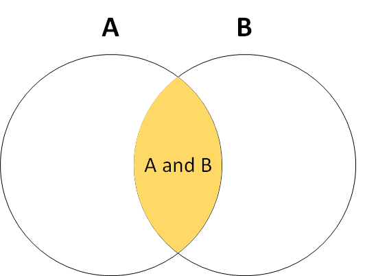
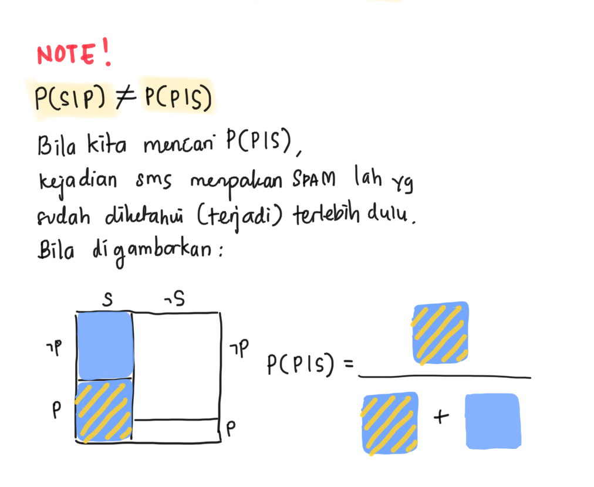
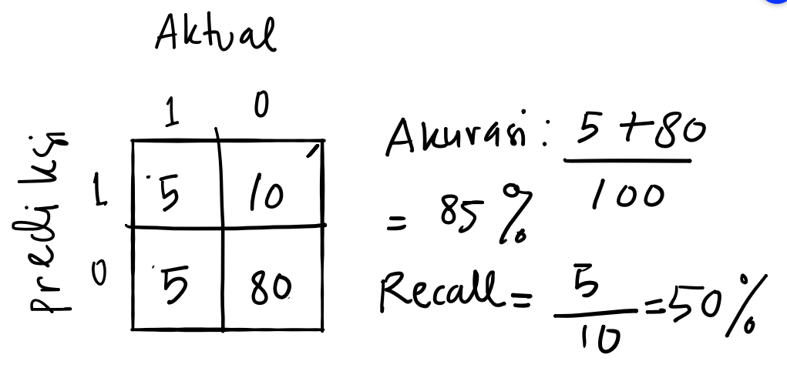
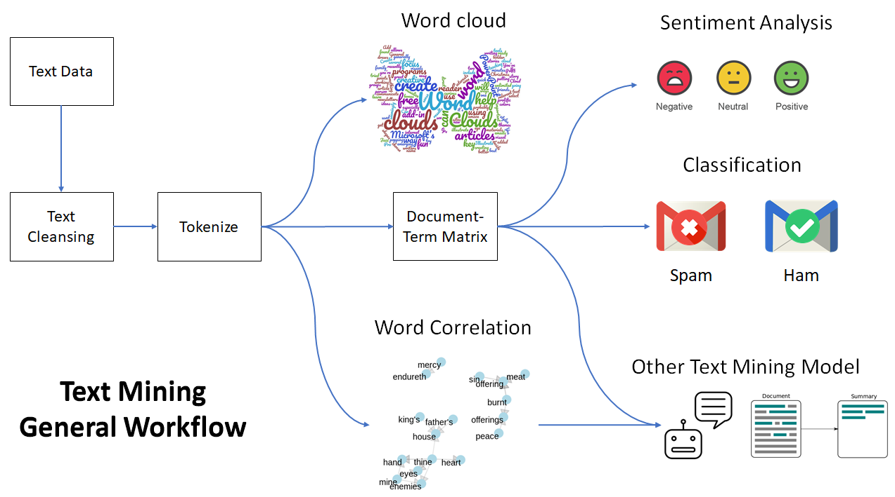
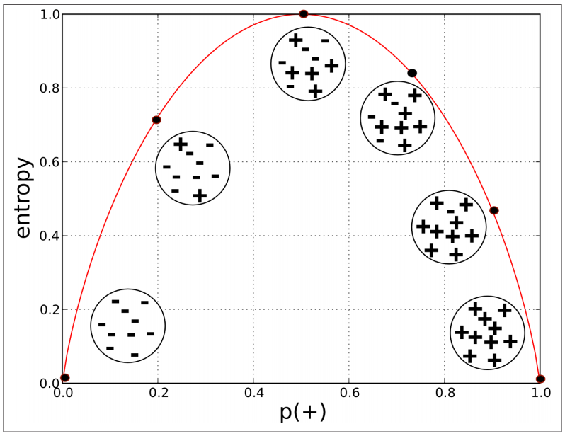
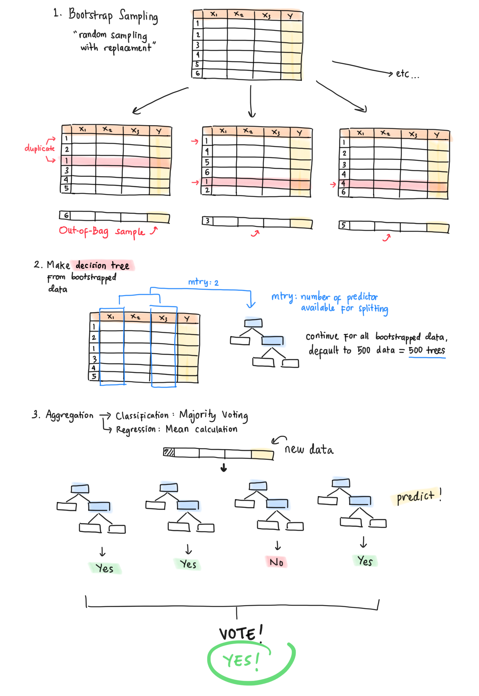
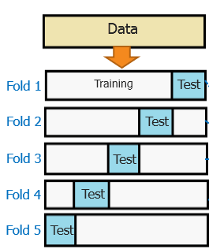

```{r setup, include=FALSE}
# clear-up the environment
rm(list = ls())

# chunk options
knitr::opts_chunk$set(
  message = FALSE,
  warning = FALSE,
  fig.align = "center",
  comment = "#>"
)

options(scipen = 999)
```

```{=html}
<style>
body {
text-align: justify}
</style>
```
# Mindmap

```{r, out.width = "100%", echo = FALSE, fig.align = "center"}
knitr::include_graphics("img/C2.png")
```

# 📑 Naive Bayes Classifier

Naive Bayes adalah suatu algoritma klasifikasi yang didasari oleh **Bayes' Theorem of Probability**. Faktanya, teorema Bayes amat sering digunakan pada kehidupan sehari-hari.

## 📌 Theory of Probability

Saat kita menghitung peluang 2 atau lebih kejadian terjadi bersamaan, kita dapat menghitungnya dengan 2 cara:

-   **Independent Event**: Peluang kejadian A tidak mempengaruhi peluang kejadian B. Contoh:

    -   Peluang dadu keluar angka 4 pada lemparan pertama **dan** peluang keluar angka 6 pada lemparan kedua
    -   Peluang saya menaiki busway ke kantor dan peluang terjadi banjir di Tangerang
    -   Peluang student Algoritma membeli jumpstart coffee dan peluang instruktor Algoritma membeli chicken karage

Peluang 2 kejadian independen yang dapat terjadi secara bersamaan adalah hasil perkalian peluang masing-masing kejadian tersebut.

$$P(A \cap B) = P(A) \times P(B)$$

```{r echo=FALSE, out.width="50%"}

```

**Contoh:**

Peluang dadu keluar angka 4 pada lemparan pertama = P(A) = 1/6 Peluang dadu keluar angka 4 pada lemparan kedua = P(B) = 1/6

$$P(A \cap B) = P(A) \times P(B) = \frac{1}{6} \times \frac{1}{6} = \frac{1}{36}$$ Jadi, peluang dadu keluar angka 4 pada lemparan pertama dan peluang keluar angka 6 pada lemparan kedua = 1/36

-   **Dependent Event**: Peluang kejadian A dipengaruhi oleh peluang kejadian B (informasi tentang kejadian B). Contoh:

    -   Peluang banjir di Jakarta **jika diketahui** peluang hujan deras di Bogor
    -   Peluang kelas Algoritma online jika diketahui PSBB diterapkan di Jakarta
    -   Peluang pelanggan memberi rating rendah jika diketahui terdapat kata "Buruk" pada form feedback

Untuk menghitung peluangnya, kita menggunakan **Bayes Theorem**:

```{r echo=FALSE, out.width="50%"}
knitr::include_graphics("img/venn.gif")
```

P(sakit perut\|pagi makan sambel)

$$P(A|B) = \frac{P(B|A) P(A)}{P(B|A) P(A)\ +\  P(B|\neg A) P(\neg A)}$$ $P(A|B)$ = Peluang terjadi A jika diketahui B telah terjadi.

$P(B|\neg A)$ = Peluang tidak terjadi A jika diketahui B telah terjadi.

$P(A)$ = Peluang terjadi A

$P(\neg A)$ = Peluang tidak terjadi A

**Study Case: SPAM Classifier**

Sebagai seorang analis di salah satu provider jaringan di Indonesia, fokus perusahaan saat ini tertuju pada banyaknya keluhan pelanggan terkait sms SPAM. Perusahaan khawatir apabila hal ini tidak ditangani, maka akan berpotensi menyebabkan terjadinya churn atau perpindahan pelanggan ke provider kompetitor karena pelanggan terganggu dengan SPAM tersebut.

Dikumpulkan sebanyak **1000 sms** yang diantaranya terapat **250 sms SPAM**. Dengan melakukan text mining, diketahui bahwa dari seluruh sms SPAM, terdapat **100 sms** dengan kata *Pinjaman* di dalamnya, dan hanya terdapat **30 sms** yang memiliki kata *Pinjaman* namun bukan merupakan SPAM.

Cika adalah seorang pelanggan dari provider tersebut. Bila Cika hari ini menerima sms dengan kata *Pinjaman* di dalamnya, apakah sms tersebut diperkirakan sebagai SPAM?

**Dicari:** Peluang sms termasuk **SPAM** jika diketahui terdapat kata **Pinjaman** di dalamnya

**Diketahui:**

$$\begin {matrix}
 & Spam & \neg Spam \\
\hline
Pinjam & 100 & 30 \\
\neg Pinjam & 150 & 720
\end{matrix}$$

Jika kita menggunakan rumus kejadian independen untuk menghitung peluang kejadian dependen, hasilnya akan terlalu optimistik:

$$ Peluang= \frac{250}{1000}\ \times \frac{130}{1000}\ = 0.0325 \ ?!? $$

Bila disimpulkan: sms yang terdapat kata *Pinjaman* di dalamnya bukan merupakan SPAM -- peluang termasuk SPAM amat kecil (=.=)

Mari kita hitung menggunakan rumus kejadian dependen:

$$ P(Spam\ |\ Pinjam) = \frac{P(Spam)\ P(Pinjam\ |\ Spam)}{P(Spam)\ P(Pinjam\ |\ Spam) + P(\neg Spam)\ P(Pinjam\ |\neg Spam)} $$

\[NOTES: Pahami intuisinya saja tidak apa-apa\]

```{r echo=FALSE, out.width="60%"}
knitr::include_graphics("img/bayes.PNG")
```

Kita cari satu per satu peluang yang dibutuhkan:

-   Peluang sms adalah SPAM: $P(Spam) = \frac{250}{1000} = 0.25$
-   Peluang muncul kata Pinjaman di sms SPAM: $P(Pinjam\ |\ Spam) = \frac{100}{250} = 0.4$
-   Peluang sms bukan SPAM: $P(\neg Spam) = 750/1000 = 0.75$
-   Peluang muncul kata Pinjaman di sms yang bukan SPAM: $P(Pinjam\ |\neg Spam) = \frac{30}{750} = 0.04$

Kita masukkan angka peluang yang sudah kita hitung:

$$P(Spam\ |\ Pinjam) = \frac{0.25 \times 0.4}{0.25 \times 0.4\ +\ 0.75 \times 0.04} = 0.7692$$

```{r}
(0.25*0.4)/((0.25*0.4)+(0.75*0.04))
```

Peluang sms yang diterima Cika adalah SPAM sebesar 0.7692. Apabila kita menentukan threshold treshold 0.5, kita bisa anggap bahwa sms tersebut adalah SPAM.

⚠️ **NOTE:**: $P(Spam\ |\ Pinjaman) \neq P(Pinjaman\ |\ Spam)$

```{r echo=FALSE, out.width="60%"}

```

#### (OPTIONAL) Penurunan Rumus Bayes Theorem

1.  Diketahui rumus joint probability untuk dependent event. Ilustrasi lihat animasi diagram venn pada tab pertama.

$$P(A|B) = \frac{P(A \cap B)}{P(B)}$$

2.  Event $A$ dan $B$ bisa ditukar, yang tadinya hipotesis menjadi evidence, begitupun sebaliknya:

$$P(B|A) = \frac{P(B \cap A)}{P(A)}$$

3.  $P(A \cap B) = P(B \cap A)$ karena sifatnya komutatif. Contoh: peluang muncul mata dadu 4 pada pelemparan pertama dan 6 pada pelemparan kedua **SAMA SAJA** dengan peluang muncul mata dadu 6 pada pelemparan kedua dan 4 pada pelemparan pertama. Maka dari itu, kedua persamaan di atas dapat dibentuk menjadi:

$$P(A \cap B) = P(A|B) \times P(B)$$

$$P(A \cap B) = P(B|A) \times P(A)$$

4.  Kedua persamaan di atas mengacu pada nilai $P(A \cap B)$ yang sama sehingga:

$$P(A|B) \times P(B) = P(B|A) \times P(A)$$

5.  Terakhir, pindahkan $P(B)$ ke ruas kanan persamaan:

$$P(A|B) = \frac{P(B|A) \times P(A)}{P(B)}$$ ## Naive Bayes

Naive Bayes adalah model machine learning yang memanfaatkan Bayes Theorem untuk melakukan klasifikasi. Hubungan antara prediktor dengan target variabel dianggap saling dependen. Namun, Naive Bayes mengasumsikan **tiap prediktor saling independen** (tidak berhubungan satu sama lain) dan **memiliki bobot yang sama** untuk menghasilkan prediksi--oleh karena itu dinamakan *"Naive"*. Hal ini untuk memudahkan kalkulasi dan mengurangi beban komputasi.

Secara umum, Naive Bayes dapat dibedakan berdasarkan tipe data predictornya:

1.  Bernoulli/Binomial NB: predictor kategorikal, 2 kelas (contoh case: Text Mining Spam Classifier)
2.  Multinomial NB: predictor kategorikal, multi kelas (contoh case: Market Analysis)
3.  Gaussian NB: predictor numerikal, asumsi distribusi normal (tidak dibahas pada course ini, silahkan mengacu pada [askalgo: C2](https://askalgo.netlify.app/#classification-2) pertanyaan nomor 4)

### **Study Case: Market Analysis** {.tabset}

**Business Question:** Sebagai seorang marketing analyst, kita ingin meningkatkan penjualan dengan menargetkan customer dengan karakteristik tertentu. Dari **400 customer** yang sudah kita prospek, kita dapatkan informasi tentang gender, umur, dan kategori gaji serta apakah dia membeli produk kita atau tidak.

-   Positive Class: membeli
-   Negative Class: tidak membeli

```{r, message=FALSE, warning=FALSE}
library(dplyr)

# read data Customer_Behaviour.csv
customer <- read.csv("data_input/Customer_Behaviour.csv", stringsAsFactors = T)
# cek data
head(customer)
```

Deskripsi data:

-   **Gender**: Jenis Kelamin (Male, Female)
-   **Age**: Range usia (\<30, 30-50, > 50)
-   **Estimated Salary**: Kategori Gaji Customer (Low, Medium, High)
-   **Purchased**: Apakah klien membeli produk kita atau tidak (Yes, No)

Apakah terdapat tipe data yang perlu diperbaiki? Tidak ada.

Klien kita berikutnya adalah Eca, seorang **wanita** berusia **24 tahun** dengan **gaji yang tinggi**. Berapa peluang Eca akan membeli produk kita?

Kita formulakan:

$$P(Purchase\ | Gender = Female\ \cap\ Age<30\ \cap\ Salary = High) = P(Purchase| A\ \cap\ B\ \cap\ C)$$ Untuk mempersingkat notasi, kita simbolkan kejadian $A, B, C$ (prediktornya) sebagai:

-   $A$: Gender = Female
-   $B$: Age \< 30
-   $C$: Salary = High

Sehingga:

$$P(Purchase| A\ \cap\ B\ \cap\ C) = \frac{P(Purchase) \ P(A\ \cap\ B\ \cap\ C\ |\ Purchase)}{P(Purchase) \ P(A\ \cap\ B\ \cap\ C\ |\ Purchase)\ + \ P(\neg Purchase) \ P(A\ \cap\ B\ \cap\ C\ |\ \neg Purchase)}$$

**Asumsi Independensi Antar Variable Prediktor**

Naive Bayes mengasumsikan bahwa tiap prediktor saling independen atau tidak berkaitan satu sama lain. Karena feature kita adalah $A\ \cap\ B\ \cap\ C$, dapat diubah menjadi seperti berikut:

$$P(A\ \cap\ B\ \cap\ C\ |\ Purchase) = P(A\ |\ Purchase)\ P(B\ |\ Purchase)\ P(C\ |\ Purchase)\ $$

Sehingga:

$$= \frac{P(Purchase) \ P(A\ |\ Purchase)\ P(B\ |\ Purchase)\ P(C\ |\ Purchase)}{P(Purchase) \ P(A\ |\ Purchase)\ P(B\ |\ Purchase)\ P(C\ |\ Purchase)\ +\ P(\neg Purchase) \ P(A\ |\neg Purchase)\ P(B\ |\neg Purchase)\ P(C\ |\neg Purchase)}$$

#### Perhitungan Manual

Kita cari satu per satu peluang yang dibutuhkan:

-   Peluang seseorang membeli produk kita ($P(Purchase)$)

```{r}
# table frekuensi
prop.table(table(customer$Purchased))
```

Jika dihitung dengan cara manual :

```{r}
p_yes <- 143/nrow(customer)
p_no <- 257/nrow(customer)
```

-   Table Frekuensi Gender vs Purchase

```{r}
table("Gender" = customer$Gender, "Purchased" = customer$Purchased)
```

a.  Peluang seseorang adalah **wanita** ($A$) jika diketahui dia membeli produk kita ($P(A\ |\ Purchase)$)

```{r}
p_female_yes <- 77/(77+66)
```

b.  Peluang seseorang adalah **wanita** ($A$) jika diketahui dia tidak membeli produk kita ($P(A\ |\neg Purchase)$)

```{r}
p_female_no <- 127/(127+130)
```

-   Tabel Frekuensi Age vs Purchase

```{r}
table("Age" = customer$Age, "Purchased" = customer$Purchased)
```

a.  Peluang seseorang berumur \< 30 ($B$) jika diketahui dia membeli produk kita ($P(B\ |\ Purchase)$)

```{r}
p_30_yes <- 4/(4+45+94)
```

b.  Peluang seseorang berumur \< 30 ($B$) jika diketahui dia tidak membeli produk kita ($P(B\ |\neg Purchase)$)

```{r}
p_30_no <- 96/(96+4+157)
```

-   Tabel Frekuensi Salary vs Purchase

```{r}
table("Salary" = customer$Salary, "Purchased" = customer$Purchased)
```

a.  Peluang seseorang salary tinggi ($C$) jika diketahui dia membeli produk kita ($P(C\ |\ Purchase)$)

```{r}
p_high_yes <- 75/(75+39+29)
```

b.  Peluang seseorang salary tinggi ($C$) jika diketahui dia tidak membeli produk kita ($P(C\ |\neg Purchase)$)

```{r}
p_high_no <- 19/(19+56+182)
```

Kita kembali pada perhitungan peluang Eca purchase ketika diketahui kondisi-kondisinya:

$$= \frac{P(Purchase) \ P(A\ |\ Purchase)\ P(B\ |\ Purchase)\ P(C\ |\ Purchase)}{P(Purchase) \ P(A\ |\ Purchase)\ P(B\ |\ Purchase)\ P(C\ |\ Purchase)\ +\ P(\neg Purchase) \ P(A\ |\neg Purchase)\ P(B\ |\neg Purchase)\ P(C\ |\neg Purchase)}$$

```{r}
(p_yes*p_female_yes*p_30_yes*p_high_yes)/((p_yes*p_female_yes*p_30_yes*p_high_yes)+
                                            p_no*p_female_no*p_30_no*p_high_no)

```

Kesimpulan: Karena probability Eca untuk membeli produk sama dengan 0.24, apabila threshold pengambilan keputusan kita untuk mengklasifikasi Eca membeli atau tidak yaitu 0.5, artinya Eca tidak akan membeli.

Strategi apa yang harus dipersiapkan?

-   memberikan promo/cashback
-   menawarkan produk yang sesuai dengan personality Eca

#### `naiveBayes()` function

Pada R kita dapat menggunakan function `naiveBayes()` dari package `e1071` untuk membuat model Naive Bayes.

Terdapat 2 cara dalam membuat model menggunakan function `naiveBayes()` :

1.  Menggunakan argumen `naiveBayes(formula, data)`

-   `formula`: formula y\~x, dimana y: target variabel, x: prediktor variabel
-   `data`: data yang digunakan untuk target dan prediktor variabel

2.  Menggunakan argumen `naiveBayes(x, y)`

-   `x`: prediktor variabel dari data yang digunakan
-   `y`: target variabel dari data yang digunakan

```{r}
# install.packages("e1071")
library(e1071)

# Train Model
model_customer <- naiveBayes(formula = Purchased~., data = customer)
  
# check model
model_customer
```

Output dari `naiveBayes()`:

-   A-priori probability : nilai probability dari target variabel (proporsi target variabel)
-   Conditional probabilities : nilai probability untuk masing-masing variabel target terhadap variabel prediktor

```{r}
(0.3575*0.5384615*0.02797203*0.52447552)/((0.3575*0.5384615*0.02797203*0.52447552)+
                                            (0.6425*0.4941634*0.37354086*0.07392996))
```

Model Naive Bayes menyimpan informasi tentang nilai peluang dependen antara target dengan setiap feature. Kita bisa periksa nilainya dengan perhitungan manual.

-   `margin`: perhitungan proporsi berdasarkan 1 = baris, 2 = kolom

```{r}
prop.table(table(Gender = customer$Gender, Purchased = customer$Purchased),
           margin = 2) # penghitungan proporsi per baris
```

Prediksi wanita dengan gaji tinggi dan berusia di bawah 30 tahun. `type = raw` mengembalikan nilai peluang kelasnya. `type = class` mengembalikan nilai prediksi kelasnya, default function `predict()` dalam model Naive Bayes.

Parameter `type`:

-   `type = "raw"` mengembalikan nilai peluang untuk masing-masing kelas
-   `type = "class"` mengembalikan label kelasnya (default threshold 0.5)

```{r}

eca <- data.frame(Gender = "Female", 
                    Age = "< 30",
                    Salary = "High")
# predict probability
pred_eca_proba <- predict(object = model_customer, newdata = eca, type = "raw")
pred_eca_proba

# predict class
pred_eca_class <- predict(object = model_customer, newdata = eca, type = "class")
pred_eca_class

```

💡 **IMPORTANT POINTS**

-   Naive Bayes mengklasifikasi berdasarkan peluang dependen antara prediktor dengan target variabel

-   Naive Bayes mengasumsikan:

    -   setiap prediktor memiliki bobot yang sama (sama-sama dianggap penting)
    -   antar prediktor saling independen

-   Kelebihan:

    -   waktu training model lebih cepat dikarenakan asumsi setiap prediktor memiliki bobot yang sama
    -   model naive bayes biasanya dijadikan sebagai *base classifier* atau benchmark model untuk acuan pembanding model yang lebih kompleks

## Laplace Smoothing

Pada beberapa kasus, dapat terjadi data scarcity dimana *salah satu prediktor memiliki nilai yang tidak ada sama sekali di salah satu kelas*. Misalnya kita modifikasi dari data Customer Behaviour sebelumnya, pada golongan orang-orang yang *Purchase* sama sekali tidak ada yang berjenis kelamin wanita sehingga table frekuensinya menjadi sebagai berikut:

```{r echo=FALSE}
matrix(c(127, 130, 0, 143), nrow = 2, dimnames = list(c("Female", "Male"), c("No Purchase", "Purchase")))
```

Apabila tabel frekuensi untuk prediktor lainnya tetap sama, maka peluang Eca sebagai **wanita** dengan **usia \< 30** dengan **gaji tinggi** untuk membeli produk:

$$P(Purchase\ |\ Age <30 \ \cap\ Gender = Female\ \cap\ Salary = High ) \\
= \frac{\frac{143}{143+257}\ \frac{4}{4+45+94}\ \frac{0}{0+143}\ \frac{75}{75+39+29}}
{\frac{143}{143+257}\ \frac{4}{4+45+94}\ \frac{0}{0+143}\ \frac{75}{75+39+29} + \frac{257}{143+257}\ \frac{96}{96+4+157}\ \frac{127}{127+130}\ \frac{19}{19+56+182}} = 0$$

Karena terdapat pembilang yang memiliki nilai 0, maka peluangnya akan langsung menjadi **0**.

Ini adalah karakteristik kedua dari Naive Bayes: **Skewness Due To Scarcity**. Ketika terdapat *suatu prediktor yang frekuensi nilainya 0 untuk salah satu kelas* (pada kasus ini `0 Female` untuk `Purchase = Yes`), maka *model secara otomatis memprediksi bahwa peluangya adalah 0 untuk kondisi tersebut, tanpa memperdulikan nilai dari prediktor yang lainnya*. Alhasil, model akan secara otomatis memprediksi peluang = 0 (tidak beli) bila customer adalah wanita, dan otomatis memprediksi peluang = 1 (beli) bila customer adalah pria. Model menjadi bias atau kurang akurat dalam melakukan prediksi.

Apa yang harus kita lakukan jika menemukan fenomena tersebut?

-   **Strategi 1: Menghilangkan prediktor yang bermasalah**

Prediktor yang bermasalah bisa dihilangkan atau tidak digunakan untuk pembuatan model. Namun, cara ini mungkin kurang tepat karena bisa saja feature tersebut memang punya pengaruh besar terhadap hasil prediksi, sehingga ketika dihilangkan maka hasil prediksi justru kurang baik.

-   **Strategi 2: Menggunakan Laplace Smoothing**

Solusi alternatifnya adalah Laplace Smoothing yaitu *menambahkan frekuensi dari setiap prediktor sebanyak angka tertentu (biasanya 1)*, sehingga tidak ada prediktor yang memiliki nilai 0 dan harus dibuang.

**Tabel Frekuensi Gender**

$$\begin {matrix}
 & Purchase & No\ Purchase \\
\hline
Female & 127+1 & 0+1 \\
Male & 130+1 & 143+1
\end{matrix}$$

**Tabel Frekuensi Age**

$$\begin {matrix}
 & Purchase & No\ Purchase \\
\hline
<30 & 96+1 & 4+1 \\
>50 & 4+1 & 45+1 \\
30-50 & 157+1 & 94+1
\end{matrix}$$ **Tabel Frekuensi Salary**

$$\begin {matrix}
 & Purchase & No\ Purchase \\
\hline
Salary\ High & 19+1 & 75+1 \\
Salary\ Low & 56+1 & 39+1 \\
Salary\ Medium & 182+1 & 29+1
\end{matrix}$$

Jika kita kembali menghitung peluang Eca untuk membeli produk kita dari persamaan sebelumnya:

$$P(Purchase\ |\ Age <30 \ \cap\ Gender = Female\ \cap\ Salary = High ) \\
= \frac{\frac{144}{144+258}\ \frac{5}{5+46+95}\ \frac{1}{1+144}\ \frac{76}{76+40+30}}
{\frac{144}{144+258}\ \frac{5}{5+46+95}\ \frac{1}{1+144}\ \frac{76}{76+40+30} + \frac{258}{144+258}\ \frac{97}{97+5+158}\ \frac{128}{128+131}\ \frac{20}{20+57+183}} = 0.0048$$

```{r}
((144/(144+258))*(5/(5+46+95))*(1/(1+144))*(76/(76+40+30)))/
  ((144/(144+258))*(5/(5+46+95))*(1/(1+144))*(76/(76+40+30)) +
     (258/(144+258))*(97/(97+5+158))*(128/(128+131))*(20/(20+57+183)))
```

```{r}
# pembilang <- ((144/(144+258))*(5/(5+46+95))*(1/(1+144))*(76/(76+40+30)))
# penyebut <- ((144/(144+258))*(5/(5+46+95))*(1/(1+144))*(76/(76+40+30)) +
#      (258/(144+258))*(97/(97+5+158))*(128/(128+131))*(20/(20+57+183)))
# pembilang/penyebut
```

Meskipun peluangnya masih sangat kecil, tetapi setidaknya dengan metode Laplace Smoothing bisa memastikan model tidak terlalu ekstrim dalam menentukan nilai target serta tetap dapat mempertimbangkan nilai peluang dari prediktor lainnya.

Menggunakan Laplace Smoothing pada model sebelumnya cukup menambahkan argumen `laplace = 1`, artinya kita menambahkan 1 untuk setiap frekuensi nilai prediktor yang ada.

```{r eval=FALSE}
# pembuatan mdoel naiveBayes menggunakan laplace
model_customer2 <- naiveBayes(formula = Purchased~., data = customer, laplace = 1)

```

💡 **IMPORTANT POINTS**

-   Kekurangan Naive Bayes: **skewness due to data scarcity** yaitu timbul bias dalam memprediksi dikarenakan ada salah satu kejadian yang tidak muncul dalam data kita

-   **Laplace Smoothing** merupakan menambahkan nilai tertentu pada setiap prediktor dan kategorinya supaya tidak ada kondisi probability = 0 untuk melakukan *tunning model* dalam mengatasi kondisi skewness due to data scarcity

## 🧠 DIVE DEEPER: Party Affiliation

Kita akan coba menganalisis data dari **United States Congressional Voting tahun 1984**. Data berisi informasi tentang hasil voting atau dukungan dari masing-masing anggota kongres dangan affiliasi partai yang berbeda (republican/democrat) terhadap berbagai isu atau kebijakan negara.

**Business Question:** Ingin dilakukan klasifikasi apakah seseorang cenderung berafiliasi dengan partai republican/democrat.

-   Positive Class: either
-   Negative Class: either

### Read Data

Read data `votes.txt` dengan `header = F` agar observasi pertama tidak dianggap sebagai header atau nama kolom.

```{r}
# read data
party <- read.csv("data_input/votes.txt", header = F, stringsAsFactors = T)
# cek data
head(party)
```

### Data Wrangling

Ubah nama kolom menggunakan ketentuan berikut:

```{r}
names(party) <- c("party",
                  "hcapped_infants",
                  "watercost_sharing",
                  "adoption_budget_reso",
                  "physfee_freeze",
                  "elsalvador_aid",
                  "religious_grps",
                  "antisatellite_ban",
                  "nicaraguan_contras",
                  "mxmissile",
                  "immigration",
                  "synfuels_cutback",
                  "education_funding",
                  "superfundright_sue",
                  "crime",
                  "dutyfree_exps",
                  "expadmin_southafr"
                  )

# cek data
head(party)
```

Keterangan:

-   y = yes (setuju)
-   n = no (tidak setuju)
-   ? = tidak vote

Adakah tipe data yang perlu diperbaiki? Tidak ada yang perlu diperbaiki

### Cross-Validation

Split datanya menjadi data training dan data testing, dengan 75% data akan digunakan sebagai data training.

```{r}
RNGkind(sample.kind = "Rounding")
set.seed(100)
intrain <- sample(nrow(party), nrow(party)*0.75)
party_train <- party[intrain, ]
party_test <- party[-intrain, ]
```

Cek proporsi kelas target:

```{r}
prop.table(table(party_train$party))
```

### Model Fitting

Dalam model fitting, kita akan mencoba memodelkan menggunakan Naive Bayes tanpa melakukan tunning model.

```{r}
model_party <- naiveBayes(formula = party ~ ., data = party_train, laplace = 1)

```

Model Interpretation

```{r}
model_party
```

Kita bisa menginterpretasikan masing-masing prediktor dari hasil perhitungan peluang dependennya dengan variabel target. Contoh:

-   peluang anggota kongres berafiliasi dengan partai republican saat ia tidak menyetujui kebijakan `hcapped_infants` adalah 0.80597015
-   peluang anggota kongres berafiliasi dengan partai demokrat saat ia menyetujui kebijakan `adoption_budget_reso` adalah 0.86868687

### Model Prediction

Prediksi **kelas** dari data test dengan function `predict()`, masukan ke dalam objek `party_predClass`:

```{r}
# predict
party_predClass <- predict(object = model_party, newdata = party_test, type = "class")
head(party_predClass)
```

### Model Evaluation

Evaluasi model dengan confusion matrix:

```{r}
library(caret)
confusionMatrix(data = party_predClass, reference = party_test$party, positive = "democrat")
```

Metrics mana yang ingin diunggulkan?

> Memilih accuracy karena pada kondisi ini, kita tidak mengunggulkan dari salah satu partai apapun, sehingga kita ingin model yang kita buat dapat memprediksi kedua kelas dengan baik.

```{r echo=FALSE, out.width="80%"}

```

Ketika kita menggunakan metric accuracy, hal ini akan sangat tepat dipilih ketika data yang kita miliki balance, karena accuracy akan memperhitungkan setiap TP dan TN yang berhasil ditebak oleh model. Namun, ketika data kita imbalance, dan kita ingin melihat seberapa baik model yang kita miliki dalam membedakan kelas Positive dan Negative, kita bisa menggunakan metric ROC(Receiver-Operating Curve) dan AUC(Area Under Curve).

# ROC and AUC

**ROC** dan **AUC** adalah tools evaluasi lain setelah Confusion Matrix, untuk mengevaluasi kebaikan model dalam mengklasifikasi kedua kelas (kelas positif & kelas negatif) dengan baik.

## Receiver-Operating Curve (ROC)

**Receiver-Operating Curve (ROC)** memplotkan hubungan antara True Positive Rate (Sensitivity atau Recall) dengan False Positive Rate (1-Specificity). Model yang baik idealnya memiliki **True Positive Rate yang tinggi dan False Positive Rate yang rendah**.

**Intuisi Imbalance Class**

```{r echo=FALSE, out.width="80%"}
knitr::include_graphics("img/roc-animation.gif")
```

Mari kita buat kurva ROC dari model `model_party`:

```{r}
# ambil hasil prediksi probability
pred_partyProb <- predict(model_party, newdata = party_test, type = "raw")
```

Siapkan data frame untuk ROC (sebenarnya opsional, namun akan mempermudah). Kita asumsi kelas positifnya adalah "democrat".

```{r}
# siapkan data frame untuk ROC
df_roc_party <- data.frame(prob = pred_partyProb[,1], # subset probability prediction untuk democrat
                           label = as.numeric(party_test$party == "democrat")) # data actual label untuk kelas positive democrat, 0 = republican, 1 = democrat
df_roc_party
```

Kita dapat buat ROC dengan menyiapkan objek `prediction()`:

```{r message=FALSE}
# install.packages("ROCR", dependencies = T)
library(ROCR)

# buat objek prediction
prediction_roc_party <- prediction(predictions = df_roc_party$prob, # mengambil kolom prediksi prob
                                  labels = df_roc_party$label) # mengambil label dari kelas target

# buat plot dari objek prediction
plot(performance(prediction.obj = prediction_roc_party, 
                 measure = "tpr", # nilai true positive rate (y axis)
                 x.measure = "fpr")) # nilai false positive rate (x axis)
```

-   TPR: dari seluruh anggota yang actualnya Democrat, berapa persen model kita mengklasifikasi dengan benar (tetap diprediksi sebagai Democrat)?

-   FPR: dari seluruh anggota yang actualnya Republik, berapa persen model kita salah mengklasifikasi (diprediksi jadi Democrat)?

-   Model yang buruk adalah yang menghasilkan garis diagonal pada plot -> model hanya baik memprediksi salah satu kelas.

## Area Under ROC Curve (AUC)

AUC menunjukkan luas area di bawah kurva ROC. **Semakin mendekati 1**, semakin bagus performa modelnya. Untuk mendapatkan nilai AUC, tulis `auc` pada parameter `measure` dari `performance()` dan ambil nilai `y.values`.

```{r}
auc_party <- performance(prediction.obj = prediction_roc_party, measure = "auc")
auc_party@y.values
```

Nilai AUC dari model Naive Bayes mendekati 1, artinya model kita mampu mengklasifikasikan kelas positif dan kelas negatif dengan baik.

💡 **Important Notes**:

ROC & AUC sebagai tools tambahan untuk menentukan kebaikan model mengklasifiksaikan kelas positif maupun kelas negatif:

-   diinginkan kurva yang seperti huruf L terbalik atau membentuk garis tegak lurus dimana nilai TPR tinggi dan FPR rendah
-   diinginkan AUC yang mendekati angka 1, tidak diinginkan AUC yang mendekati 0.5.

# 📝 Summary Day 1

-   Naive bayes merupakan metode klasifikasi dimana menggunakan konsep Bayes Theorem.

-   Naive bayes menganggap semua prediktor sama penting (semua prediktor independen)

-   Komputasi modelnya lebih ringan karena melakukan perhitungan probability setiap kejadian

-   kekurangan naive bayes sensitive terhadap ketidak munculan kondisi pada data (*skewness due to data scracity*)

-   Cara mengatasi kekurangan naive bayes :

    -   bisa menambahkan 1 angka pada parameter `laplace = 1`
    -   bisa menghilangkan variabel prediktor yang terindikasi tidak terdapat kejadian yang ada

-   ROC dan AUC sebagai alat evaluasi model:

    -   ROC adalah kurva yang menggambarkan TPR vs FPR untuk setiap threshold, sedangkan AUC adalah luas area di bawah kurva ROC.
    -   Semakin cembung kurva ROC (artinya, AUC mendekati nilai satu), semakin baik model dalam memisahkan kelas positif dan negatif.
    -   Model yang **baik** memiliki nilai **AUC mendekati 1**, sedangkan model yang **tidak baik** memiliki nilai **AUC mendekati 0.5**.

<center>

**---\[End of Day 1\]---**

</center>

<center>

**---\[Start of Day2\]---**

<center>

# 📑 Text Mining

Text Mining adalah salah satu metode analisis data yang fokus utamanya adalah mencari informasi dan pola-pola dari data yang **tidak terstruktur, yaitu data teks**. Data teks disebut tidak terstruktur karena:

-   Satu kalimat terdiri dari beberapa kata yang jumlahnya berbeda-beda tiap kalimat.
-   Adanya *typo* (salah ketik), penyingkatan kata (you menjadi u), ataupun simbol-simbol tidak bermakna sehingga perlu dilakukan cleansing.
-   Adanya perbedaan bahasa yang digunakan sehingga perlu mencari kosa kata yang cocok.

Berikut ilustrasi workflow dari text mining:

```{r echo=FALSE, out.width="100%"}

```

## Study Case: Spam Classifier

**Business Question:** Berdasarkan kata-kata pada SMS, kita ingin melakukan klasifikasi apakah suatu SMS termasuk spam atau bukan (ham)?

-   Kelas positif: spam
-   Kelas negatif: ham (not spam)

## Read Data

```{r}
sms_raw <- read.csv("data_input/spam.csv",
                    stringsAsFactors = FALSE,
                    encoding = "UTF-8")
str(sms_raw)
```

## Data Wrangling

**Dive Deeper**

*Est. time 5 minutes*

Adakah kolom yang tidak berguna? Adakah kolom yang tipe datanya perlu diperbaiki?

1.  Hapus 3 kolom terakhir yang tidak memiliki nilai dan informasi
2.  Gantilah nama kolom pertama menjadi "label" dan kolom kedua menjadi "text". Jangan lupa simpan perubahannya pada object dataframe `sms` kembali.\
3.  Berapa banyak proporsi sms "spam" pada data `sms`?
4.  Apakah kolom `label` sudah dalam bentuk factor? Jika belum, ubahlah dalam tipe data factor yang menyimpan 2 levels nilai kategori.

```{r}
# your code here
# Pak Sunarto
sms <- sms_raw %>% select(v1, v2) 
names(sms)[1] <- "label" 
names(sms)[2] <- "text" 
# proporsi target variabel
prop.table(table(sms$label)) 

sms$label <- as.factor(sms$label) 
head(sms)
```

## Exploratory Data Analysis (EDA)

Silahkan ambil 5 sample text yang termasuk spam, kemudian amati kata-kata apa saja yang dapat menjadi indikator (prediktor) bahwa suatu text adalah spam?

```{r}
# your code here
sms %>% 
  filter(label == "spam") %>% 
  head(5)
```

Kata yang berpotensial mengindikasi bahwa suatu text adalah spam: free, prize, claim, win, phone number

## Data Preprocessing

Data text (raw) perlu dibersihkan terlebih dahulu (text cleansing) sebelum pembuatan model. Text dapat diubah menjadi format `corpus` kemudian kita bersihkan.

### Text to Corpus

**Corpus** adalah kumpulan dari dokumen. Pada kasus ini, satu dokumen ekuivalen dengan satu observasi SMS. Di dalam satu SMS bisa terdapat satu atau lebih kalimat.

Salah satu package yang bisa kita gunakan untuk text mining adalah `tm`. Pengubahan dari vector text menjadi corpus bisa dilakukan menggunakan function `VCorpus()`

```{r}
# install.packages("tm")
library(tm)

# ubah format menjadi corpus
sms_corpus <- VCorpus(VectorSource(sms$text))
```

Untuk selanjutnya mari kita inspect content SMS ke-9:

```{r}
# cek content ke-9
sms_corpus[[9]]$content
```

### Text Cleansing

Dalam text cleansing ini, kita akan coba lakukan beberapa proses cleansing, sbb:

-   `tolower` : Mengubah semua huruf kapital menjadi huruf kecil

```{r}
dat <- c("Algoritma ALGORITMA ALGOritma")
dat <- dat %>% 
  VectorSource() %>% 
  VCorpus() %>% 
  tm_map(content_transformer(tolower))

dat[[1]]$content
```

```{r}
# case-folding: mengubah semua text menjadi lowercase
sms_corpus_clean <- sms_corpus %>% 
  tm_map(content_transformer(tolower))
sms_corpus_clean[[9]]$content
```

-   `removeNumbers()` : Menghapus angka

```{r}
dat_num <- "324algoritma81919" %>% 
  VectorSource() %>% 
  VCorpus() %>% 
  tm_map(removeNumbers)
dat_num[[1]]$content
```

```{r}
# remove numbers: menghapus angka
sms_corpus_clean <- sms_corpus_clean %>% 
  tm_map(removeNumbers)

sms_corpus_clean[[9]]$content
```

-   `removeWords()` : Menghilangkan kata-kata umum yang kurang bermakna (stopwords)

```{r}
dat_stop <- "Return various kinds of stopwords with support for different languages" %>% 
  VectorSource() %>% 
  VCorpus() %>% 
  tm_map(removeWords, stopwords("english"))
dat_stop[[1]]$content
```

```{r}
# remove stopwords: menghapus kata yang sering muncul di corpus dan biasanya tidak meaningful

```

**Notes**: apabila ingin melakukan penghapusan stopwords pada teks bahasa Indonesia dapat menggunakan package [`katadasaR`](https://github.com/nurandi/katadasaR)

-   `removePunctuation()` : Menghilangkan tanda baca

Untuk menghilangkan semua tanda baca (punctuation), gunakan `removePunctuation()`. Tanda baca yang dihilangkan: ! ' \# S % & ' ( ) \* + , - . / : ; \< = \> ? \@ \[ / \] \^ \_ { \| } \~

```{r}
dat_pc <- ("algo??\\ritma!!@$&^*+") %>% 
  VectorSource() %>% 
  VCorpus() %>% 
  tm_map(removePunctuation)

dat_pc[[1]]$content
```

Untuk menghilangkan/me-replace karakter tertentu, kita dapat membuat function DIY.

```{r}
# function DIY
transformer <- content_transformer(FUN = function(x, pattern){
 gsub(x = x, 
      pattern = pattern, 
      replacement = " ") 
})
```

```{r}
# replace ".", "/", "@", "-" with a white space

# remove all punctuation, but without white space (dari package tm)


# cek content ke-9
```

-   `stemDocument()` : Menghapus kata-kata imbuhan yang kurang bermakna atau pemotongan kata menjadi kata dasarnya. Misalnya *walking*, *walked*, *walks* menjadi *walk*.

**mengubah kata dasar**

```{r}
stemDocument(c("do", "doing", "kiss", "kisses", "kissing", "playing"))
```

`stemDocument()` akan menghapus imbuhan kata "ing", "e", "ed", "er", "s", "es", dll

Mengapa kata imbuhan dihapuskan? Karena yang dibutuhkan dalam text mining ini adalah mendapatkan beberapa kata-kata yang muncul atau tidak muncul dalam suatu sekumpulan text dimana kata-kata tersebut akan digunakan sebagai prediktor untuk memprediksi apakah sms masuk kedalam "spam" atau "ham".

```{r}
tes <- "updating update updated" %>% 
  VectorSource() %>% 
  VCorpus() %>% 
  tm_map(stemDocument)

tes[[1]]$content
```

```{r}
# lakukan instalasi package: SnowballC
# stemming


# cek content ke-9 

```

**Note:** Stemming hanya melakukan pemotongan kata, apabila ingin lebih akurat kita dapat menggunakan teknik lemmatizing (lookup kata sebenarnya sesuai kaidah bahasa, contoh: receiving -> receive). Namun trade-offnya, komputasi lemmatizing lebih lama dibandingkan stemming. Silahkan mengacu pada referensi untuk penggunaan lemmatizing.

-   `stripWhitespace()` : Menghapus spasi berlebih (white space)

Terakhir, kita melakukan remove space yang berlebihan "\_\_*" karena proses tokenizing dan pembuatan document-term-matrix akan memotong kata perkata dengan separator spasi "*",

```{r}
dat_space <- "algo data      science" %>% 
  VectorSource() %>% 
  VCorpus() %>% 
  tm_map(stripWhitespace)
dat_space[[1]]$content
```

```{r}
# remove white space
sms_corpus_clean <- sms_corpus_clean %>% 
  tm_map(removePunctuation) %>% # menghapus tanda baca
  tm_map(removeWords, stopwords("english")) %>% # menghapus kata hubung
  tm_map(stemDocument) %>% # mengubah menjadi kata aslinya
  tm_map(stripWhitespace) # menghapus spasi berlebih

sms_corpus[[9]]$content
sms_corpus_clean[[9]]$content
```

Summary singkat, secara umum tahapan yang sering dilakukan untuk text cleansing adalah:

-   Case-folding -> mengganti setiap penulisan kata menjadi seragam, dalam kasus kita kita ubah menjadi huruf kecil semua
-   Remove numbers -> menghapus angka yang ada teks
-   Remove stopwords -> menghapus kata hubung yang kurang bermakna
-   Remove punctuation -> menghapus tanda baca
-   Stemming -> menghapus kata imbuhan agar menjadi kata dasarnya, contoh, kata updated -> updat, playing - \> play
-   Remove white space -> menghapus spasi berlebih

### Document-Term Matrix (DTM)

Sampai di tahap ini, data kita masih berupa text. Pertanyaannya bagaimana cara model kita belajar apabila prediktornya masih berupa text?

Kita perlu melakukan transformasi data text menjadi **Document-Term Matrix (DTM)** melalu proses tokenization. **Tokenization** adalah proses memecah satu kalimat menjadi beberapa *term* (bisa berupa 1 kata, pasangan kata, dll). Dalam DTM, 1 kata akan menjadi 1 prediktor dengan nilai berupa frekuensi kemunculan kata tersebut dalam sebuah dokumen.

```{r}
# ubah menjadi DTM
sms_dtm <- DocumentTermMatrix(sms_corpus_clean)
inspect(sms_dtm)
```

```{r}
sms_corpus_clean[[1085]]$content
```

Istilah:

-   documents: SMS
-   terms: kata yang unique di seluruh SMS kita
-   non-sparse: nilai yang bukan 0 pada matrix
-   sparse: nilai yang 0 pada matrix

Mari kita amati SMS ke 1085 yang sudah di-cleansing, kemudian dapat kita konfirmasi bahwa kata "will" muncul sebanyak 12 kali:

```{r}

```

## Cross-Validation

Splitting data menjadi `sms_train` dan `sms_test` dengan perbandingan 75-25.

```{r}
RNGkind(sample.kind = "Rounding")
set.seed(100)
# melakukan splitting berdasarkan sms_dtm
intrain <- sample(nrow(sms_dtm), nrow(sms_dtm)*0.75)
# train-test splitting
sms_train <- sms_dtm[intrain,]
sms_test <- sms_dtm[-intrain,]
```

Siapkan juga label untuk targetnya:

```{r}
# label untuk train dan test, tersimpan pada dataframe sms
label_train <- sms[intrain, "label"]
label_test <- sms[-intrain, "label"]
```

Cek proporsi kelas target pada `label_train` dan `label_test`:

```{r}
prop.table(table(label_train))
prop.table(table(label_test))
```

Note Penting: Pada kasus ini memang SMS kita cukup imbalance. Namun pada tahap ini kita ingin melihat perfoma model tanpa dilakukannya balancing.

## Further Data Preprocessing

### Remove Infrequent Words

Cek dimensi `sms_train` yang akan digunakan untuk pembuatan model:

```{r}
dim(sms_train)
```

Predictor kita sangat banyak, mencapai 6822 Mari kita kurangi noise pada data kita dengan mengambil kata-kata yang cukup sering muncul, misalnya minimal 20 kali dalam keseluruhan SMS. Gunakan function `findFreqTerms()`:

```{r}
# sms_train dari sms_dtm
sms_freq <- findFreqTerms(x = sms_train, lowfreq = 20)
```

**Note:** Penentuan `lowfreq = 20` tidak mutlak dan dapat diubah-ubah untuk *feature selection*. Perlu diketahui: Semakin besar `lowfreq`, semakin sedikit terms yang kita gunakan sebagai feature/predictor.

Mari subset data `sms_train` hanya untuk kata-kata yang muncul di `sms_freq`:

```{r}
sms_train <- sms_train[, sms_freq]
dim(sms_train)
```

### Bernoulli Converter

Nilai pada matrix `sms_train` masih berupa frekuensi. Untuk perhitungan peluang, frekuensi akan diubah menjadi hanya kondisi muncul (1) atau tidak (0). Salah satu caranya dengan menggunakan **Bernoulli Converter**.

-   Jika frekuensi > 0, maka bernilai 1 (muncul)
-   Jika frekuensi == 0, maka bernilai 0 (tidak muncul)

```{r}
bernoulli_conv <- function(x){
  # parameter ifelse: kondisi, TRUE, FALSE
  x <- as.factor(ifelse(x > 0, 1, 0)) 
  return(x)
}

# testing fungsi
bernoulli_conv(c(3,0,0,1,4,0))
```

Selanjutnya, terapkan `bernoulli_conv` ke `sms_train` dan `sms_test`:

```{r}
sms_train_bn <- apply(sms_train, MARGIN = 2, FUN = bernoulli_conv)
sms_test_bn <- apply(sms_test, MARGIN = 2, FUN = bernoulli_conv)
```

-   MARGIN = 1 -> mengaplikasikan FUN by baris
-   MARGIN = 2 -> mengaplikasikan FUN by kolom, karena kita ingin tetap matrix berupa DocumentTermMatrix

Mari cek hasilnya:

```{r}
sms_train_bn[4:10, 50:55]
```

## Model Fitting

Membuat model Naive Bayes dengan `sms_train_bn` yang sudah siap:

```{r}
# train
model_spam <- naiveBayes(x = sms_train_bn, y = label_train, laplace = 1)
```

## Model Prediction

Prediksi kelas target pada `sms_test_bn`. Simpan ke objek `sms_pred_class`, akan digunakan untuk mengevaluasi dengan confusion matrix.

```{r}
# predict
sms_pred_class <- predict(object = model_spam, newdata = sms_test_bn, type = "class")
```

## Model Evaluation

### Confusion Matrix

Evaluasi model `model_spam` menggunakan confusion matrix dan metric-metric yang ada:

```{r}
confusionMatrix(data = sms_pred_class, reference = label_test, positive = "spam")
```

Kasus mana yang ingin kita minimalisir: - False Negative: sms kita sebenarnya spam, tapi model prediksi sebagai ham (akibatnya sms spam masuk inbox kita) - False Positive: sms kita sebenarnya ham, tapi diprediksi sebagai spam (akibatnya sms ham masuk ke folder spam kita)

Minimalisir: False Positive

1.  Metrics mana yang kita perhatikan? Sertakan alasannya:

> Precision, agar sms yang penting tidak akan masuk kedalam spam supaya sms tersebut tetap terbaca oleh user.

2.  Menurut metrics tersebut, apakah performa model kita sudah cukup baik?

> model yang diperoleh walaupun menggunakan data yang imbalance sudah cukup baik

# 📝 Summary Day 2

1.  Naive Bayes sering digunakan untuk kasus text classification, karena waktu komputasi cukup cepat untuk predictor kata yang banyak.
2.  Workflow pada text mining adalah:

<!-- -->

a.  Read data dan wrangling
b.  Eksplorasi data
c.  Text cleansing
d.  Tokenization (DocumentTermMatrix)
e.  Cross-Validation
f.  Further Preprocessing: i. Feature selection `findFreqTerms()` ii. Bernoulli converter
g.  Train model dan prediksi
h.  Evaluasi model

<center>

**---End of Day 2---**

</center>

<center>

**---Start of Day 3---**

</center>

### 🧠 (Dive Deeper) ROC and AUC

Pertama, siapkan hasil prediksi berupa probability dari `sms_test_bn`, simpan ke objek dengan nama `sms_pred_prob`:

```{r}
sms_pred_prob <- predict(model_spam, sms_test_bn, type = "raw")
head(sms_pred_prob)
```

Siapkan data ROC untuk mempermudah kita, simpan ke objek dengan nama `data_sms_roc`:

positive class = "spam"

```{r}
data_sms_roc <- data.frame(pred = sms_pred_prob[,2], # hasil prediction probability kelas spam
                           label = as.numeric(label_test == "spam")) # data actual untuk nilai 1 = spam, 0 = ham
```

Buat kurva ROC. Simpan hasil object `prediction()` dengan nama `sms_roc`:

```{r}
sms_roc <- prediction(predictions = data_sms_roc$pred, # nilai prediksi probability
                      labels = data_sms_roc$label) # nilai actual dalam bentuk numerik
plot(performance(prediction.obj = sms_roc, 
                 measure = "tpr", # memberikan metrics untuk visualisasi y axis
                 x.measure = "fpr")) # memberikan metrics untuk visualisasi x axis
```

Hitung nilai AUC:

```{r}
sms_auc <- performance(prediction.obj = sms_roc, measure = "auc")
sms_auc@y.values # untuk menampilkan nilai auc
```

Kesimpulan: Model yang kita miliki dengan kondisi data imbalance sudah cukup bisa membedakan kelas spam dan ham dengan baik.

**Summary text mining**

1.  Naive Bayes dapat digunakan untuk kasus klasifikasi dari data text
2.  Workflow pada text mining/analysis adalah:

-   read data

-   data wrangling

-   EDA

-   data pre-processing:

    -   text -> corpus
    -   corpus cleansing
    -   corpus -> dtm

-   cross-validation

-   further data pre-processing:

    -   feature selection dengan `findFreqTerms()`
    -   beroulli converter

-   pembuatan model

-   prediction

-   model evaluation

# Decision Tree

Decision Tree merupakan *tree-based model* yang cukup sederhana dengan performa yang *robust/powerful* untuk prediksi. Decision Tree menghasilkan visualisasi berupa **pohon keputusan** yang *dapat diinterpretasi* dengan mudah.

Karakter tambahan Decision Tree:

-   Variable predictor diasumsikan saling independent, sehingga dapat mengatasi multicollinearity.
-   Dapat mengatasi nilai predictor numerik yang berupa outlier.

**Note**: Decision Tree tidak hanya terbatas pada kasus Classification, namun dapat digunakan pada kasus Regression. Pada course ini fokus kita ke kasus Classification karena idenya sama.

## Struktur

Mari memahami bagaimana struktur dari Decision Tree dan istilah yang sering digunakan. Berikut contoh untuk menentukan apakah weekend ini kita akan *beraktifitas keluar atau tidak*:

```{r echo=FALSE, out.width="100%"}
knitr::include_graphics("img/strucutre.PNG")
```

-   **Root Node**: Percabangan pertama dalam menentukan nilai target, biasa disebut sebagai predictor utama.
-   **Interior Node**: Percabangan selanjutnya yang menggunakan predictor lain apabila root node tidak cukup dalam menentukan target.
-   **Terminal/Leaf Node**: Keputusan akhir berupa nilai target yang diprediksi.

Pertanyaan selanjutnya, bagaimana Decision Tree memilih predictor pada setiap percabangannya?

-   Secara intuitif, Decision Tree memilih predictor yang sebisa mungkin meng-homogen-kan target variable pada leaf node nya. Contoh: Observasi 100% Yes ketika Outlook (cuaca) bernilai Overcast (berawan).
-   Tingkat kehomogenan ini dapat dikuantifikasi menggunakan **Entropy** dan **Information Gain**.

## Entropy and Information Gain {.tabset}

### Intuition

Misalkan saya mencatat perilaku saya dalam menentukan **apakah saya pergi makan ke restoran** selama 12 hari terakhir. Berikut saya menggunakan Decision Tree untuk menemukan pola perilaku sehingga dapat memprediksi keputusan kedepannya:

```{r}
dine <- read.csv("data_input/dineout.csv",
                 sep = ";",
                 stringsAsFactors = T)
dine
```

-   **Budget**: Budget yang saya miliki (High atau Low)
-   **Distance**: Jarak restoran dari rumah saya (Far atau Near)
-   **Friend**: Apakah ada teman yang menemani? (Available atau Absent)
-   **Dine.Out**: Keputusan saya apakah makan di restoran atau tidak (Yes atau No)

Tujuan Decision Tree yaitu memisahkan data menjadi kelompok-kelompok kecil berdasarkan variable tertentu sehingga dihasilkan **data yang homogen** atau homogenitas tinggi. Ukuran homogenitas dapat dikuantifikasi dengan nilai **entropy**.

**Entropy** adalah ukuran ketidakteraturan (measure of disorder) dari sebuah kelompok data.

```{r echo=FALSE, out.width="80%"}

```

-   **Entropy = 1**: tidak ada kelas yang dominan (proporsi seimbang, 50:50)
-   **Entropy = 0**: salah satu kelas sangat dominan (proporsi 100:0)

> Kelompok data yang diharapkan setelah dilakukan percabangan adalah kelompok yang memiliki entropy rendah.

Untuk memilih prediktor mana yang menjadi root node, dihitunglah **perubahan entropy** yaitu selisih antara entropy sebelum dan sesudah dilakukan percabangan menggunakan variable predictor.

Predictor yang dipilih adalah predictor yang menghasilkan **penurunan entropy paling besar**, berarti membuat data setelah pemisahan semakin homogen. Perubahan entropy inilah yang disebut **Information Gain**.

> Prediktor yang dipilih pada setiap percabangan adalah predictor yang menghasilkan information gain terbesar.

```{r echo=FALSE, out.width="100%"}
knitr::include_graphics("img/dineout.PNG")
```

> Ilustrasi untuk Splitting Decision Tree pada kasus di atas dapat dilihat secara detail pada [Google Sheets](https://docs.google.com/spreadsheets/d/1WWeZdZ2vDIK9c_iQ2yQuEjgWOW6Fm8gpO3qKt0D_Zx8/edit#gid=0)

Visualisasi Decision Tree:

```{r echo = FALSE, fig.width = 8}

library(partykit)

dtree_model <- ctree(formula = Dine.Out ~., data =  dine, control = ctree_control(mincriterion=0.005, minsplit=0, minbucket=0))

plot(dtree_model, type = "simple")
```

⚠️ **Peringatan:** Decision tree di atas hanyalah sebagai ilustrasi yang menggunakan data dummy dengan jumlah observasi masih sangat sedikit.

### (OPTIONAL) Perhitungan Manual

Rumus Entropy:

$$Entropy = \Sigma_{i=1}^c -p_i \ log_2 \ p_i$$

Apabila untuk binary classification (target dengan dua kelas), maka $c = 2$ dapat dijabarkan menjadi:

$$Entropy = -\ p_1 \ log_2 \ p_1 -p_2 \ log_2 \ p_2$$

-   $p_1$: proporsi kelas pertama, misalkan kelas positif `Dine.Out = Yes`
-   $p_2$: proporsi kelas kedua, misalkan kelas negatif `Dine.Out = No`

Pertama-tama hitung entropy dari variable target `Dine.Out` sebelum dilakukan splitting:

```{r}
table(dine$Dine.Out)
```

```{r}
p1 <- 4/(8+4)
p2 <- 8/(8+4)
entropy_awal <- - p1*log2(p1) - p2*log2(p2)
entropy_awal
```

Selanjutnya, kita coba splitting data menggunakan predictor satu per satu predictor secara iteratif, kemudian pilih satu predictor yang mampu menghasilkan **penurunan entropy** atau **information gain** terbesar.

$$Information \ Gain = Entropy(parent) - (P_1 \  Entropy_1 + P_2 \  Entropy_2)$$

-   $P_1$: proporsi subset data kelas pertama, misalkan `Budget = High`
-   $P_2$: proporsi subset data kelas kedua, misalkan `Budget = Low`
-   $Entropy_1$: entropy untuk subset data kelas pertama, misalkan `Budget = High`
-   $Entropy_2$: entropy untuk subset data kelas kedua, misalkan `Budget = Low`

1.  Information Gain apabila splitting dengan `Budget`:

```{r}
table(budget = dine$Budget, dine = dine$Dine.Out)

```

```{r}
table(dine$Budget)
-1/2 * log(1/2) * 2
```

```{r}
entropy_budget_high <- - 2/6*log2(2/6) - 4/6*log2(4/6)
entropy_budget_low <- - 6/6*log2(6/6)

entropy_budget <- 6/12 * entropy_budget_high +
                  6/12 * entropy_budget_low
entropy_budget
```

```{r}
ig_budget <- entropy_awal - entropy_budget
ig_budget
```

2.  Information Gain apabila splitting dengan `Distance`:

```{r}
table(distance = dine$Distance, dine = dine$Dine.Out)
```

```{r}
entropy_distance_far <- - 5/6*log2(5/6) - 1/6*log2(1/6)
entropy_distance_near <- - 3/6*log2(3/6) - 3/6*log2(3/6) 

entropy_distance <- 6/12 * entropy_distance_far +
                    6/12 * entropy_distance_near
entropy_distance
```

```{r}
ig_distance <- entropy_awal - entropy_distance
ig_distance
```

3.  Information Gain apabila splitting dengan `Friend`:

```{r}
table(friend = dine$Friend, dine = dine$Dine.Out)
```

```{r}
entropy_friend_absent <- - 5/7*log2(5/7) - 2/7*log2(2/7)
entropy_friend_available <- - 3/5*log2(3/5) - 2/5*log2(2/5) 

entropy_friend <- 7/12 * entropy_friend_absent +
                  5/12 * entropy_friend_available
entropy_friend
```

```{r}
ig_friend <- entropy_awal - entropy_friend
ig_friend
```

4.  Penentuan variable manakah yang menghasilkan information gain terbesar.

```{r}
ig_budget
ig_distance
ig_friend
```

Ternyata information gain ketika menggunakan predictor `Budget` paling besar, maka predictor tersebut dijadikan root node. Untuk menentukan internal node selanjutnya, dilakukan perhitungan information gain yang serupa.

## Study Case: Diabetes

**Business Question:** Sebagai seorang konsultan kesehatan di sebuah rumah sakit, kita diminta untuk membuat rules dari hasil tes diagnosis dan riwayat penyakit diabetes dari 768 pasien. Dalam kasus ini, kita akan mengaplikasikan decision tree agar rules dapat disajikan dalam bentuk visualisasi yang mudah diinterpretasi.

-   kelas positif: diabetes (pos)
-   kelas negatif: sehat (neg)

### Read Data

```{r}
# read data
diab <- read.csv("data_input/diabetes.csv", stringsAsFactors = T)

# cek data
head(diab)
```

Deskripsi data:

-   `pregnant`: Number of times pregnant
-   `glucose`: Plasma glucose concentration (glucose tolerance test)
-   `pressure`: Diastolic blood pressure (mm Hg)
-   `triceps`: Triceps skin fold thickness (mm)
-   `insulin`: 2-Hour serum insulin (mu U/ml)
-   `mass`: Body mass index (weight in kg/(height in m)\^2)
-   `pedigree`: Diabetes pedigree function
-   `age`: Age (years)
-   `diabetes`: Test for Diabetes

### Data Wrangling

Sesuaikan tipe data pada dataset `diab`:

```{r}
# your code

```

### Cross-Validation

Split data `diab` menjadi `diab_train` dan `diab_test` dengan proporsi 80:20

```{r}
library(rsample)
RNGkind(sample.kind = "Rounding")
set.seed(100)
intrain <- initial_split(data = diab, prop = 0.8, # proporsi data train yang akan diambil
                         strata = "diabetes") # isinya adalah nama kolom variabel target
diab_train <- training(intrain)
diab_test <- testing(intrain)
head(diab_train)
```

Keterangan:

Hasil dari output object `intrain` berisi nilai sebagai berikut:

-   <Analysis/Assess/Total>
-   \<614/154/768>
-   <jumlah data train/jumlah data test/jumlah keseluruhan data>

Cek proporsi kelas di data training:

```{r}
prop.table(table(diab_train$diabetes))
prop.table(table(diab_test$diabetes))
```

Apakah perlu upsampling/downsampling?

Apabila diperhatikan, proporsi `diab_train` sebenarnya masih bisa dianggap balance. Namun kita bisa coba membuatnya lebih balance lagi sehingga proporsinya 50:50, kita kenal dengan istilah:

-   **Upsample** = menambahkan observasi minoritas hingga seimbang dengan mayoritas, dengan menduplikat data dari observasi minoritas. memiliki kekurangan dimana data tambahannya sebenarnya hanya berupa duplikat (tidak menambah informasi baru).
-   **Downsample** = mengurangi observasi mayoritas hingga seimbang dengan yang minoritas. memiliki kekurangan dimana kita akan membuang beberapa informasi dari data yg dimiliki, umum digunakan bila kita memiliki data yang cukup banyak.

**Note:** *data yang cukup banyak* dalam artian frekuensi datanya cukup banyak untuk kelas minoritas. Ini bisa dilihat dari `table(data$kolom_target)`. Kalau ternyata terdapat 1000 data namun ternyata 800 kelas mayoritas, dan 200 kelas minoritas, setelah downsampling jadi ada 400 data, datanya masih cukup sedikit. Usahakan jumlah data minoritas setidaknya 300 observasi.

**More Note:** Bila data masih terlalu sedikit dan tidak ingin melakukan upsampling, berarti kita harus menambah data.

```{r}
# downsampling
RNGkind(sample.kind = "Rounding")
set.seed(100)

library(caret)
diab_train_down <- downSample(x = diab_train %>% select(-diabetes), # diisi dengan variabel prediktor
                              y = diab_train$diabetes, # diisi dengan variabel target 
                              yname = "diabetes") # diisi dengan nama kolom variabel target

dim(diab_train_down)
head(diab_train_down)
```

**Note:** Lakukan penyeimbangan target class hanya pada **training data**. Namun tidak dilakukan pada testing data, perlakukanlah sebagai unseen data.

## Model Fitting

```{r}
library(partykit)
model_diab <- ctree(formula = diabetes~., data = diab_train_down)
```

```{r}
# print struktur pohon
model_diab
```

Interpretasi model:

-   Ketika seorang pasien memiliki glucose \<= 114 dan pernah hamil \<=6 kali, maka pasien tersebut akan memiliki status negatif diabetes sebanyak 138 orang dengan error 17.4%
-   Ketika pasien memiliki glucose > 114 dan glucosenya tergoolong \<=144, serta body mass indexnya \<= 28.8 maka pasien tersebut akan memiliki status negatif sebanyak 37 orang dengan error 24.3%

**Notes:** Maksud dari n = ... adalah jumlah sampel pada data train yang memiliki keputusan yang sama sebelum dikurangi dengan nilai error. Nilai error artinya masih ada beberapa orang yang memiliki keputusan yang berbeda dari hasil terminal nodes yang dimunculkan

```{r}
diab_train_down %>% 
  filter(glucose <= 114, pregnant > 6)
```

```{r fig.width=10}
# visualisasi decision tree
plot(model_diab, type = "simple")
```

**Notes**: Variabel prediktor yang pernah muncul sebagai root nodes, dapat muncul kembali sebagai inner nodes dengan beberapa pertimbangan-pertimbangan perhitungan entropy dan information gain.

## Model Evaluation

Mari evaluasi `diabetes_tree` menggunakan confusion matrix berdasarkan hasil prediksi di data test:

Parameter `type`:

-   `type = "prob"` mengembalikan nilai peluang untuk masing-masing kelas
-   `type = "response"` mengembalikan label kelasnya (default threshold 0.5)

```{r}
# prediksi kelas di data test
pred_test_diab <- predict(object = model_diab, newdata = diab_test, type = "response")

# confusion matrix data test
confusionMatrix(pred_test_diab, diab_test$diabetes, positive = "pos")
```

Metric apa yang kita perhatikan pada kasus ini? Dengan ketentuan, apabila pasien dideteksi sebagai positif diabetes maka diarahkan untuk suntik insulin.

-   Precision

Selain melihat confusion matrix untuk data test saja, ada baiknya kita juga bandingkan dengan performance model di data train (`diab_train`) untuk mengetahui fitting dari sebuah model:

```{r}
# prediksi kelas di data train
pred_train_diab <- predict(model_diab, newdata = diab_train_down, type = "response")
# confusion matrix data train
confusionMatrix(pred_train_diab, diab_train_down$diabetes, positive = "pos")
```

-   precision di data train: 0.7523
-   precision di data test: 0.5455

Ketika dibandingkan, performa model `mode_diab` cenderung lebih baik pada data train dibandingkan data test. Model ini dikatakan sebagai model yang **overfitting**. Karena performa model belum cukup baik, perlu dilakukan *model tuning*.

## Bias-Variance Tradeoff

Dalam pembuatan model, model berusaha mempelajari pola yang terdapat dalam data sehingga dihasilkan suatu aturan yang dapat memprediksi kelas/nilai target dengan tepat. Untuk masing-masing model machine learning, terdapat karakteristik yang disebut *bias* dan *variance*.

-   **bias**: perbedaan antara hasil prediksi dengan nilai aktual
-   **variance**: variasi hasil prediksi yang mungkin muncul pada titik data tertentu

> **Bias-Variance Tradeoff** menyatakan bahwa semakin sederhana suatu model, maka akan semakin tinggi bias dan semakin rendah variancenya; begitupun sebaliknya.

```{r echo=FALSE, out.width="100%"}
knitr::include_graphics("img/bias-variance.png")
```

Perhatikan 3 kondisi di atas:

-   model bagian kiri yang terlalu **sederhana** memiliki **bias tinggi** dan **variance rendah** sehingga hasil prediksinya tidak terlalu tepat (**Underfitting**). Contoh model dengan karakteristik ini adalah model linear regression.
-   model bagian kanan yang terlalu **kompleks** memiliki **variance tinggi** dan **bias rendah** sehingga prediksi di data trainnya amat tepat, namun performanya buruk dalam memprediksi data test (**Overfitting**). Contoh model dengan karakteristik ini adalah decision tree.
-   kondisi yang kita inginkan adalah model di bagian tengah: yang memiliki bias dan variance yang saling berimbang. Salah satu tujuan dari model tuning adalah mendapatkan *bias-variance trade-off* yang optimal ini, sehingga didapatkan model seperti di bagian tengah ("Just Right").

## Pruning and Tree-size

Kekurangan dari Decision Tree adalah kecenderungannya untuk overfitting. Hal ini terjadi karena Decision tree mampu membagi-bagi data hingga amat detail (bahkan hingga dalam leaf node hanya terdapat 1 observasi). Hal ini membuat decision tree justru *menghafal* pola di data train, dan membuat aturan yang terlalu kompleks, bukan *mempelajari* pola tersebut. Alhasil model menjadi kurang general untuk diaplikasikan ke data yang bukan data train, sehingga cenderung overfit.

Untuk mengatasinya, **decision tree perlu tahu kapan ia berhenti membuat cabang** sehingga pohon yang dihasilkan tidak terlalu kompleks. Pemotongan/pencegahan cabang pohon itu dinamakan **Pruning**, dimana kita mencegah Decision Tree untuk membuat cabang berdasarkan kriteria tertentu.

Pruning terbagi menjadi 2 cara:

-   **Pre-Pruning**: Terlebih dahulu memasang parameter sebelum model dihasilkan. Metode ini kurang disarankan karena kita belum memiliki informasi tentang parameter apa yang sebaiknya kita atur (harus menduga).

-   **Post-Pruning**: Pruning setelah kita mendapatkan model yang lengkap atau kompleks, lalu menentukan seberapa jauh kita akan memangkas cabang pada Decision Tree.

Parameter pruning:

-   **mincriterion**: Nilai 1-$\alpha$. Saat mincriterion 0.95, P-value harus \< 0.05 untuk suatu node dapat membuat cabang. (default: 0.95)
-   **minsplit**: Jumlah minimal observasi di tiap cabang setelah pemisahan. Bila tidak terpenuhi, tidak dilakukan percabangan. (default: 20)
-   **minbucket**: Jumlah minimal observasi di terminal node. Bila tidak terpenuhi, tidak dilakukan percabangan. (default: 7)

Perhatikan model di bawah ini yang terlalu kompleks:

```{r}
diab_model_complex <- ctree(formula = diabetes~., data = diab_train_down,
                            control = ctree_control(mincriterion = 0.005, 
                                                    minsplit = 0,
                                                    minbucket = 0))
plot(diab_model_complex, type="simple")
```

Mari coba tuning `diabetes_tree` dengan parameter pruning yang telah kita pelajari. Ingat bahwa model mengalami overfitting atau pohon yang terlalu kompleks dengan parameter default, maka apa yang harus dilakukan untuk tiap parameter berikut:

-   mincriterion: ditinggikan
-   minsplit: ditinggikan
-   minbucket: ditinggikann

contoh untuk mincriterion:

-   0.95 -> alpha = 0.05 (default)
-   0.93 -> alpha = 1-0.93 = 0.07

```{r}
diab_model_new <- ctree(formula = diabetes~., 
                        data = diab_train_down,
                        control = ctree_control(
                          mincriterion = 0.07,
                          minsplit = 35,
                          minbucket = 10))
plot(diab_model_new, type="simple")
```

Mari evaluasi adakah overfitting pada model baru. Simpan hasil prediksi kelas pada `diabtrain_new`/`diabtest_new`:

```{r}
# prediksi `kelas` data test

pred_test_diab_new <- predict(diab_model_new, newdata = diab_test, type = "response")

confusionMatrix(pred_test_diab_new, diab_test$diabetes, positive = "pos")
# confusion matrix data test

```

```{r}
# prediksi `kelas` data train

pred_train_diab_new <- predict(diab_model_new, newdata = diab_train_down, type = "response")

confusionMatrix(pred_train_diab_new, diab_train_down$diabetes, positive = "pos")
# confusion matrix data train

```

Prunning merupakan salah satu metode untuk tuning model decision tree.

Bila performa model decision tree masih overfitting. Untuk mengatasinya, kita bisa tingkatkan performa tree-based model dengan *Ensemble Method*.

## 📝 Summary

1.  Kelebihan Decision Tree:

-   bisa digunakan untuk prediktor numerik maupun kategorik
-   bisa mengatasi outlier
-   interpretable
-   cukup robust

2.  Decision tree membuat **pohon keputusan** dengan memilih prediktor yang:

-   menghasilkan data setelah percabangan yang **homogen** atau **entropy-nya kecil atau semakin mendekati 0**
-   prediktor menghasilkan **information gain paling besar**

3.  Kekurangan Decision Tree:

-   Bisa menghasilkan model yang overfit

4.  Kekurangan tersebut diatasi dengan model tuning: **Prunning**.
5.  Pruning adalah memangkas pohon agar tidak terlalu kompleks. Parameter prunning diantaranya:

-   mincriterion
-   minsplit
-   minbucket

# Ensemble Method

## Wisdom of the Crowd

Salah satu cara untuk menekan bias dan variance sekaligus adalah dengan **menggabungkan prediksi dari beberapa model menjadi 1 prediksi tunggal**. Gabungan beberapa model machine learning ini disebut dengan **Ensemble Method**. Ensemble method bertujuan untuk meningkatkan performa model dalam memprediksi. Salah satu contoh ensemble method yang merupakan pengembangan dari decision tree adalah **Random Forest**.

# Random Forest

## Memahami Random Forest

Random Forest adalah salah satu jenis Ensemble Method. Random Forest melakukan prediksi dengan membuat **banyak Decision Tree**. Masing-masing Decision Tree memiliki karakteristik masing-masing dan tidak saling berhubungan satu sama lain. Random Forest kemudian melakukan prediksi untuk masing-masing decision tree, kemudian dari sekian banyak hasil prediksi tersebut dilakukan voting. Kelas dengan jumlah terbanyak akan menjadi hasil prediksi final. Random Forest memanfaatkan konsep bernama **Bagging: Bootstrap and Aggregation**. Berikut adalah proses yang terjadi:

1.  Membuat data dengan random sampling dari data yang ada dan mengizinkan adanya duplikat (**Bootstrap sampling**)
2.  Membuat decision tree dari masing-masing data hasil bootstrap sampling, digunakan prediktor sebanyak `mtry` yang juga dipilih secara random
3.  Melakukan prediksi data baru untuk setiap decision tree
4.  Melakukan majority voting untuk menentukan hasil prediksi final (**Aggregation**)

```{r echo=FALSE, out.width="100%"}

```

Kelebihan:

-   Mereduksi bias sekaligus variance dari decision tree
-   Robust untuk prediksi
-   Automatic Feature Selection: pemilihan prediktor secara otomatis & random pada pembuatan decision tree
-   Out-of-Bag error untuk pengganti evaluasi model ke data test (dibahas selanjutnya)

## K-Fold Cross Validation

Sebagai tambahan sebelum masuk ke study case untuk Random Forest, mari belajar 1 metode cross validasi tambahan yaitu k-fold cross validation. Cross validation biasa hanya membagi datanya menjadi `data_train` dan `data_test` secara tetap. **K-fold cross validation** akan membagi datanya sebanyak **k** bagian, setiap bagian akan digunakan menjadi data test secara bergantian.

```{r echo=FALSE, out.width="40%"}

```

```{r eval=FALSE}
# run in console, then see panel `Plot`

library(animation)
ani.options(interval = 1, nmax = 15)
cv.ani(main = "Demonstration of the k-fold Cross Validation", bty = "l")
```

## Study Case: Fitbit

Kita adalah seorang analis dari perusahaan teknologi berbasis machine learning yang mengeluarkan product wearable fitness gadgets. Gadget tersebut menggunakan machine learning untuk secara otomatis mengingatkan penggunanya apabila suatu excercise belum dilakukan secara optimal.

Kita diberikan data rekaman gadgets tersebut beserta label status excercise `classe` sebagai berikut:

-   Class A: Exactly according to specification
-   Class B: Throwing elbows to the front
-   Class C: Lifting the dumbbell only halfway
-   Class D: Lowering the dumbbell only halfway
-   Class E: Throwing the hips to the front

Buat model random forest yang dapat mengklasifikasikan kelima status tersebut dengan baik!

### Read Data

```{r}
# read data fitbit.csv
fb <- read.csv("data_input/fitbit.csv", stringsAsFactors = F)
# cek data
head(fb)
```

### Data Wrangling

Adakah tipe data yang belum sesuai?

-   `classe`
-   `user_name`
-   `new_window`

```{r}
fb_clean <- fb %>% 
  mutate(classe = as.factor(classe),
         user_name = as.factor(user_name),
         new_window = as.factor(new_window))
```

### Data Pre-processing

Kekurangan random forest adalah beban komputasinya yang amat besar dan lama. Hal ini dapat dikurangi dengan menseleksi prediktor sehingga tidak terlalu banyak. Bila ditemukan jumlah kolom yang amat banyak, kita dapat menghapus kolom yang memiliki variansi mendekati nol (kurang informatif) dengan `nearZeroVar()` dari package `caret`.

**Notes:** : `nearzerovar()` bisa digunakan sebagai salah satu cara dalam melakukan reduksi dimensi (pengurangan banyak kolom) dengan mencari kolom yang memiliki variansi mendekati 0.

```{r}
# feature selection menggunakan nearzerovar
no_var <- nearZeroVar(fb_clean)
fb_clean <- fb_clean[, -no_var]
dim(fb_clean)
```

### Cross Validation

Splitting train test dengan proporsi 80%:20%

```{r}
RNGkind(sample.kind = "Rounding")
set.seed(100)

insample <- sample(nrow(fb_clean), nrow(fb_clean)*0.8)
fb_train <- fb_clean[insample, ]
fb_test <- fb_clean[-insample, ]


```

Cek proporsi kelas target pada data train

```{r}
prop.table(table(fb_train$classe))
prop.table(table(fb_test$classe))
```

### Model Fitting

Dari `fb_train` yang kita buat. Misalkan, kita akan buat model random forest dengan k-fold cross validation (k=5) dan pembuatan set k-fold tersebut dilakukan 3 kali:

Argumen `trainControl` :

-   `method`: metode dalam melakukan cross validation
-   `number`: nilai k dalam k-fold CV
-   `repeats`: pengulangan dalam melakukan k-fold CV

```{r eval=FALSE}
# JANGAN DI RUN!!!!
set.seed(417)
control <- trainControl(method = "repeatedcv", number = 5, repeats = 3)

# pembuatan model random forest
# fb_model <- train(formula = classe~., data = fb_train, method = "rf",
#                   trainControl = control)
#   
# # simpan model
# saveRDS(fb_model, "fb_forest.RDS")
```

> Ilustrasi untuk `trainControl(method = "repeatedcv", number = 5, repeats = 3)` dapat dilihat pada [Google Sheets](https://docs.google.com/spreadsheets/d/1WWeZdZ2vDIK9c_iQ2yQuEjgWOW6Fm8gpO3qKt0D_Zx8/edit#gid=338676966)

> Ilustrasi untuk `train()` di atas dapat dilihat pada [Google Sheets](https://docs.google.com/spreadsheets/d/1WWeZdZ2vDIK9c_iQ2yQuEjgWOW6Fm8gpO3qKt0D_Zx8/edit#gid=201054596)

Salah satu kelemahan Random Forest adalah pembuatan model yang membutuhkan waktu yang cukup lama. Practice yang baik saat selesai melakukan training adalah menyimpan model tersebut ke dalam bentuk file RDS dengan function `saveRDS()` agar model dapat langsung digunakan tanpa harus training dari awal.

```{r}
# read model
fb_model <- readRDS("../model/fb_forest.RDS")

```

```{r}
fb_model
```

```{r}
# summary model
summary(fb_model)
```

Bila dilihat dari summary model, dilakukan beberapa percobaan `mtry` (jumlah prediktor yang dapat digunakan untuk splitting node (1 prediktor bisa digunakan lebih dari 1 kali)). Di tiap repeats, akan dicoba mtry yang berbeda (pemilihan angka mtry secara random juga). Random forest akan secara otomatis memilih mtry yang menghasilkan metrics evaluasi (dalam kasus ini Accuracy) terbaik.

Model diatas dilakukan beberapa kali percobaan `mtry` (jumlah predictor random yang digunakan saat splitting node). Secara **default** akan dicoba sebanyak 3 nilai `mtry`, yaitu:

1.  Minimal `mtry = 2`
2.  Maksimal `mtry` sebanyak jumlah predictor (numerik + dummy variable). Pada kasus ini, terdapat 55 predictor numerik dan 5 dummy variable dari predicyot kategorikal
3.  Rata-rata `mtry` minimal dan maksimal

Pada kasus ini model yang dipilih adalah dengan mtry = 31, yang memiliki akurasi tertinggi ketika diujikan ke data hasil boostrap sampling (bisa dianggap sebagai *data train* pada pembuatan decision tree pada random forest).

## Out of Bag Error

Meskipun sebelumnya kita melakukan splitting data dan dapat mengevaluasi data menggunakan data_test, sebenarnya kita **tidak perlu melakukan cross-validation** saat menggunakan random forest. Hal ini karena dari hasil **boostrap sampling**, terdapat data-data yang tidak digunakan dalam pembuatan random forest. Data-data tersebut adalah **out-of-bag data** dan dianggap sebagai *data test* oleh model. Model akan melakukan prediksi dengan data tersebut dan menghitung error yang dihasilkan. Error tersebut disebut sebagai **out-of-bag error**.

```{r}
library(randomForest)
# lihat final model
fb_model$finalModel
```

Pada model `fb_forest`, nilai **Out of Bag Error** sebesar 0.08%. Dengan kata lain, akurasi model pada data test (out of bag data) adalah 99.92%!

$$Accuracy  = 100 - 0.08 = 99.92 \%$$

**Note:** In practice, ketika membuat model Random Forest, kita tidak diwajibkan untuk splitting training-testing dataset di awal. Hal ini karena OOB sudah dapat mengestimasi performa model di unseen data.

## Interpretation

Meskipun random forest dilabel kan sebagai model yang tidak interpretable, setidaknya kita bisa melihat prediktor apa saja yang paling digunakan (penting) dalam pembuatan random forest:

```{r}
# melihat variabel yang paling penting
varImp(fb_model)
```

Nilai importance berasal dari perhitungan *Gini Importance* yang konsepnya sama dengan *Information Gain*, hanya berbeda rumus saja.

## Prediction dan Model Evaluation

```{r}
pred_fb_test <- predict(fb_model, newdata = fb_test)
confusionMatrix(pred_fb_test, as.factor(fb_test$classe), positive="1")
```

Angka importance berasal dari perhitungan *gini importance*, yang konsepnya sama dengan Information Gain (<https://askalgo.netlify.app/#classification-2>).

## 📝 SUMMARY

1.  K-fold cross validation adalah metode cross validation dimana data akan dibagi menjadi $k$ bagian sama banyak. Setiap bagian akan digunakan menjadi data test secara bergantian.
2.  Random Forest merupakan salah satu model ensemble method, yaitu menggunakan banyak Decision Tree untuk menghasilkan 1 prediksi tunggal.
3.  Proses Bagging digunakan dalam pembuatan Random Forest:

<!-- -->

a.  Bootstraping: random sampling (baris) with replacement (mengizinkan adanya duplikasi)
b.  Pembuatan Decision Tree untuk masing-masing data Bootstrap. Parameter `mtry`: banyaknya predictor yang dicoba untuk splitting
c.  Aggregation: menghasilkan 1 prediksi tunggal. Untuk kasus klasifikasi menggunakan majority voting

<!-- -->

4.  Kelebihan Random Forest:

-   Performa model yang sangat baik (baik di data train maupun test)
-   Feature selection secara otomatis (parameter `mtry`)
-   Terdapat Out-of-Bag sample sebagai pengganti testing data

5.  Kekurangan Random Forest:

-   Kurang dapat diinterpretasi (black-box model)

-   Training cost yang sangat besar (dari segi hardware maupun waktu)
