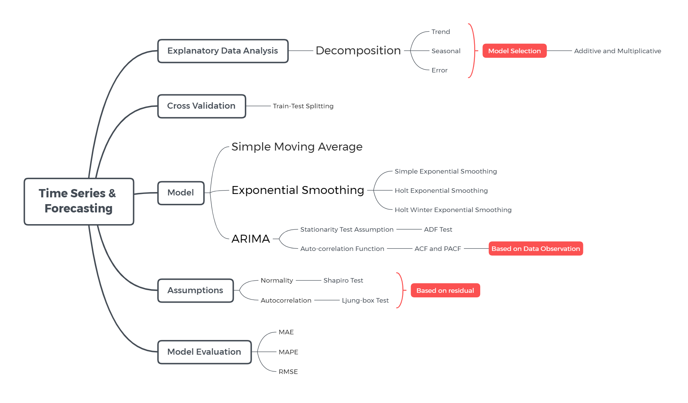
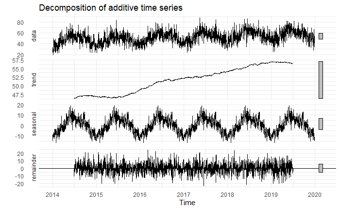
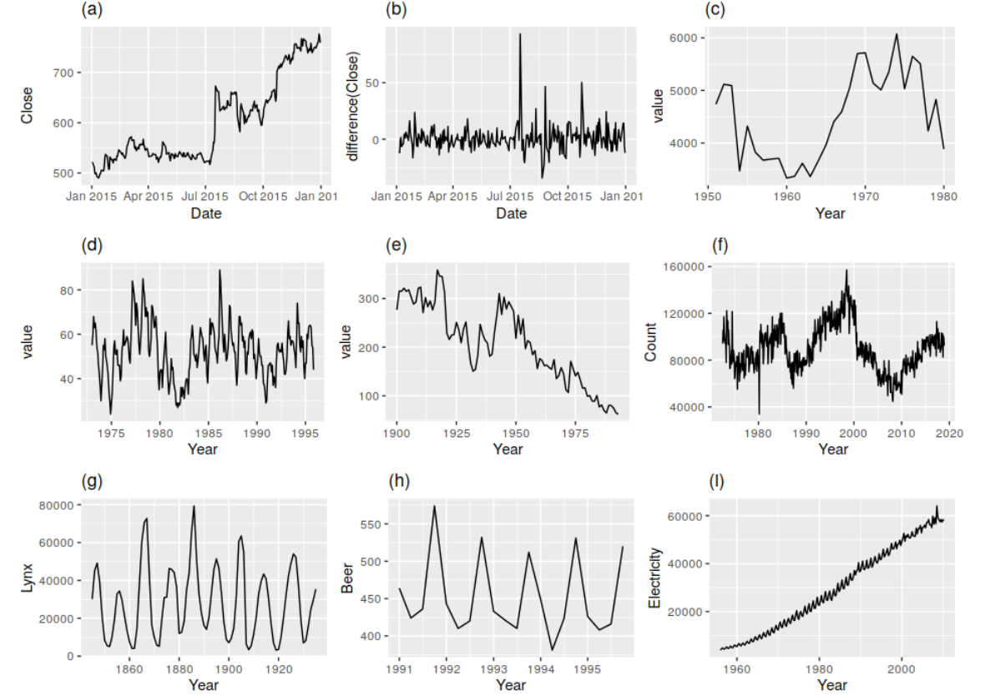

```{r setup, include=FALSE}
# chunk options
knitr::opts_chunk$set(
  message = FALSE,
  warning = FALSE,
  fig.align = "center",
  comment = "#>"
)

# load library

library(dplyr) # data wrangling
library(lubridate) # date manipulation
library(forecast) # time series library
library(TTR) # for Simple moving average function
library(MLmetrics) # calculate error
library(tseries) # adf.test
library(fpp) # usconsumtion
library(TSstudio) # mempercantik visualisasi timeseries
library(ggplot2)
library(tidyr)
```

```{=html}
<style>
body { 
text-align: justify}
</style>
```
# Time Series and Forecasting

```{r echo=FALSE}

```

**Glossary**:

1.  Timeseries: Data yang berhubungan dengan waktu.
2.  Forecasting: Prediksi/Peramalan dimasa depan.
3.  Objek ts: untuk analisis time series di R, kita perlu convert
    dataframe menjadi objek ts.

-   Data: Pilih satu variabel yang ingin diamati
-   start: periode awal data kita.
-   frequency: untuk penentuan pola musiman yang ingin diperhatikan.

4.  Seasonal Adjustment: Penyesuaian musiman, data yang sudah dilakukan
    proses penyesuaian musiman dapat menunjukkan pola (behaviour) yang
    riel dimana pengaruh musim sudah dikeluarkan dari data aslinya.
    (Bps, 2019).

# Working with Time Series

Apa itu time series? Apa perbedaannya dengan regresi atau yang lainnya?

Time series adalah suatu object dalam statistik dimana object tersebut
berhubungan dengan suatu deret waktu tertentu. Objek ini banyak ditemui
dalam kehidupan sehari-hari, contoh: harga daging sapi harian, curah
hujan bulanan, kuantitas penumpang bulanan, pendapatan tahunan, dll.

Perbedaan mendasar antara time series dengan regresi adalah jika pada
regresi untuk memprediksi suatu nilai Y dipengaruhi oleh beberapa faktor
yaitu x1,x2,..,xn. Sedangkan jika **time series**, untuk memprediksi
suatu nilai Y dipengaruhi oleh nilai Y itu sendiri pada masa lampau
($Y_{t-1}$).

Analisis time series berhubungan dengan suatu data yang memiliki nilai
numerik pada interval waktu tertentu. Proses untuk memprediksi nilai
pada anilisis time series disebut sebagai peramalan atau
**forecasting**. Ide utama dalam melakukan forecasting itu adalah
korelasi dari data numerik.

## Karakteristik Data Time Series

Time series data: data yang berhubungan dengan waktu dan memiliki
interval waktu yang tetap/sama.

💡 Syarat utama data time series:

1.  Data harus urut sesuai periode waktu dari data terlama sampai ke
    data terbaru
2.  Interval waktunya harus tetap/sama
3.  Tidak boleh ada data yang terlewat untuk setiap interval
4.  Tidak boleh ada yang missing

❓ **Knowledge Check**

Apakah data berikut sudah memenuhi syarat data time series yang baik?

1.  Demand product

```{r}
df_demand <- data.frame(
  date = ymd(c("2021-5-3", "2021-5-4", "2021-5-6", "2021-5-7")),
  demand = c(29, 79, 41, 88)
  )

df_demand
```

**Kesimpulan:** Tanggal 5 masih bolong, jadi data tersebut bukan time
series.

```{r}
all(seq.Date(from = as.Date('2021-05-03'), to=as.Date('2021-05-07'), by='day') == df_demand$date)
```

2.  Price product

```{r}
df_price <- data.frame(
  date = ymd(c("2021-5-16", "2021-5-19", "2021-5-18", "2021-5-17", "2021-5-20", "2021-5-21")),
  price = c(1000, 1001, 1002, 1003, 1004, 1005)
  )

df_price
```

**Kesimpulan:**

💡 Perbaikan yang dapat dilakukan sesuai syarat time series:

-   Mengurutkan data berdasarkan waktu: `arrange()`

```{r}
# mengurutkan df_price
df_price %>% 
  arrange(date)
```

-   Melakukan padding untuk memastikan interval data sama: `pad()` dari
    package `padr`

Secara default, `pad()` akan menambal periode waktu (tanggal)
berdasarkan kolom yang tipe datanya date. Mengisi nilai yang terlewat
atau missing (`NA`), cara yang umum dilakukan dengan package `zoo`:

-   `na.fill()`: mengisi `NA` dengan sebuah nilai, Gunakan
    `fill="extend"` untuk mengisi dengan nilai rata-rata dengan nilai
    yang missing
-   `na.aggregate()`: nilai aggregasi (mean, median)
-   `na.locf()`: nilai terakhir sebelum missing

Note: metode untuk mengisi missing value disesuaikan dengan perspektif
dari businessnya.

```{r}
# case: toko tutup di tanggal 5
# kita isi NA dengan nilai 0
anyNA(df_demand)
library(padr)
library(zoo)
df_demand %>% 
  pad(start_val = min(df_demand$date), end_val = max(df_demand$date)) %>% 
  mutate(demand = na.fill(demand, 0))
```

## Time Series Object

Kita akan menggunakan data emisi CO2 di Indonesia dimana datanya sudah
tersimpan dalam folder data_input dengan nama `environment_1970f.csv`.
Dari data `co2` ini, kita akan menggunakan 2 kolom yang kita butuhkan
yaitu kolom `year` untuk menunjukkan waktu dan
`CO2.emissions..metric.tons.per.capita.` sebagai nilai Y yang kita amati
untuk membuat object `ts`.

Untuk membuat sebuah object time series pada R kita bisa menggunakan
function `ts()` dengan parameter yang diperlukan yaitu :

> ts(data, start, frequency)

-   `data` = data yang akan kita prediksi (Wajib)
-   `start` = waktu awal mula data yang akan diprediksi
-   `frequency` = pola berulang dari data (Wajib)

```{r, echo=FALSE}
data.frame(
  Data = c("Annual","Quarterly", "Monthly", "Weekly"),
  Frequency = c(1,4,12,52)
)
```

```{r, echo = FALSE}
data.frame(
  Data = c("Daily", "Hourly", "Minutes", "Seconds"),
  Minute = c("-", "-", "-", "60"),
  Hour = c("-", "-", "60", "60*60"),
  Day = c("-", "24", "60*24", "60*60*24"),
  Week = c("7", "24*7", "60*24*7", "60*60*24*7"),
  Month = c("7*4", "24*7*4", "60*24*7*4", "60*60*24*7*4"),
  Year = c("7*4*12", "24*7*4*12", "60*24*7*4*12", "60*60*24*7*4*12")
)
```

**Latihan :**

1.  data **jam** -> pola **harian** -> freq = 24
2.  data **harian** -> pola **mingguan** -> freq = 7
3.  data **harian** -> pola **weekday** -> freq = 5
4.  data **jam** -> pola **mingguan** -> freq = 24\*7
5.  data **bulanan** -> pola **tahunan** -> freq = 12
6.  data **bulanan** -> pola **kuartalan** -> freq = 3
7.  data **tahunan** -> pola **tahunan** -> freq = 1

**Langkah awal dalam membuat object time series:**

Kita akan gunakan data emisi CO2 dimana datanya sudah tersimpan dalam
folder data_input dengan nama `environment_1970f.csv`.

-   read data

```{r}
# read data co
co2 <- read.csv("data_input/environment_1970f.csv")
head(co2)
```

Data `co2` terdiri dari 43 observasi yang mewakili kontribusi gas emisi
per tahun terhadap atmosfer Indonesia (43 tahun, 1970-2012). Data ini
terdiri dari 7 variabel, yaitu:

-   `year`: tahun.
-   `emisi co2 (kt)`: emisi yang berasal dari pembakaran bahan bakar
    fosil dan pembuatan semen, termasuk yang dihasilkan selama konsumsi.
-   `emisi co2 (metrik ton per kapita)`: `idem`.
-   `emisi metana (kt setara co2)`: emisi yang berasal dari aktivitas
    manusia (pertanian) dan dari produksi metana industri.
-   `emisi nitro oksida (ribu metrik ton setara co2)`: emisi dari
    pembakaran biomassa pertanian, kegiatan industri, dan pengelolaan
    ternak.
-   `emisi gas rumah kaca dan lainnya, HFC, PFC dan SF6 (ribu metrik ton setara co2)`:
    emisi hasil samping dari hidrofluorokarbon, perfluorokarbon, dan
    sulfur hexafluoride.
-   `total emisi gas rumah kaca (setara dengan co2)`: total CO2 tidak
    termasuk pembakaran biomassa siklus pendek (pembakaran limbah
    pertanian dan savannah), tetapi termasuk pembakaran biomassa lainnya
    (kebakaran hutan, pembusukan pasca-pembakaran, kebakaran gambut, dan
    pembusukan lahan gambut yang dikeringkan), semua sumber CH4
    antropogenik, sumber N2O dan gas-F (HFC, PFC, dan SF6).

Dari data `co2` ini, kita akan menggunakan 2 kolom yang kita butuhkan
yaitu kolom `year` untuk menunjukkan waktu dan
`CO2.emissions..metric.tons.per.capita.` sebagai nilai Y yang kita amati
untuk membuat object `ts`.

-   mengetahui range atau periode waktu data time series

untuk mengetahui periode waktu data time series dari awal hingga akhir
kita bisa menggunakan fungsi `range()`.

```{r}

# untuk mengurutkan data berdasarkan periode waktu
range(co2$year)
all(1970:2012 == co2$year)

co2 <- co2 %>% 
  arrange(year)

co2
```

-   mengetahui frequency atau banyak data dalam satu pola musiman

untuk mengetahui frequency data yang dimiliki dapat diinspect
berdasarkan:

1.  data yang disusun per periode apa
2.  pola yang ingin dilihat apa
    (harian/mingguan/bulanan/kuartalan/tahunan)

-   cek apakah data sudah memenuhi syarat data time series yang baik?

    -   pastikan terurut:
    -   interval waktunya tetap:
    -   tidak ada waktu yang terlongkap:

```{r}
# untuk mengetahui apakah periode sudah terurut


# untuk cek missing value
anyNA(co2)
```

-   membuat object ts dengan `ts()` function

Ingat: parameter `start` tidak wajib dituliskan.

```{r}
# simpan dalam object co2_ts
co2_ts <- ts(data=co2$CO2.emissions..metric.tons.per.capita.,
    start=range(co2$year)[1],
    frequency=1)
```

-   memvisualisasikan data time series untuk melihat pola datanya

```{r}
# inspect pola data
co2_ts %>% 
  autoplot()
```

**Insight :** Emisi CO2 dalam 40 tahun terakhir memiliki kecenderungan
untuk naik. Sekitaran tahun 1997-1999 terjadi penurunan emisi CO2 yang
cukup drastis.

-   dari plot diatas, misalkan kita ingin melakukan subset periode pada
    object `ts` dapat menggunakan fungsi `window()`

> window(object_ts, start, end)

Misalkan dari data `co2_ts` kita ingin mensubset periode dari 1995-2000

```{r}
# window
plot(window(co2_ts, start=1995, end=2000))
```

------------------------------------------------------------------------

**Dive Deeper**

Kita akan coba menggunakan data `births` terdiri dari 168 observasi
tingkat kelahiran per bulan di New York. Data ini terdiri dari 2
variabel, yaitu:

-   `date`: tanggal.
-   `births`: tingkat kelahiran.

> data birth data tingkat kelahiran di new york city dari tahun Jan 1946
> - Des 1959

-   Read data `nybirth.csv`

```{r}
# read nybirth.csv
birth <- read.csv("./data_input/nybirth.csv")
birth$date <- ymd(birth$date)

birth <- birth %>% arrange(date)
```

```{r}
```

-   membuat object ts dari data `birth` dan disimpan dalam object
    `birth_ts` dengan data yang terkumpul adalah data bulanan dengan
    pola yang ingin dilihat adalah tahunan

```{r}
# answer here
range(birth$date)
#urutan <- seq.Date(from = as.Date("1946-01-01"), to=as.Date("1959-12-01"), by="month")
#all(urutan == births$date)
birth_ts <- ts(data = birth$births, 
               start = c(1946,1),
               frequency = 12)
```

-   Visualisasi object `birth_ts` menggunakan `autoplot()`

```{r}
birth_ts %>% autoplot()
```

Insight:

-   Terdapat pola musiman dari data `birth`

-   Trend pergerakan kelahiran bayi sebelum 1950 terlihat menurun, namun
    setelah tahun 1950 cenderung naik.

-   

## Decomposition

Decomposition adalah suatu tahapan dalam time series analisis yang
digunakan untuk menguraikan beberapa komponen dalam time series data.

💡 Komponen dalam time series :

-   **Trend** : pola data secara general, cenderung untuk naik atau
    turun. Jika ada trend masih terdapat pola artinya masih ada pola
    yang belum terurai dengan baik.
-   **Seasonal** : pola musiman yang membentuk pola berulang pada
    periode waktu yang tetap
-   **Error/Reminder/Random** : pola yang tidak dapat ditangkap dalam
    trend dan seasonal

Sebelum melakukan modeling forecasting kita perlu mengamati objek
timeseries dari hasil `decompose`. Ide utama dari decompose adalah untuk
menguraikan ketiga komponen dari objek ts (trend, seasonal, residual).

> Jika pada hasil decompose, trend masih membetuk sebuah pola maka dapat
> dicurigai masih ada seasonality yang belum ditangkap. Seharusnya trend
> cenderung naik atau cendurung turun.

Untuk dapat menguraikan data time series kita menjadi 3 komponen
tersebut, kita dapat menggunakan fungsi `decompose()`.

```{r}
birth_decom <- decompose(x=birth_ts)
```

Memvisualisasikan hasil decompose menggunakan `autoplot()` dari package
`forecast`

Ingat: Apabila pada trend tidak menunjukkan penurunan / kenaikan, bisa
jadi terdapat pola seasonal yang lain.

```{r}
# autoplot
birth_decom %>% autoplot()
```

```{r}
birth %>% 
  mutate(date = ymd(date),
         month = month(date, label = T),
         seasonal = birth_decom$seasonal) %>% 
  distinct(month, seasonal) %>% 
  ggplot(aes(month, seasonal))+
  geom_col()

```

Dari pola seasonal diatas, dapat dilihat tingkat kelahiran terendah dan
tertinggi nya berada dimana.

```{r}
birth_clean <- birth %>% 
  mutate(date = ymd(date),
         month = month(date, label = T))
ggplot(data = birth_clean, aes(x = date, y = births)) +
  geom_point() +
  geom_point(data = birth_clean %>% 
               filter(month %in% c("Jan", "Feb", "Jul")),
             aes(col = month)) +
  geom_line() +
  scale_color_manual(values = c("red", "blue", "yellow"))
```

Pada hasil decompose kita mendapatkan informasi visualisasi:

1.  Data : pola data asli
2.  Seasonal (S) : pola musiman atau pola berulang dari data
3.  Trend (T) : pola data secara global (naik atau turun)
4.  Remainder (E) : pola data yang tidak dapat ditangkap oleh seasonal
    dan trend

💡 **Notes:** Jika pada hasil decompose, trend masih membentuk sebuah
pola maka dapat dicurigai masih ada seasonality yang belum ditangkap.
Seharusnya trend cenderung naik atau cenderung turun secara smooth.
Penyebabnya:

-   frequency yang kita tetapkan belum tepat, atau
-   terdapat multiseasonality pada data (pola berulang lebih dari satu,
    visitor bioskop)

```{r}
birth_decom %>% autoplot()
```

## Knowledge Check

1.  Manakah pernyataan di bawah ini yang salah terkait data time series?

-   [ ] Data time series harus disusun secara berurut sesuai waktu
    dengan interval waktu yang tetap.
-   [ ] Data time series dapat diurai menjadi pola trend, seasonal, dan
    error.
-   [ ] Data time series disebut additive karena variasi seasonalnya
    relatif konstan dari waktu ke waktu.
-   [x] Data time series disebut multiplicative karena menunjukkan trend
    yang linear.

2.  Misalkan kita memiliki object retail merupakan dataframe penjualan
    bulanan dari tahun 2010 sampai 2015. Kita ingin menganalisis
    pergerakan nilai pada kolom sales dari dataframe retail. Cara
    membuat object ts dengan pola seasonality tahunan adalah ...

-   [ ] ts(retail, frequency = 1)
-   [ ] ts(retail, frequency = 12)
-   [ ] ts(retail\$sales, frequency = 1)
-   [x] ts(retail\$sales, frequency = 12)

3.  Decompose adalah bagian dari eksplorasi data pada analisis time
    series. Berikut adalah manfaat dari melakukan decompose, kecuali ...

-   [ ] Mengetahui pola naik atau turun-nya data dari trend.
-   [ ] Dapat digunakan untuk analisis pola musiman dari pola
    seasonality.
-   [x] Mengetahui nilai di waktu yang akan datang berdasarkan pola data
    historis.
-   [ ] Mengetahui apakah frequency yang diatur dalam object time series
    sudah sesuai atau belum.

```{r echo=FALSE}

```

Gambar tersebut menunjukkan hasil decomposition untuk data time series
terkait tingkat kejahatan harian di Chicago dari tahun 2014 sampai
dengan 2019.

4.  Berdasarkan grafik tersebut, bagaimana pola trend yang terdapat pada
    data?

-   [ ] tidak terdapat pola tertentu
-   [x] pola meningkat
-   [ ] pola menurun
-   [ ] pola naik turun secara berulang

## Additive vs Multiplicative Time Series

```{r echo=FALSE}
knitr::include_graphics("assets/seasonaltypes.gif")
```

Ada 2 jenis model pada data time series, yaitu :

1.  **Model Additive** : Model time series yang memiliki varians konstan
    mengikuti trend dan seasonalnya

$Y_t = T_t + S_t + E_t$

Data = Trend + Seasonal + Error

2.  **Model Multiplicative** : Model time series yang memiliki varians
    semakin tinggi/rendah mengikuti trend dan seasonal yang ada

$Y_t = T_t * S_t * E_t$

Data = Trend \* Seasonal \* Error

### Additive Time Series

Jika kita perhatikan lagi pada data `birth_ts` memiliki pola additive,
karena varians dari polanya tetap atau konstan. Untuk melakukan
decompose pada pola additive tambahkan parameter `type = "additive"`
dimana secara default fungsi `decompose()` memiliki type = "additive".

```{r}
# additive time series
birth_ts %>% autoplot()
```

**Melakukan inspect komponen time series padaa data `birth_dc`**

**1. Trend**

Trend diperoleh dari hasil perhintungan `center moving average (CMA)`.
Tujuan utamanya untuk smoothing data sehingga diperoleh trend yang
cenderung naik/ cenderung turun.

Trend = Data - Seasonality - Error

```{r}
birth_decom$trend %>% autoplot()
```

**Pendekatan manual menddungkan Center Moving Average**

```{r}
birth_trend <- ma(x = birth_ts, order = 12, centre = T)
birth_trend %>% autoplot()
# birth_trend %>% ts_plot()
```

**2. Seasonal**

Karena polanya additive maka:

*Seasonal + Error = Data - Trend*

```{r}
birth_decom$seasonal %>% autoplot()
```

**Pendekatan manual**:

```{r}
# matematic didalamnya
sea.err_birth <- birth_ts-birth_trend
sea.err_birth %>% autoplot()

# mean of each month
mean.month_birth <- sea.err_birth %>% 
  matrix(ncol =  12, byrow = T) %>% 
  colMeans(na.rm = T)

# mean global
mean.glob_birth <- mean(mean.month_birth)

# Seasonality Calculation
birth_seasonal <- ts(rep(mean.month_birth - mean.glob_birth, 12), start = start(birth_ts), frequency = 12)
 
birth_seasonal %>% autoplot()
```

**3. Error**

Untuk memperoleh informasi error pada model additive, dapat menggunakan
rumus:

*Error = Data - Trend - Seasonal*

```{r}
birth_decom$random %>% autoplot()

# matematis didalamnya

birth_error <- birth_ts - (birth_trend + birth_seasonal)
birth_error %>% autoplot()
```

### Analisis Seasonal

Untuk dapat melakukan analisis seasonal, kita bisa lakukan dengan cara
melakukan inputasi komponen seasonal yang ada.

```{r}
birth %>% 
  mutate(monthly = month(date, label = T, abbr = F),
         seasonality = birth_decom$seasonal) %>% 
  distinct(monthly, seasonality) %>% 
  ggplot(aes(x = monthly, y = seasonality)) +
  geom_col()+
  theme_minimal()
```

```{r}
birth_ts %>% seasonplot()
```

### Multiplicative Time Series

Jika kita memiliki pola multiplicative pada data time series dan ingin
membuat decomposenya cukup menambahkan `type = "multiplicative"` pada
fungsi `decompose()`.

Ketika kita menemukan pola data kita mengandung multiplikative :

> cara 1: membuat data multiplikative tersebut menjadi additive dengan
> fungsi `log`. Setelah memperoleh hasil forecast kita dapat
> mengembalikan nilainya dengan `exp`.

```{r}
AirPassengers %>% autoplot()
decompose(AirPassengers, type = "multiplicative") %>% autoplot()
```

```{r}
# transformasi log agar data menjadi tipe additive
log(AirPassengers) %>% autoplot()
```

(Opsional) Sifat logaritma: perkalian menjadi penjumlahan

$$y = T * S * E$$ -> multiplicative $$log(y) = log(T * S * E)$$
$$log(y) = log(T) + log(S) + log(E)$$ -> additive

> Cara 2: Tetap menggunakan model multiplicative, kemudian nanti hasil
> dibandingkan dengan memilih model dengan error yang paling kecil.

Parameter `type` dalam fungsi `decompose()`, secara default
`type = "additive"`

multi:

1.  transformasi/scaling -> additive
2.  decompose, dengan catatan selalu tambahkan parameter yang
    menjelaskan bahwa datanya adalah multiplicative

```{r}

```

Decompose dapat kita gunakan untuk melakukan analisis seasonal dengan
tujuan untuk mendapatkan insight dari efek seasonal yang ada.

Tujuan dan manfaat melakukan decompose : 1. Mengidentifikasi tipe time
series yang kita miliki, multiplicative atau additive 2. Kita mengetahui
komponen trend, seasonal, dan error pada data kita

### Seasonality Adjustment

Objek time series yang telah dihilangkan efek seasonalnya.

Tujuan dari seasonality adjusment adalah untuk mengetahui pola data time
series yang dimiliki tanpa memperhitungkan efek seasonal yang ada pada
data. Hal ini akan sangat berguna untuk melakukan analisis lebih lanjut
dalam pengambilan suatu keputusan.

1.  Read data `AirPassanger`

```{r}
AirPassengers
```

Data `AirPassanger` merupakan data banyaknya penumpang pesawat terbang
dari bulan Jan 1949 - Des 1960.

2.  Membuat visualisasi

```{r}
AirPassengers %>% autoplot()

air_df <- air_df %>%
  mutate(monthly = month(date, label = T))
air_df %>% 
  ggplot(aes(x = date, y =value))+
    geom_point(data = air_df %>% filter(monthly == "Jul"), col = "firebrick")+
  geom_line()
```

4.  Melakukan decomposition

Melakukan decomposition pada data `AirPassengers` dengan `cara 2`

```{r}
air_dc <- AirPassengers %>% decompose(type = "multiplicative")
```

5.  Menghilangkan efek seasonality dengan menggunakan fungsi `seasadj`
    dari package `forecast`

```{r}
air_df <- air_df %>% 
  mutate(seasadj = seasadj(air_dc))
air_df %>% 
  ggplot(aes(x = date, y = seasadj))+
  geom_point(data = air_df %>% filter(monthly == "Jul"), col = "firebrick")+
  geom_line()
```

# Forecasting Model

💡 **Forecasting Model:**

1.  Simple Moving Average (SMA)

2.  Exponential Smoothing

    -   Simple Exponential Smoothing (SES)
    -   Double Exponential Smoothing (Holts Exponential Smoothing)
    -   Triple Exponential Smoothing (Holts Winter)

3.  Autoregresive Integrated Moving Average (ARIMA)

## Single Moving Average (SMA)

Metode yang menggunakan rataan beregerak untuk melakukan forecasting.
Karena menggunakan rataan, bobot yang digunakan sama untuk setiap
observasi di masa lalu. Metode ini sering digunakan untuk data yang
tidak mengandung trend dan seasonal (datanya bergerak disekitar
rata-rata).

Fungsi yang digunakan untuk forecasting SMA adalah
`SMA(objek time series, n)` dari library `TTR`. Parameter yang
diugunakan, yaitu:

-   `x` :objek time series yang akan di forecast

-   `n`: jumlah observasi di masa lalu yang digunakan untuk forecasting

Kita akan coba melakukan forecasting pada data curah hujan tahunan sejak
1813-1912 yang tersimpan pada folder data_input dengan nama file
`precip1.dat`.

-   read data menggunakan `scan()`

```{r}
rain <- scan("data_input/precip1.dat", skip = 1)
head(rain)
```

-   membuat object ts

```{r}

```

-   Visualisasikan data

```{r}

```

-   Melakukan forecasting menggunakan `SMA()` dengan ordo 3

```{r}

```

Memvisualisasikan data historis dengan hasil forecast

```{r}

```

**Kesimpulan**:

💡 **Note:**

-   SMA tepat digunakan ketika data yang kita miliki tidak memiliki
    trend maupun seasonal (data stasioner).
-   penentuan ordo tidak ada rule of thumb nya
-   semakin besar ordo, semakin smooth datanya dan hasil forecastnya

## Exponential Smoothing

Metode SMA hanya mempertimbangkan n observasi di masa lampau untuk
melakukan forecast baik pola trend maupun seasonal cenderung tidak
tertangkap sehingga dibutuhkan metode lain yang memperhitungkan
keseluruhan data di masa lampau, yaitu metode eksponensial.

**Simple Exponential Smoothing** digunakan untuk data time series yang
**tidak mengandung trend dan seasonal**. Fungsi yang digunakan untuk
membuat model exponential smoothing, yaitu:

1.  `ets()` dari library `forecast` yang merupakan error, trend, dan
    seasonal. Parameter yang digunakan, yaitu:

-   objek timeseries yang digunakan.

-   model: model time series untuk `error, trend, dan seasonal`.

    -   `A`: aditif
    -   `M`: multiplikatif
    -   `N`: none
    -   `Z`: auto

-   alpha: bobot untuk smoothing eror, nilainya antara 0 - 1.

    -   \~ 1 observasi yang paling baru diberikan bobot yang paling
        tinggi tinggi dibandingkan dengan data periode lama
    -   \~ 0 observasi yang paling baru diberikan bobot yang paling
        tinggi tinggi namun perbedaannya sangat sedikit dengan data
        periode lama

-   beta: bobot untuk smoothing trend, nilainya antara 0 - 1.

-   gamma: bobot untuk smoothing seasonal, nilainya antara 0 - 1.

**SES**: ets(data, model = "\*NN")

**Holts exponential**: ets(data, model = "\*\*N")

**Holts Winter**: ets(data, model = "\*\*\*")

2.  `HoltWinters()`, parameter yang digunakan, yaitu:

-   objek timeseries yang digunakan.
-   secara default parameter `alpha`, `beta`, dan `gamma` adalah
    **NULL**, dimana apabila kita tidak mendefinisikan nilainya, maka
    model `HolWinters()` akan mencari nilai parameternya hingga
    mendapatkan nilai paling optimum. Sehingga jika objek time series
    tidak mengandung trend dan seasonal parameter `beta` dan `gamma`
    harus diubah menjadi **FALSE**.

**Simple Eksponential Smoothing**: HoltWinters(data, beta = F, gamma =
F)

**Holt's Exponential**: HoltWinters(data, gamma = F)

**Holt's Winter Explonential**: HoltWinters(data)

### Simple Exponential Smoothing (SES)

Simple Exponential Smoothing merupakan metode forecasting yang tepat
digunakan untuk data yang tidak memiliki trend maupun seasonal[^1].

[^1]: [Simple Exponential Smoothing](https://otexts.com/fpp2/ses.html)

Kita akan coba menggunakan data `rain_ts` yang kita miliki untuk
melakukan forecasting menggunakan SES.

```{r}
# visualisasikan rain

```

Data `rain_ts` tidak memiliki pola trend maupun seasonal. Karena datanya
polanya tahunan, oleh karena itu data rain tidak memiliki pola seasonal
yang dapat dilihat.

**SES**: ets(data, model = "\*NN")

Melakukan forecasting data `rain_ts` dengan metode SES (tidak
mempertimbangkan pola trend)

```{r}
# menggunakan fungsi `ets()`

# untuk melihat hasil predict menggunakan fitted values

```

Menggunakan alpha = 0.03

```{r}

```

Untuk membuat model SES menggunakan `HolWinters()` kita bisa setup
`beta = F`, dan `gamma = F` karena dalam model SES tidak memperhitungkan
efek trend dan seasonal. (default alpha, beta, dan gamma = NULL)

Visualisasi data historis dengan hasil forecast

```{r}
# gunakan autolayer()

```

> Kesimpulannya:

**Model evaluation**

Karena kita melakukan pemodelan tanpa cross validation kita tidak perlu
melakukan prediksi/forecast sebab hasil forecast data historis sudah
terdapat pada output hasil pemodelan. Kita dapat menghitung error yang
dihasilkan oleh model dengan menggunakan fungsi `accuracy()` dari
library `forecast`.

```{r}
# use accuracy
library(forecast)

```

Untuk melihat nilai error menggunakan MAPE(Mean Absolute Percentage
Error), kita bisa tahu seberapa persen nilai error dari prediksi kita.

### Holt's Exponential Smoothing

**Holt's exponential (Double Exponential Smoothing)** digunakan untuk
data time series yang tidak mengandung efek seasonal[^2].

[^2]: [Trend Methods](https://otexts.com/fpp2/holt.html)

Melakukan forecasting data `co2_ts` dengan metode Holt's Exponential
menggunakan fungsi `HolWinters()`

```{r}

```

Buatlah model untuk prediksi co2_ts, nilai alpha = 0.79 & 0.70 nilai
beta = 0.15 & 0.01

```{r}
# alpha 0.79 beta 0.15

  
# alpha 0.70 beta 0.01

```

Visualisasi data historis dengan hasil forecast

```{r}
# gunakan autolayer()

  
```

**Kesimpulan**: dari ketiga model, walaupun MAPE nya lumayan kecil
sebesat \~6% namun apabila dilihat dari pergerakan hasil forecastnya
masih terlambat dalam mengikuti pola datanya (masih terdapat lagging)

Model evaluation

```{r}
# gunakan accuracy()

```

### Holt's Winters Exponential

**Holt's Winters Exponential (Triple Exponential Smoothing)** merupakan
metode forecasting yang tepat digunakan untuk data yang memiliki efek
trend dan seasonal[^3].

[^3]: [Holt's Exponential
    Smoothing](https://otexts.com/fpp2/holt-winters.html)

#### Workflow Analisis Time Series

1.  Read data `fancy.dat` dan simpan dengan nama object `souvenir`

```{r}
souvenir <- scan("data_input/fancy.dat")
souvenir
```

Data `souvenir` terdiri dari 84 observasi penjualan souvenir per bulan
dari tahun 1987.

2.  Buat time series object dan simpan dengan nama object `souvenir_ts`

```{r}

```

3.  Visualisasikan data `souvenir_ts`

Apakah tipe data time series yang terbentuk dari data `souvenir_ts`?

```{r}

```

4.  Decomposition

Tujuannya untuk menguraikan tipe-tipe data pada setiap komponen time
series yang ada agar tepat dalam penentuan pemilihan model untuk
forecast nya.

```{r}
# menguraikan komponen data time series

```

5.  Splitting Data

-   Data train: 1987 - 1992 (6 tahun) simpan dengan nama object
    `souvenir_train`
-   Data test: 1993 (1 tahun) simpan dengan nama object `souvenir_test`

```{r}
# test menggunakan `tail()`

# train menggunakan `head()`

```

6.  Melakukan model fitting pada data train `souvenir_train`

```{r}
# model multiplicative

```

7.  Melakukan prediksi pada data test `souvenir_test` dengan menggunakan
    fungsi `forecast()` dari library `forecast`

-   `object` = model time series
-   `h` = berapa banyak data kedepan yang akan di forecast

```{r}
# forecast menggunakan model multiplicative

```

Visualisasi hasil forecast

```{r}
# visualisasi hasil forecast dari model multiplicative

```

8.  Model evaluation menggunakan data `souvenir_test`

```{r}
# model multiplicative

```

**Kesimpulan** Apabila dilihat dari visualisasi hasil forecast dengan
data actual tidak terdapat lagging walaupun hasil forecast cenderung
lebih tinggi nilainya. Dan jika dilihat dari nilai MAPE pada data train
dan data test terdapat perbedaan 8%, oleh karena itu saya akan anggap
sudah lumayan tidak terlalu overfit.

Tunning Model dimana data di transformasikan log

```{r}

```

-   Modeling menggunakan data yang sudah di transformasi

```{r}

```

-   Forecasting

**Note**: Hasil forecast dari data yang sudah di transformasikan log
harus dikembalikan kembali ke bentuk data aslinya menggunakan `exp()`

```{r}

```

-   Model evaluation

```{r}

```

# ARIMA (Autoregressive Integrated Moving Average)

ARIMA adalah gabungan antara dua metode, yaitu *Auto Regressive* (AR)
dan *Moving Average* (MA). I nya menjelaskan *Integrated*. Tujuan utama
dari ARIMA adalah melakukan autocorrelation pada data.

## Stasionarity

Stasionarity time series memiliki arti bahwa pada data time series yang
kita miliki tidak memiliki trend maupun seasonal dan memiliki variansi
konstan[^4]. Berdasarkan gambar dibawah ini, manakah yang termasuk data
time series yang stasioner?

[^4]: [Stationarity and
    Differencing](https://otexts.com/fpp3/stationarity.html)

```{r echo=FALSE}

```

Apabila data yang kita miliki belum stasioner, maka kita bisa melakukan
differencing.

## Differencing

Jadi untuk membuat datanya stasioner, cara yang paling umum digunakan
adalah dengan melakukan differencing `diff`, yaitu mengurangi data saat
ini dengan data sebelumnya[^5]. Terkadang, tergantung pada kompleksitas
data, jumlah differencing bisa lebih dari 1 kali.

[^5]: [Explanation `diff()` in
    R](http://www.datasciencemadesimple.com/difference-function-in-r/)

**Pemahaman konsep mengapa perlu differencing???**

-   data sebelum dilakukan differencing

```{r}
data.frame(
  xt = c(AirPassengers),
  lag1 = lag(x = as.vector(AirPassengers), n = 1),
  lag2 = lag(x = as.vector(AirPassengers), n = 2),
  lag3 = lag(x = as.vector(AirPassengers), n = 3),
  lag4 = lag(x = as.vector(AirPassengers), n = 4),
  lag5 = lag(x = as.vector(AirPassengers), n = 5) 
) %>% 
  na.omit() %>% 
  GGally::ggcorr()
```

-   data setelah dilakukan differencing

```{r}
data.frame(
  xt = c(diff(AirPassengers)),
  lag1 = lag(x = as.vector(diff(AirPassengers)), n = 1),
  lag2 = lag(x = as.vector(diff(AirPassengers)), n = 2),
  lag3 = lag(x = as.vector(diff(AirPassengers)), n = 3),
  lag4 = lag(x = as.vector(diff(AirPassengers)), n = 4),
  lag5 = lag(x = as.vector(diff(AirPassengers)), n = 5) 
) %>% 
  na.omit() %>% 
  GGally::ggcorr(label = T)
```

Ide utama melakukan differencing adalah agar ketika melakukan prediksi,
tidak ada multicolinearity terhadap data-data sebelumnya.

Model ARIMA:

ARIMA(p,d,q)

## AR(p) : Auto Regressive

**Auto regressive** di ARIMA artinya kita membuat model linear
regression berdasarkan lag dari datanya sebagai prediktor[^6]. Linear
regression models, baik ketika prediktornya tidak ada korelasi dan
independen satu dengan lainnya. Nilai `p` berarti berapa banyak data
yang akan dipakai ketika melakukan auto regressive.

[^6]: [Auto Regression Model](https://otexts.com/fpp2/AR.html)

Model autoregressive dapat dituliskan sebagai berikut.

$$
Y_t = \alpha + \beta_1Y_{t-1}+\beta_2Y_{t-2}+...+\beta_pY_{t-p}+ \epsilon_1
$$

dimana, $Y_{t-1}$ adalah lag1, $\beta_1$ adalah coefficient dari lag1,
dan $\alpha$ adalah intercept.

## MA(q) : Moving Average

**Moving Average** dalam ARIMA artinya kita melakukan rata-rata berjalan
terhadap data time series itu sendiri[^7].

[^7]: [Moving Average Model](https://otexts.com/fpp2/MA.html)

Moving Average Model (MA model).

$$
Y_t = \alpha + \epsilon_t + \phi_1\epsilon_{t-1}+\phi_2\epsilon_{t-2}+...+\phi_q\epsilon_{t-q}
$$

Arima memiliki bentuk model (p,d,q) dimana[^8] :

[^8]: [Non Seasonal
    Model](https://otexts.com/fpp2/non-seasonal-arima.html)

-   Auto Regressive -> AR(p)\
    AR ini mirip dengan regresi linear, hanya saja dia melakukan regresi
    terhadap dirinya sendiri. Nilai `p` berarti berapa banyak data yang
    akan dipakai ketika melakukan auto regressive.

Untuk mencari order p untuk model AR, kita dapat melihat dari plot PACF
(Partial Autocorrelation Function).

> autokorelasi pada saat t dan t - k tanpa dipengaruhi oleh korelasi
> periode ditengahnya (intermediate lags). Misalnya autokorelasi untuk
> lag(2) maka bisa dikatakan ingin mencari autokorelasi antara hari rabu
> ke jumat secara langsung.

-   Integrated -> I(d)\
    Integrated adalah berapa kali data dilakukan differencing untuk
    membuat suatu data stationer. Nilai `d` dapat diketahui dengan
    mencari tahu berapa kali differencing yang dilakukan pada data.

-   Moving Average -> MA(q)\
    MA digunakan untuk melakukan smoothing error. Nilai `q` berarti
    berapa banyak data yang diperlukan untuk smoothing error menggunakan
    moving average.

Untuk mencari order q untuk model MA, kita dapat melihat dari plot ACF
(Auto correlation Function)

> mencari autokorelasi pada saat t dan t - k, dan dipengaruhi oleh
> periode ditengahnya. Misal: autokorelasi untuk lag(2) maka bisa
> dikatakan, akan dihitung nilai autokorelasi di hari jumat ke rabu,
> namun mempertimbangkan korelasi antara jumat ke kamis dan kamis ke
> rabu.

**Tahap analisis menggunakan metode ARIMA:**

1.  Objek time series
2.  Melakukan pengujian stasioner menggunakan `adf.test`

H0 : data tidak stasioner H1 : data stasioner

> kita mengharapkan p-value \< alpha, sehingga pola data stasioner

3.  Catat informasi berapa kali dilakukan differencing sampai data
    menjadi stasioner
4.  Lakukan pembuatan model arima menggunakan
    `auto.arima(objek_ts, seasonal = F)`.
5.  Tuning model dengan mencari ordo (p) dan (q) secara manual.

-   plot acf vs pacf untuk mencari ordo (p) dan (q) secara manual
-   acf (autocorrelation function), pacf (partial autocorrelation
    function).
-   acf: mencari autokorelasi pada saat t dan t - k, dan diperngaruhi
    oleh periode ditengahnya. Misal: autokorelasi untuk lag(2) maka bisa
    dikatakan, akan dihitung nilai autokorelasi di hari jumat ke rabu,
    namun mempertimbangkan korelasi antara jumat ke kamus dan kamis ke
    rabu.
-   pacf: mencari autokorelasi pada saat t dan t - k tanpa dipengaruhi
    oleh korelasi periode ditengahnya.

6.  Memperhatikan pola dari plot acf dan pacf. Dimana ada dua tipe pola
    yaitu: `tails off` atau `cuts of lag`.

-   `tails off`: garis saat lag ke-1 mengalami penurunan yang lambat.
-   `cuts off lag`: garis saat lag ke-1 mengalami penurunan yang cepat.

```{r echo=FALSE}
knitr::include_graphics("assets/arima-table.png")
```

7.  Memperhatikan garis keluar dari batas pada lag ke berapa saja.
    (signifikan pada lag ke berapa aja)

-   membuat model perbandingan dari beberapa kemungkinan ordo nya
-   mencari model terbaik dari nilai AIC yang terkecil

8.  Model evaluation dengan nilai MAPE
9.  Cek asumsi time series

-   normality residual assumption
-   autocorrelation residual assumption

## Non-Seasonal ARIMA(p,d,q)

Kita akan coba melakukan forecast pada data `environment_1970f.csv`,
dimana yang akan kita ubah kedalam bentuk object time series adalah data
`Nitrous.oxide.emissions..thousand.metric.tons.of.CO2.equivalent.`

1.  Read Data

```{r}
nitro <- read.csv("data_input/environment_1970f.csv")
head(nitro)
```

2.  Membuat object time series untuk kolom
    `Nitrous.oxide.emissions..thousand.metric.tons.of.CO2.equivalent.`

```{r}

```

3.  Melakukan pengecekan object ts stasioner

Stasioner adalah data yang bergerak disekitar rata-rata globalnya.

-   melihat berdasarkan visual

```{r}

```

-   melakukan pengujian menggunakan `adf.test()`

```{r}

```

> dengan alpah = 5%, p-value \> alpha artinya gagal tolak H0, jadi
> datanya belum stasioner.

4.  Melakukan differencing data agar stasioner

-   mencoba melakukan pengujian data `no_ts` dengan satu kali
    differencing

```{r}

```

Data kita perlu dilakukan differencing 1x hingga dia stasioner.

> artinya nilai d pada ARIMA(p,d,q) = 1

```{r eval=FALSE}
# diff lebih dari 1 kali

```

5.  Model Fitting

-   **melakukan tunning model untuk p, d, dan q nya menggunakan acf dan
    pacf**

p = melihat lag yang keluar dari plot PACF (partial autocorrelation
function) q = melihat lag yang keluar dari plot ACF (autocorrelation
function)

ACF untuk melihat korelasi suatu data dengan mempertimbangkan data
tengahnya. misal ingin melihat korelasi hari senin dengan hari rabu,
kita harus mempertimbangkan:

-   korelasi hari senin - selasa
-   korelasi hari senin - rabu
-   korelasi hari selasa - rabu

PACF untuk melihat korelasi data tanpa mempertimbangkan data tengahnya.
misal ingin melihat korelasi hari senin dengan rabu, cukup melihat nilai
korelasi hari senin - rabu saja

melihat plot pacf dan acf untuk menemukan nilai `p` dan `q`

```{r}
# melihat plot acf dan pacf menggunakan `tsdisplay()`

```

nilai p yang diperoleh dari 5 lag pertama yang keluar dari plot pacf

nilai q yang diperoleh dari 5 lag pertama yang kelaur dari plot acf

Kombinasi model ARIMA yang terbentuk[^9] :

[^9]: [ARIMA in R](https://otexts.com/fpp2/arima-r.html)

-   ARIMA

parameter pada fungsi `Arima()`

-   y = object time series
-   order = nilai (p,d,q)

```{r}

```

-   perbandingan model terbaik berdasarkan nilai AIC

```{r}

```

-   membuat model arima secara otomatis menggunakan `auto.arima()`

```{r}

```

6.  Goodness of Fit (Pemilihan model terbaik)

Untuk pemilihan model terbaik kita bisa melihat nilai AIC dari
masing-masing model yang paling kecil

```{r}

```

7.  Model Evaluation

-   bisa menggunakan fungsi `accuracy()` dari package `forecast` untuk
    melihat MAPE

```{r}


```

```{r}

```

------------------------------------------------------------------------

## 📝 Summary Day 1

1.  Time series adalah suatu data yang berhubungan dengan runtun waktu.
2.  Analisis time series adalah analisis data runtun waktu dimana yang
    akan kita prediksi adalah data time series itu sendiri dengan data
    historicalnya.
3.  Untuk membuat object time series dapat menggunakan fungsi
    `ts(data, start, frequency)`

-   `data` : data yang ingin di forecast
-   `start` : awal mula dari data time series
-   `frequency` : pola berulang yang ingin diamati

4.  Komponen data time series :

-   trend : pola general dari data, apakah naik atau turun
-   seasonal : pola berulang atau pola musiman dari data
-   random/error : pola yang belum bisa tertangkap oleh tren dan
    seasonal

5.  Tipe pola data time series :

-   additive : pola time series apabila trend bertambah, maka ukuran
    seasonalnya sama

$X = T+S+E$

-   multiplicative : pola time series apabila trend bertambah, maka
    ukuran seasonalnya semakin besar (amplitudo bertambah berkali lipat)

$X = T*S*E$

6.  Apabila data time series yang kita miliki terdapat pola
    multiplicative, maka ada beberapa cara yang bisa kita gunakan yaitu
    :

-   melakukan transformasi menggunakan `log()` atau `sqrt()` agar pola
    datanya menjadi additive. Hal ini akan sangat berguna apabila kita
    memiliki data yang kurang tertangkap pola multiplicativenya
-   tetap menjadikan multiplicative dan melanjutkan ke pemodelan time
    series

Kedua cara diatas dapat digunakan sebagai salah satu cara untuk tunning
model dalam analisis time series.

7.  Manfaat melakukan decompose:

-   menemukan pola trend, seasonal, dan random pada data time series
-   bisa melakukan analisis seasonal untuk melihat pola seasonalnya pada
    data yang nantinya akan berguna untuk pembuatan keputusan yang
    berdasarkan pola seasonal yang diperoleh
-   bisa melakukan analisis trend yang dapat digunakan untuk mengetahui
    pola data yang sesungguhnya pada data tanpa adanya efek seasonal
    pada data

8.  Seasonal adjustment digunakan untuk melihat data real tanpa ada efek
    seasonal supaya kita mendapatkan nilai asli tanpa adanya penambahan
    seasonality yang dapat membuat data kita sangat terpengaruh.

9.  Forecasting model :

-   SMA(Single moving average) : cocok untuk data yang tidak ada trend
    dan seasonal
-   Simple exponential smoothing (SES) : cocok untuk data yang tidak ada
    trend dan seasonal. Parameter smoothing didalamnya yaitu alpha
-   Holt Exponential : cocok untuk data yang ada trend dan eror.
    Parameter smoothing didalamnya yaitu alpha dan beta
-   Holt Winters Exponential : cocok untuk data yang semua komponen time
    series. Parameter smoothing didalamnya yaitu alpha, beta, gamma

10. Untuk membuat model exponential smoothing bisa menggunakan dua
    fungsi yaitu `ets()` dan `HoltWinters()`.

-   fungsi `ets(object_ts, model = "ZZZ")`
-   fungsi
    `HoltWinters(object_ts, alpha = NULL/FALSE, beta = NULL/FALSE, gamma = NULL/FALSE, seasonal = "additive/multiplicative")`

11. Untuk melakukan evalusi model bisa menggunakan nilai error :

-   RMSE(Root Mean Square Error) : range nilainya cenderung seperti data
    aslinya
-   MAPE(Mean Absolute Percentage Error) : range nilainya 0%-100%

<center>

**--- End Day 1 ---**

</center>

# Reference

More resource to learn more :

-   [ARIMA vs ETS](https://otexts.com/fpp2/arima-ets.html)
-   [Regression ARIMA](https://otexts.com/fpp2/regarima.html)
-   [Multiple Seasonal Time
    Series](https://algotech.netlify.com/blog/multiple-seasonal/)
-   [Multiple Seasonal using
    Purrr](https://algotech.netlify.com/blog/purrr-operly-fitting-multiple-time-series-model/)
