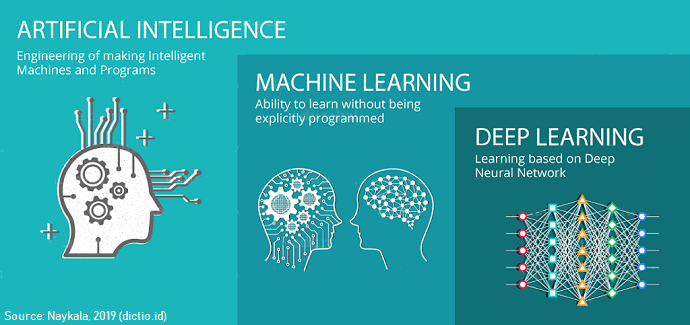
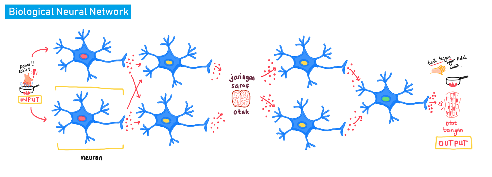

<style>
body {
text-align: justify}
</style>


```{r setup, include=FALSE}
# chunk options
knitr::opts_chunk$set(
  message = FALSE,
  warning = FALSE,
  fig.align = "center",
  comment = "#>"
)

options(scipen = 99)

# load library
library(neuralnet)
library(tidyverse)
library(caret)
```

# Training Objective

```{r, echo=FALSE}
knitr::include_graphics("assets/Neural Network.png")
```

# Neural Network and Deep Learning

Welcome to the last stage of Machine Learning Specialization, **Neural Network & Deep learning**! Topik ini erat kaitannya dengan teknologi mutakhir yang menjadi sorotan dunia saat ini yaitu **Artifical Intellegence**. Topik ini akan membuka gerbang ke perjalanan yang lebih menarik sekaligus menantang di ranah [Artificial Intellegence](https://www.youtube.com/watch?v=5IvQ3fYKnfM).

## Deep Learning
```{r, out.width = "100%", echo = FALSE, fig.align = "center"}

```

Deep learning merupakan bagian dari machine learning. Deep learning dirancang untuk menganalisa data dengan struktur logika yang mirip dengan bagaimana manusia mengambil keputusan, terutama untuk data yang tidak terstuktur dan umumnya hanya baik dianalisis oleh manusia. Untuk dapat mencapai kemampuan tersebut, deep learning berasal dan dikembangkan dari metode **Neural Network**.

## Neural Network

**Neural network** atau artificial neural network (ANN) adalah metode machine learning yang *terinspirasi dari cara kerja otak manusia*. Otak bekerja dengan suatu sistem saraf (biological neural network). Terdapat 2 hal utama  dari sistem saraf manusia yang diadopsi oleh neural network: **arsitektur** & **proses belajar** yang dilakukan.

### Arsitektur Neural Network

Sistem saraf yang dimiliki manusia terdiri dari sel saraf yang dinamakan **neuron**, dan neuron tersebut amat banyak hingga membentuk **jaringan**. Tiap stimulus/input dari luar akan diterima oleh panca indra sebagai signal kemudian akan dialirkan melalui sel saraf satu ke sel saraf lainnya. Jaringan sel saraf tersebar dari ujung jari hingga otak dan berlanjut kembali ke seluruh tubuh kita. 
    
> Jaringan sel saraf terus mengalirkan informasi dari stimulus/**input**, diproses melalui otak, hingga diekspresikan melalui reaksi/aktivitas tubuh sebagai **output** atau respon yang kita berikan.

```{r, echo=FALSE}

```

Arsitektur sistem saraf inilah yang menginspirasi terbentuknya model neural network. 
```{r, echo = FALSE}
knitr::include_graphics("assets/animation.gif")
```
Pada model neural network, informasi dialirkan dan diproses melalui arsitektur yang terdiri dari:

- Input Layer: Layer pertama dalam arsitektur NN. Jumlah Neuron-nya tergantung pada jumlah variabel X di data kita.

- Hidden Layer: Layer antara input layer dan output layer. Jumlahnya dapat lebih dari 1 layer, yang menentukan adalah user.

- Output Layer: Layer terakhir dalam arsitektur NN. Jumlah neuronnya tergantung dengan banyak variabel y kita.


### Belajar dari Kesalahan

Cara belajar neural network dibuat menyerupai manusia. Cara belajar manusia, adalah melalui kesalahan.

> Manusia tidak serta merta terlahir pintar. Selama manusia hidup, selama itu pula [sistem saraf kita berkembang](https://www.youtube.com/watch?v=VNNsN9IJkws), selama itu pula manusia belajar.

Seluruh refleks dalam tubuh kita tidak terjadi begitu saja, namun melalui proses latihan. Melalui banyak kesalahan dan pengulangan, tubuh kita belajar dan membangun sistem saraf yang "pintar". Sistem tersebut mengerti **sel-sel saraf mana saja yang perlu aktif/inaktif dalam mengalirkan stimulus**. Sel saraf yang aktif memiliki bobot atau peran yang tinggi untuk menentukan output, sementara sel yang inaktif dianggap tidak penting atau mengganggu proses pengolahan informasi sehingga lebih diabaikan. Hal ini membuat output atau respon yang tubuh kita berikan tepat dan cepat. Konsep **pembobotan** ini diadaptasikan pada neural network.

Untuk lebih memahaminya, mari buat model neural network untuk kasus regresi dari dummy data di bawah ini. Untuk kemudahan visualisasi kita akan menggunakan package `neuralnet`.

```{r echo=FALSE}
y <- c(0,1,1,0)
dat <- data.frame(expand.grid(c(0,1), c(0,1), c(1,2)), y)

set.seed(100)
dat <- dat %>%
  mutate(y = runif(nrow(dat), 3, 4) + sum(dat[1:2, ]) + dat$Var3^2)

head(dat)
```

```{r message=FALSE, warning=FALSE, echo=FALSE}
library(neuralnet)
# modelling nn
set.seed(100)
model1 <-
  
```
**Proses training model:**

1. Neural network memberikan **pembobotan awal secara random** untuk tiap node

2. Aliran informasi terjadi untuk melakukan prediksi dari input -> hidden -> output layer (**feed forward**).

3. Didapatkan **error (cost function)** hasil prediksi.

4. Model "belajar dari kesalahan" dengan menyalurkan kembali informasi error ke node-node sebelumnya (**back propagation**) sehingga bobot dapat diperbaiki (**update bobot**). Satu rangkaian proses update bobot (1 feed forward & 1 back propagation) disebut sebagai **step/epoch**.

5. Model terus mengupdate bobotnya hingga didapatkan error terkecil. Pada contoh di atas, dibutuhkan 283 step/epoch untuk mendapatkan error terkecil 0.001066. 


**Glossary Arsitektur Neural Network**

- *weight*: informasi yang dibawa oleh setiap neuron, sama seperti slope pada regresi. Awalnya bobot ini akan di inisialisasi secara random.

- *bias*: sama seperti intercept pada regresi.Awalnya bias akan di inisialisasi secara random

- *Activation function* : fungsi untuk standarisasi hasil perhitungan

- *Forward propagation*: proses membawa data input melewati tiap neuron pada hidden layer sampai pada output layer yang nantinya akan dihitung errornya

- *Backpropogation*: proses membawa error yang didapat dari forward propagation untuk mengupdate setiap weight dan bias. 

- *Cost function*: Error. Selisih antara hasil prediksi dan data aktual. cross entropy (ce) untuk klasifikasi dan sse untuk regresi.

- *Epoch*: Banyaknya proses iterasi (1x forward dan 1x backward = 1 epoch) dalam training model.


### Highlight on Hidden Layer

**Hidden layer** adalah komponen penting dalam arsitektur neural network maupun deep learning. Untuk lebih memahaminya, mari buat suatu model neural network tanpa hidden layer menggunakan data `dat` yang kita gunakan untuk kasus regresi sebelumnya. Buat model dengan nama `model_reg`, tanpa hidden layer, dengan 5 kali percobaan (rep), kemudian plotkan model tersebut:

```{r}
# modelling
set.seed(100)
model_reg <-  
  
  
```


Coba bandingkan dengan model regresi linear:

```{r}
# model regresi linear
lm_reg <- 
  
summary(lm_reg)
```

Coba lihat hasil prediksinya:

```{r}
# predict ke data train
lm_pred <- predict(lm_reg,newdata = dat)

# fungsi SSE (error yang digunakan pada nn/deep learning regresi)
sse <- function(pred, act) {
    return(sum((pred - act)^2)/2)
}

# kalkulasi sse
sse(pred = lm_pred,act = dat$y)
```

Ternyata model neural network tanpa hidden layer amat mirip dan sesederhana model regresi linear! Begitu pula untuk kasus klasifikasi, akan sama saja sederhananya dengan model regresi logistik. 

Keberadaan hidden layer merupakan keunggulan yang dimiliki neural network/deep learning. Hidden layer membuat model mampu menangkap **informasi/pola abstrak** yang sulit ditangkap oleh model machine learning sederhana (automatic feature extraction). Keunggulan tersebut membuatnya menjadi robust.

## Dive Deeper 1

```{r}
plot(model1, rep = "best")
```

1. Tinjau model neural network di atas:
  a. model terdiri dari tipe layer apa saja, dan berapa jumlah layer untuk masing-masing tipe?
  
  b. berapa jumlah node pada hidden layer? 
  
2. Mengapa digunakan `set.seed` saat membuat model neural network? 

3. Apabila ditambahkan variabel prediktor baru sejumlah 2, perbedaan apa yang dimiliki model baru dibandingkan model di atas? 

4. Kapan neural network digunakan? 


## Deep Learning

Kita telah mengetahui tentang neural network. Namun apa hubungannya dengan Deep Learning? **Deep learning** ternyata hanyalah suatu neural network yang memiliki jumlah hidden layer yang lebih dari satu. Untuk membuatnya, kita dapat mengubah nilai pada parameter `hidden`:


```{r}
#modelling
set.seed(100)
model_dl <-  
plot(model_dl, rep = "best")
```

Dengan menambahkan jumlah hidden layer di model neural network awal kita, kita telah mengubahnya menjadi model deep learning!

## Model deep learning

Buat model neural network `model_dl2` yang memiliki hidden layer sebanyak 3 layer dengan masing masing layer terdiri dari 8, 6, dan 4 neuron menggunakan data `dat`. Seperti sebelumnya, ingin dilakukan 5 kali percobaan pembuatan model. 

```{r}
# buat model
set.seed(100)
model_dl2 <- 
# plot model
plot(model_dl2, rep = "best")
```

Bandingkan antara ketiga model yang telah kita buat (`model_nn`, `model_dl`, dan `model_dl2`), model mana yang memiliki performa paling baik?

* `model1`: 
* `model_dl`: 
* `model_dl2`: 

**Note:** Faktanya, semakin banyak **hidden layer** dan jumlah node yang digunakan tidak menjamin hasil prediksi yang lebih baik (model_nn vs. model_dl). Pengaturan jumlah hidden layer serta jumlah node yang ada di dalamnya adalah beberapa hal yang dapat kita tuning untuk menghasilkan model terbaik. 


## Prediksi model `neuralnet`

Untuk memprediksi data menggunakan package `neuralnet`, bisa digunakan fungsi `compute()` dengan parameter:

* x = model NN  
* covariate = variable prediktor data yang ingin diprediksi
* rep = repetisi ke berapa yang ingin digunakan (diinginkan rep = "best")  

```{r}
# cari model terbaik
which.min(model_dl2$result.matrix[1,]) # untuk mencari model ke berapa yang memiliki error paling kecil
```

gunakan fungsi `compute()`
```{r}
# prediksi
dl2_pred <-  
dl2_pred$net.result #hasil prediksi
```

```{r}
# kalkulasi error (sse)
sse(pred = dl2_pred$net.result,act = dat$y)
```

## Regresi vs Klasifikasi

Pembuatan model yang kita demonstrasikan sebelumnya adalah untuk kasus regresi. Terdapat beberapa perbedaan ketika kita membangun neural network/deep learning untuk kasus regresi dan klasifikasi:

### Cost Function 

Cost function adalah nilai acuan kebaikan model; nilai untuk mengevaluasi kebaikan model; dapat juga dianalogikan sebagai error. Model dapat "belajar" dengan mengetahui cost function yang harus ia gunakan untuk mengevaluasi dirinya sendiri. Cost function yang digunakan berbeda untuk tiap kasus:

* regresi:
  + sum of squared error(sse)
  + setting parameter: `neuralnet(..., err.fct="sse")`

$$SSE = \frac{1}{2} {\Sigma (y - \hat y)^2}$$ 

* klasifikasi:
  + cross-entropy error (ce)
  + setting parameter: `neuralnet(..., err.fct="ce")`

$$Binary\ Cross-Entropy = -p(x)\ log\ q(x) + (1-p(x))\ log\ (1-q(x))$$
### Activation Function

Activation function ada pada setiap node setelah input layer dan berfungsi untuk **mentrasformasi nilai/informasi pada node (scaling data)** sebelum diteruskan ke node selanjutnya. Hal ini bermanfaat agar:

* nilai yang diteruskan sudah dalam bentuk sepatutnya (misal output klasifikasi berupa peluang: 0~1 
* menjaga agar nilai yang diteruskan ke node-node selanjutnya tidak semakin besar dan memperberat komputasi.

Contoh activation function yang sering digunakan untuk kasus regresi & klasifikasi:

* **Linear**
  + cocok di output layer dan untuk kasus regresi (range: -inf ~ inf)
  + setting parameter: `linear.output = T` (default)
* **Sigmoid/logistic**
  + cocok di output layer untuk kasus klasifikasi biner (range: 0 ~ 1)
  + setting parameter: `linear.output = F` & `act.fct = "logistic"`

```{r, fig.height = 3, fig.width=9, echo=F}
par(mfrow = c(1, 2))
curve(identity(x), from = -5, to = 5, main = "Linear function")
curve(plogis, from = -5, to = 5, main = "Logistic Regression")
```

Contoh activation function lain:

* Softmax: 
  + cocok di output layer untuk kasus klasifikasi multiclass (range: 0 ~ 1)
  + softmax akan menghasilkan nilai peluang untuk masing-masing kelas target yang bila dijumlahkan adalah 1. Data baru akan diklasifikasikan ke kelas target yang memiliki peluang paling tinggi.
* ReLU / Rectified Linear Unit: 
  + cocok di hidden layer untuk kasus data image (range: 0 ~ inf)
* tanh / Hyperbolic Tangent : 
  + cocok di hidden layer bila nilai prediktor banyak yang negatif (range: -1 ~ 1)
  
```{r, fig.height = 3, fig.width=9, echo=F}
par(mfrow = c(1, 3))
curve(tanh(x), xlim=c(-5, 5), main="Hyperbolic Tangent")
curve(exp(x) / sum(exp(x)), xlim=c(-5,5), main="Softmax Function")
curve(ifelse(x >= 0, x, 0), xlim=c(-5, 5), main="Rectified Linear Unit")
```

## Dive Deeper 2.1

* Deep learning dan neural network terinspirasi dari cara kerja otak manusia. Model tersebut mengadopsi 2 hal utama yaitu:
  + ...
  + ...

* Kita telah belajar banyak terminologi selama mempelajari arsitektur dan cara kerja deep learning. Coba cocokan terminologi-terminologi di bawah ini!

1. `neuron/node`: 
2. `input layer`: 
3. `hidden layer`: 
4. `output layer`: 
5. `weight`: 
6. `bias`: 
7. `feed forward`: 
8. `back propagation`: 
9. `cost function`: 
10. `step / epoch`: 
11. `activation function`: 


a. layer berisi node yang menerima informasi dari variabel prediktor
b. tempat penyimpanan informasi atau nilai
c. layer berisi node yang mengeluarkan hasil prediksi
d. aliran informasi melalui input-hidden-output layer; aliran informasi untuk melakukan prediksi
e. nilai intercept
f. bobot tiap node; koefisien yang dikalikan dengan nilai dari variable prediktor
g. layer berisi node tempat informasi di proses
h. aliran informasi untuk memperbaiki/mengupdate bobot; aliran informasi dari output ke hidden layer
i. fungsi untuk melakukan scaling atau transformasi nilai pada node, sebelum nilai dilanjutkan ke node berikutnya
j. 1 kali tahapan feed forward dan back propagation
k. nilai kebaikan model yang dijadikan bahan evaluasi model; selisih antara nilai aktual dengan prediksi. 

* Keunggulan Neural Network & Deep Learning:
  + 
  + 
  + 
  + 

* Perbedaan neural network dan deep learning terdapat pada: [X]

[ ] jumlah node pada input layer
[ ] jumlah node pada output layer
[ ] jumlah node pada hidden layer
[ ] jumlah hidden layer

* Parameter yang dibedakan pada neural network/deep learning untuk kasus klasifikasi dan regresi adalah:
  + cost function: 
    1. regresi = ...
    2. klassifikasi = ...
  + activation function: 
    1. regresi = ...
    2. klassifikasi = ...

### Paremeter di `neuralnet`

1. `Formula`.

2. `Data`.

3. `hidden`: defaultnya adalah 1.

4. `threshold`: batas minimum error yang harus dicapai. Defaultnya adalah 0,01.

5. `rep`: jumlah tipe model yang ingin dibuat. Defaultnya adalah 1.

6. `err.fct`: menentukan jenis cost function yang digunakan. Pada packages `neuralnet` disediakan 2 jenis saja. Yaitu `SSE` (Sum square error), dan `ce` (Cross Entropy). `SSE` digunakan ketika kasus kita regresi. Sedangkan `ce` digunakan ketika kasusnya klasifikasi. Defaultnya adalah `SSE`. 

7. `act.fct`: menentukan jenis activation function yang digunakan. Ada berbagai macam jenisnya: Sigmoid, softmax, ReLU, tanh. Perbedaan masing-masing jenisnya terdapat pada interval nilai yang dihasilkan. Defaultnya adalah Sigmoid/logistic.

8. `linear.output`: sebuah logical, ketika TRUE maka outputnya akan diteruskan secara linear (regresi). Kalau pilihannya FALSE maka outputnya akan ditransformasikan menggunakn activation function (klasifikasi). Defaultnya linearoutput = TRUE.

## Dive deeper 2.2

Coba buat model deep learning untuk kasus klasifikasi menggunakan data berikut:


```{r}
# dummy data
set.seed(100)
y <- c(0, 1, 1, 0)
dat_cl <- data.frame(expand.grid(c(0, 1), c(0, 1), c(1, 
    2)), y) %>% 
  mutate(y = as.factor(y))

head(dat_cl)
```
Buat model deep learning dengan nama `model_cl` (parameter dibebaskan). Gunakan waktu yang dimiliki untuk mencoba tuning model, kemudian plotkan model terbaik yang didapatkan.

```{r}
#buat model

#plot model


```

**BONUS:** Coba lakukan prediksi dan evaluasi menggunakan confusion matrix!

```{r}
# cari rep model terbaik

```

```{r}
# prediksi dengan `compute()`


# ambil hasil prediksi (probability)


```

```{r}
# simple confusion matrix

```


