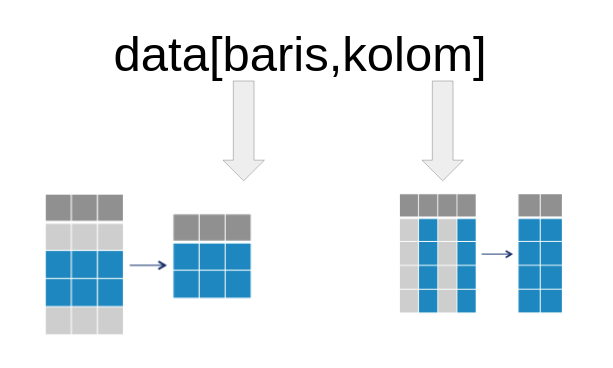

```{r setup, include=FALSE}
# clear-up the environment
rm(list = ls())

# chunk options
knitr::opts_chunk$set(
  message = FALSE,
  warning = FALSE,
  fig.align = "center",
  comment = "#>"
)
```

```{=html}
<style>
body {
text-align: justify}
</style>
```
# RStudio

**R** is the programming language, **RStudio** is an IDE for using R.

```{r import photo}
knitr::include_graphics("assets/rstudio.png")
```

-   **Console** : command prompt, engine utama\
-   **Source**: *R Files*: RScript, RMarkdown
-   **Environment tab**: Where we can save our R Objects
-   **Files, Plots, Help tabs**:\
-   *Help*: to get help, use `?` followed by function name. e/g: `?class`

# Basic R Programming

## Introduction to R Markdown

Bagian putih dari R Markdown (.Rmd) berguna untuk menulis narasi. Pada bagian ini dapat ditambahkan heading dengan menambahkan hashtag `#` sebelum kalimat. Narasi yang tidak ditambahkan `#` sebelum kalimat akan menjadi paragraf biasa.

Bagian abu-abu dari Rmarkdown adalah `chunk`. Chunk berguna untuk menulis **code**.

Shortcut

-   menambahkan chunk : ctrl/cmd + alt/option + i
-   run 1 chunk : ctrl/cmd + shift + enter
-   run 1 baris : ctrl/cmd + enter

```{r}


```

## Object

Untuk pengolahan data di R, data atau sebuah value dapat disimpan/diassign ke dalam objek. Untuk assign objek dapat menggunakan `<-` dan hasilnya akan tersimpan pada environment.

```{r}


```

```{r}
# objek bernama `nama` berisi suatu value:
nama <- "Algoritma"
# print isi objek
nama
```

Data rumah:

-   panjang = 50

-   lebar = 10

-   luas = panjang\*lebar

-   shortcut assignment= alt + -

```{r}
panjang <- 50
lebar <- 10
```

```{r}
# hitung luas rumah
luas <- panjang*lebar
luas
```

## R is Case Sensitive

```{r}
"Algoritma" == "algoritma"
"Algoritma" == "Algoritma"
"Algoritma" != "algoritma"
```

Aturan dalam object:

1.  Tidak boleh ada spasi
2.  Tidak boleh ada angka didepan nama object
3.  Case sensitive

-   artinya Panjang tidak sama dengan panjang

-   Apabila ingin menghapus object yang sudah tersimpan di environment, dapat menggunakan command `rm(nama_object)` yang dijalankan di console

-   cara lain buat hapus:

1.  Ganti list jadi grid
2.  pilih variable
3.  hapus pakai icon kuas

## Overwrite

Value yang tersimpan kedalam environment adalah value yang terakhir di run.

```{r}
tempat <- "Algoritma" # character
tempat <- "Rumah"
```

```{r}
tempat <- "Ruang belajar"
tempat <- "Cafe"
```

## Comment

Untuk memasukan narasi dalam chunk dapat menggunakan **comment** dengan menambahkan `#` sebelum narasi tersebut. Comment tidak dianggap sebagai codingan dalam chunk, sehingga tidak akan menimbulkan error.

-   Shortcut --> ctrl/cmd + shift + c

```{r}
#ini adalah komentar
1 + 2 

```

```{r}
# ini adalah comment
1+1 # operasi matematika
```

## 🧠 Dive Deeper

Buatlah 3 buah object sebagai berikut:

-   `nama`: nama lengkap Anda
-   `pekerjaan`: pekerjaan Anda saat ini
-   `kota`: domisili Anda

Gunakan komentar untuk memperjelas code yang diketikkan

```{r}
# code here

```

## Summary Day 1

R dan RStudio: Tools data science

-   R : Bahasanya
-   RStudio : Tempatnya/IDE/GUI

Files:

-   .html :

    -   File yang dapat dibuka di web browser
    -   Hasil knit dari file rmd

-   .rmd :

    -   Kepanjangan dari RMarkdown

    -   File yang harus dibuka menggunakan RStudio

    -   Gabungan dari code R dan Markdown

        -   Markdown : Menulis narasinya
        -   Code R (Chunk): Menulis code/perintah R

-   .rproj :

    -   Untuk membuka RStudio agar directorynya langsung pada project/folder

Object

-   Menyimpan suatu nilai atau value

-   Ditandai denga tanda assignment (\<-)

-   Sifat-sifat

    -   Tidak boleh pakai spasi
    -   tidak boleh ada angka didepan
    -   Case sensitive
    -   Overwrite

## Data Type

### Character

Tipe data yang berisi huruf/karakter.

```{r}
# buat data kota

# cek tipe data

```

### Numeric

Tipe data berisi angka yang dapat berupa angka kontinu (ada koma/pecahan), maupun diskrit (bilangan bulat tanpa koma).

```{r}
# buat data kota

# cek tipe data

```

### Integer

Tipe data berisi angka yang berupa angka diskrit (bilangan bulat tanpa koma). Umumnya dari data ID (costumer ID, transaction ID, dll). Untuk memaksa numeric menjadi integer, dapat gunakann L dibelakang angka.

```{r}
# buat data kota

# cek tipe data

```

### Logical

Tipe data yang hanya berisi `TRUE` atau `FALSE`. Penulisan TRUE/FALSE dapat disingkat menjadi T/F.

```{r}
# buat data kota

# cek tipe data

```

### Implicit Coercion

Lalu, apa yang akan terjadi jika dalam satu vector memiliki beberapa tipe data yang berbeda seperti chunk dibawah ini?

```{r}
mix <- c("Algoritma", 2020, TRUE)
mix
```

```{r}
class(mix)
```

Bila Anda perhatikan setiap nilai pada vector `mix` memiliki **petik dua**, artinya nilai tersebut merupakan sebuah objek dengan tipe character. Proses perubahan paksa dari suatu vector bisa disebut sebagai **implicit coercion**. Ilustrasi terjadinya implicit coercion dapat dilihat pada gambar di bawah ini:

```{r}
knitr::include_graphics("img/data_type.png")
```

## ❓ Knowledge Check

1.  Dibawah ini mana pernyataan yang salah terkait sifat pemrograman di R ?\

-   [ ] Bahasa Pemrograman R bersifat case sensitive\
-   [ ] Tanda \<- berfungsi untuk memasukkan suatu nilai kedalam sebuah objek\
-   [ ] Tanda // diawal sebuah chunk berfungsi sebagai tanda komentar

2.  Tipe data yang tepat untuk kolom yang berisi nama pelanggan adalah ?

-   [ ] Logical
-   [ ] Integer
-   [ ] Character
-   [ ] Numeric

1.  Di bawah ini mana pernyataan yang **salah** terkait sifat pemrograman di R ?

-   [ ] Bahasa pemrograman R bersifat case sensitive
-   [ ] Tanda \<- berfungsi untuk menyimpan suatu nilai ke dalam sebuah objek
-   [ ] Tanda // diawal sebuah chunk berfungsi sebagai tanda komentar\
-   [ ] tanda == digunakan untuk mengecek kesamaan antar 2 buah nilai

2.  Tipe data yang tepat untuk kolom umur student adalah ...

-   [ ] Logical
-   [ ] Integer
-   [ ] Character
-   [ ] Numeric

3.  Jawablah tipe data dari beberapa vector di bawah ini:

```{r}
vector1 <- c(TRUE, 1L, 1/2)
vector2 <- c(TRUE, "TRUE", 1, 1.0)
vector3 <- c(1, 2, 3, 4L)
```

-   Tipe data `vector1` adalah ...
-   Tipe data `vector2` adalah ...
-   Tipe data `vector3` adalah ...

## Data Structure

Struktur data merupakan bagaimana data disusun berdasarkan struktur tertentu, pada R terdapat 4 struktur data dasar yaitu vector, matrix, list, dan dataframe.

### Vector

Vector merupakan salah satu struktur data yang sering digunakan. vector merupakan struktur data yang hanya bisa menampung 1 tipe data saja dan hanya terdiri dari satu dimensi. untuk membuat vector dapat menggunanakan fungsi `c()`

```{r}
place <- c("Algoritma", "BCA", "Jakarta")
place
```

### Factor

factor merupkan bentuk perkembangan dari vector, yang membedakan vector dan factor adalah pada factor objek memiliki levels.

```{r}
card <- factor(c("Blue", "Gold", "Platinum", "Gold", "Gold"))
card
```

### Matrix

Matrix merupakan struktur data yang memiliki 2 dimensi dan hanya bisa di isi dengan 1 tipe data saja

```{r}
mat <- matrix(11:16, nrow = 3, ncol = 2)
mat
```

```{r}
mat[3,2]
```

### List

List merupakan struktur data yang dapat menyimpan lebih dari 1 tipe data dan hanya memiliki 1 dimensi

```{r}
our_list <- list(c(TRUE, FALSE), "TRUE", c(1, 6, 12), 1L)
our_list
```

Seperti `vector`, sebuah `list` hanya memiliki 1 dimensi; namun jika Anda ingin mengakses elemen-elemen data di dalamnya, Anda dapat menggunakan `[]`. Meskipun kita sudah menggunakan `[]`, kita masih akan mendapatkan objek dengan struktur data berupa `list`:

Jika ingin mengakses element pada list bisa mengguanakan tanda `[]`

```{r}
our_list[3]
```

Untuk mengakses *vector* yang ada di dalamnya, maka kita bisa menggunakan `[[]]`:

```{r}
our_list[[3]]
```

### Data Frame

Data frame merupakan tipe data yang paling sering digunakan dalam pengolahan data, karena data frame dapat berisi beberapa tipe data serta memiliki 2 dimensi. Adapun cara untuk membuat sebuah data frame kita bisa menggunakan fungsi `data.frame()` seperti di bawah ini:

```{r}
daftar_buah <- data.frame(
  buah = c("Apel", "Semangka", "Jambu"),
  ukuran = c(22,76, 12)
)

daftar_buah
```

Ilustrasi dari rangkuman keempat struktur data yang sudah kita bahas di atas, dapat diilustrasikan seperti di bawah ini:

```{r}
knitr::include_graphics("img/structure.png")
```

## 🧠 Dive Deeper

Buat sebuah data frame yang berisi 3 baris dengan kolom sebagai berikut:

-   `product_name`: nama produk di pasar swalayan (bebas/yang sering Anda beli)
-   `quantity`: jumlah pembelian masing-masing produk
-   `harga`: harga satuan untuk masing-masing produk

Simpan pada object yang bernama `product`

```{r}
# code here

```

# Working with Data Frame

## Directory

untuk mengetahui lokasi directory dari lokasi Rmd bisa menggunakan fungsi `getwd()`

```{r}
getwd()
```

dan untuk mengatur lokasi dari working directory bisa menggunakan `setwd()`

```{r}
setwd("../P4DS/")
```

## Read and extracting data

untuk memasukkan data yang bertipe csv ke R kita bisa menggunakan fungsi `read.csv`. Pada workshop kali ini data yang digunakan adalah data *retail.csv* yang berada pada folder **data_input**

```{r}
retail <- read.csv("data_input/retail.csv")
```

### View()

Pada umumnya ketika bekerja dengan data kita ingin melihat data bentuk data secara keseluruhan, hal tersebut dapat dilakukan dengan menggunakan fungsi View().

```{r}


```

### head() and tail()

Untuk melihat seluruh sebagian data yang sudah digunakan bisa menggunakan fungsi `head()` dan `tail()`. `head()` berguna untuk melihat beberapa baris pertama pada data (default 6)

```{r}


```

sedangkan `tail()` untuk melihat beberapa data terakhir.

```{r}


```

### str()

Untuk melihat struktur data yang dimiliki dapat mengguankan fungsi `str()`

```{r}

```

### dim(), nrow(), ncol()

mengetahui dimensi dari data bisa menggunakan fungsi dim()

```{r}

```

untuk mengetahui jumlah baris bisa menggunakan fungsi `nrow()` sedangkan jumlah kolom bisa menggunakan `ncol()`

```{r}


```

### summary

dengan menggunakan fungsi summary() kita bisa melihat rangkuman dari suatu data.

```{r}


```

## ❓ Knowledge Check

1.  Code yang tepat untuk melihat 10 baris terakhir pada data retail yaitu ...

-   [ ] `head(retail, 10)`
-   [ ] `str(retail)`
-   [ ] `summary(retail, 10)`
-   [ ] `tail(retail, 10)`

2.  Fungsi yang digunakan untuk menampilkan dimensi data serta tipe data setiap kolom secara sekaligus yaitu ...

-   [ ] `dim()`
-   [ ] `ncol()`
-   [ ] `class()`
-   [ ] `str()`

## Performing simple data cleansing

### Explicit Coercion

Tahapan awal sebelum melakukan analisis data adalah memastikan bahwa data yang digunakan sudah bersih. Salah satu teknik data cleansing yaitu mengubah tipe data ke dalam tipe data yang tepat, atau dikenal sebagai istilah **explicit coercion**.

```{r}
# cek kembali struktur data retail
str(retail)
```

Untuk mengubah tipe data, kita bisa menggunakan fungsi `as.___()` di mana `___` diisi dengan tipe data tujuan. Contoh:

-   `as.character()`
-   `as.Date()`
-   `as.integer()`
-   `as.numeric()`
-   dan sebagainya

**Diskusi:** Dari data `retail`, kolom manakah saja yang perlu diubah tipe datanya?

-   ...
-   ...
-   ...

```{r}
# explicit coercion


# sekarang pada kolom dengan tipe data factor muncul frekuensinya 

```

Parameter `format` pada `as.Date()` digunakan untuk menspesifikan format penulisan tanggal pada data, berikut format yang sering digunakan:

-   YEAR

    -   %Y = tahun empat digit, contoh: 2022
    -   %y = tahun dua digit, contoh: 22

-   MONTH

    -   %B = nama bulan, contoh: January
    -   %b = nama bulan singkatan, contoh: Jan
    -   %m = bulan dua digit, contoh: 01
    -   %M = bulan satu digit, contoh: 1

-   DAY

    -   %A = nama hari, contoh: Monday
    -   %d = tanggal, contoh: 01 sampai 31

```{r}
retail$Ship.Date <- as.Date()
retail$Order.Date <- as.Date()
head(retail)
```

Tambahan: Kolom dengan tipe data date dapat dioperasikan satu sama lain. Misal kita ingin menghitung durasi waktu antara pemesanan (`Order.Date`) dengan pengiriman (`Ship.Date`), lalu simpan hasil perhitungan ke kolom `Duration`.

Fungsi `difftime()` digunakan untuk menghitung `time1 - time2` dengan parameter:

-   `time1`: waktu end
-   `time2`: waktu start
-   `units`: satuan waktu hasil pengurangan

```{r}
retail$Duration <- 
head(retail)
```

### Check Missing Value

Untuk mengetahui apakah terdapat missing value pada data, kita bisa menggunakan fungsi `anyNA()`

```{r}

```

untuk mengecek missing value pada setiap kolom dapat menggunakan fungsi `is.na()` dan `ColSums()`

```{r}

```

Pada data retail tidak didapati missing value. Proses imputasi missing value akan dibahas pada course machine learning.

### Subsetting

untuk melakukan subsetting pada R anda akan membutuhkan \[,\]. Ilustrasi penggunaan \[,\] dapat dilihat seperti gambar dibawah

```{r}

```

Dari data retail, ambil data dengan index 10 hingga 20

```{r}


```

Dari data retail ambil kolom kolom Ship.Date dan Ship.Mode

```{r}


```

#### Conditional Subsetting

Kita dapat menggunakan operator logikal berikut untuk melakukan **filter baris** berdasarkan kondisi tertentu.

**Logical Operator:**

-   `>` lebih dari
-   `<` kurang dari
-   `>=` lebih dari sama dengan
-   `<=` kurang dari sama dengan
-   `==` mengecek kesamaan 2 nilai
-   `!=` tidak sama dengan
-   `&` dan
-   `|` atau

Dari data `retail` ambil data yang memiliki `profit` lebih dari 4000, dan ambil kolom Product.Name dan Profit

```{r}


```

Berapa banyak data yang ber- Segment Corporate dan memiliki Profit diatas 500 ?

```{r}


```

## 🧠 Dive Deeper

Anda sebagai seorang analis hendak menelusuri performa penjualan perusahaan retail ini. Jawablah beberapa pertanyaan berikut:

1.  Ada berapa banyak transaksi barang dengan `Category` Furniture yang tipe pengirimannya (`Ship.Mode`) adalah Standard Class?

```{r}
# your code


```

2.  Ada berapa banyak transaksi dari `Category` Furniture yang mengakibatkan kerugian (`Profit` kurang dari nol)?

```{r}

```

### Sampling Data

Sampling data digunakan untuk mengambil beberapa baris secara random dari data. Biasanya dipakai ketika machine learning. Untuk sampling data gunakan fungsi `sample()` dan random number generator `set.seed()`.

```{r}
# contoh sederhana menggunakan vector
# tanpa set.seed() sampling akan berubah tiap kali running
Daerah <- c("Bandung", "Jakarta", "Yogyakarta", "Medan")
sample(Daerah, 3)
```

```{r}
# `set.seed()` mengunci random number generatornya, sehingga cara sampling tidak berubah tiap kali running.

set.seed(100) # dijalankan bersaman sample. angkanya bebas, max 10 digit.
sample(Daerah, 3)
```

Untuk sampling dari data.frame, harus dibuat objek berisi index baris yang akan diambil. Index baris dibuat secara random, kemudian diambil baris sesuai index yang sudah dibuat.

Contoh: Sample 60% observasi dari data retail!

```{r}
# buat index baris secara random
set.seed(100)
index <- sample(nrow(retail), # jumlah baris data
                nrow(retail)*0.6) # jumlah baris yang ingin diambil: 60%

head(index) # menampilkan index random yang akan disampling
```

```{r}
retail[index,]
```

## Data Aggregation

Ketika melakukan analisis data selain subsetting hal lain yang sering dilakukan adalah aggregasi data.

### `table()`

`table()`: menampilkan **frekuensi** tiap **kategori**

1.  Hitung frekuensi dari setiap Segment pada data.

```{r}


```

### `prop.table()`

Untuk mengetahui **proporsi/persentase** dari tiap kategori.

`prop.table(table(...))`

Tampilkan proporsi transaksi untuk masing-masing Segment pelanggan!

```{r}


```

### Xtabs

`xtabs()` menampilkan **jumlah (sum) suatu variabel numerik** untuk tiap variabel factor.

`xtab(formula = ..., data =...)`

Ket:

-   formula = numerik \~ factor
-   data = data yang digunakan

Contoh:

Berapa total Profit yang dihasilkan untuk tiap Category Produk?

```{r}


```

Berapa total Sales yang dihasilkan untuk tiap pasangan Segment & Category?

```{r}
# your code


```

### Aggregate

Untuk aggregasi data lebih fleksibel (dari segi fungsi yang digunakan), kita dapat menggunakan fungsi `aggregate()`. `aggregate()` digunakan untuk menghitung nilai statistik tertentu (jumlah, rata2, dll) berdasarkan kategori tertentu dalam data.

`aggreagete(formula=..., data=..., FUN=...)`

Ket:

-   formula = (yg ingin dihitung) \~ (kategori1) + (kategori2) + (dst)

-   data = data yang ingin digunakan

-   fungsi = nilai statistik tertentu:

    -   sum = jumlah
    -   min = nilai min
    -   max = nilai max
    -   mean = rata rata
    -   median = nilai tengah

Contoh: Berapa rata-rata Sales untuk setiap Segment dan Category?

```{r}


```

### Summary Tables

-   `table()`:
-   `prop.table()`:
-   `xtabs()`:
-   `aggregate()`:

### 🧠 Dive Deeper

1.  Berapa rata-rata profit yang dihasilkan dari tiap Segmen pelanggan?

2.  Berapa jumlah Quantity yang terjual untuk masing-masing Category?

3.  Pasangan Category-Sub.Category yang yang menghasilkan rata-rata profit tertinggi adalah?
