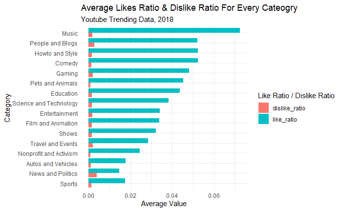
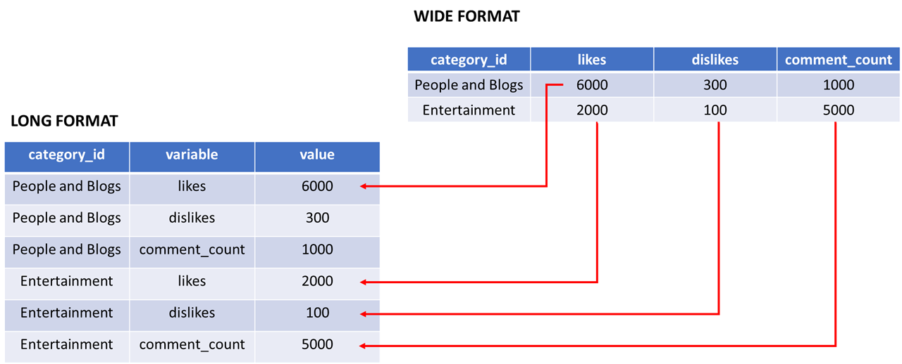

```{r setup, include=FALSE}
# clear-up the environment
rm(list = ls())

# chunk options
knitr::opts_chunk$set(
  fig.align = "center",
  message = FALSE,
  warning = FALSE,
  comment = "#>"
)
```

TOPIC: 1. DATA WRANGLING 2. DATA VISUALIZATION

# About The Dataframe

Data yang akan kita gunakan untuk mendalami Data Visualization selama 4
hari kedepan adalah sebuah dataframe yang bernama **Youtube's US
Trending Videos**.

Contoh trending video di Youtube:

```{r}
# Please run code down below
knitr::include_graphics("assets/trending.png")
```

## Data Import / Read Data

```{r}
# Please run code down below
vids <- read.csv("data_input/USvideos.csv")
head(vids)
```

Penjelasan mengenai 12 kolom dalam dataframe:

-   `trending_date`: tanggal trending (format: YY.DD.MM)
-   `title`: judul video
-   `channel_title`: nama channel Youtube
-   `category_id`: kategori video
-   `publish_time`: tanggal upload video (format: YYYY-MM-DD-HH-MM-SS)
-   `views`: jumlah views dalam video tersebut
-   `likes`: jumlah likes dalam video tersebut
-   `dislikes`: jumlah dislikes dalam video tersebut
-   `comment_count` jumlah komentar
-   `comment_disabled`: apakah kolom komentar tidak diaktifkan
-   `rating_disabled`: apakah rating video tidak diaktifkan
-   `video_error_or_removed`: apakah video dihapus

Setelah melakukan import dataframe yang ingin digunakan jangan lupa
untuk melakukan inspeksi tipe data, untuk memastikan tipe data sudah
sesuai.

```{r}
# Inspect Data Type 
str(vids)
```

Apa saja kolom yang tipe datanya belum sesuai?

-   trending_date -> datetime
-   publish_time -> datetime
-   channel_title -> factor
-   category_id -> factor

Kenapa melakukan inspeksi tipe data itu **penting** sebelum melanjutkan
ke tahap selanjutnya? Untuk memastikan bahwa semua tipe data yang ada
pada dataframe tersebut sudah sesuai dan *bisa diolah lebih lanjut*.

## Data Wrangling

### Manipulasi data waktu menggunakan fungsi as.date()

strftime reference: <https://strftime.org/>

-   Kolom `trending_date`

Before:

```{r}
# Please type your code
as.Date(vids$trending_date, format = "%y.%d.%m")
head(vids$trending_date)
```

Default date pada R \<- Year - Month - Day (YYYY/MM/DD)

After:

```{r}
# Please type your code
head(vids$trending_date)
```

```{r}
# Class adalah sebuah fungsi untuk melakukan inspeksi tipe data
str(vids$trending_date)
```

```{r}
class(vids$trending_date)
```

-   Kolom `publish_time`

Before:

```{r}
head(vids$publish_time)
head(as.Date(vids$publish_time, format="%Y-%m-%d"))
```

After:

```{r}
# Please type your code
head(vids$publish_time)
```

```{r}
# Cek tipe data
str(vids$publish_time)
```

Quick Summary About `as.Date()`

-   Format tanggal/date yang bisa langsung diubah dengan menggunakn
    `as.date()` adalah Year-Month-Day
-   Dia akan menghilangkan format waktu
-   Jika format date/tanggal berbeda dengan default fungsi `as.Date()`,
    kita bisa menambahkan parameter **format =**.

### Manipulasi data waktu menggunakan library `lubridate`

Penggunaan lubridate secara singkat dapat dilihat di `cheatsheet`

```{r}
#install.packages("lubridate")
library(lubridate)
```

-   Kolom `trending_date`

Before:

```{r}
# Please type your code
vids$trending_date <- ydm(vids$trending_date)
head(vids$trending_date)
```

After:

```{r}
# Please type your code
# Format date dari kolom trending_date = Year-Day-Month
class(vids$trending_date)
```

-   Kolom `publish_time`

Before:

```{r}
# Please type your code
# Format date dari kolom publish_date = Year-Month-Day-Hour-Month-Day
vids$publish_time <- ymd_hms(vids$publish_time, tz='America/New_York')
head(vids$publish_time)
```

After:

```{r}
class(vids$publish_time)
```

Kita bisa merubah timezone (zona waktu) List time zone:
<https://en.wikipedia.org/wiki/List_of_tz_database_time_zones>

Kita ubah timezone menjadi Jakarta

```{r}
# Please run code down below
head(ymd_hms(vids$publish_time, tz = "Asia/Jakarta"))
```

Kita ubah timezone menjadi New_York

```{r}
# Please run code down below
head(ymd_hms(vids$publish_time, tz = "America/New_York"))
```

```{r}
# Please type your code

```

Quick Summary About tipe yang memiliki tanggal & waktu:

-   *POSIXct/POSIXt* adalah tipe data untuk data yang memiliki tanggal &
    waktu
-   Jika ada data waktu, kita bisa mengatur zona waktunya dengan
    menambahkan parameter **tz =**

**Bermain dengan `lubridate`**

`most_view` adalah sebuah objeck yang isinya adalah sebuah video dengan
views terbanyak dari dataframe **Youtube's US Trending Videos**

```{r}
# Please run the code down below
most_view <- vids[vids$views == max(vids$views), ]
most_view
```

Task 1: Mengekstrak Tahun dari kolom `trending_date`

```{r}
# Please type your code
head(year(vids$trending_date))
```

Task 2: Mengekstrak bulan dari kolom `publish_time`

```{r}
# Please type your code
head(month(vids$publish_time))
```

Task 3: Mengekstrak bulan sebagai nama bulan dari kolom `publish_time`

```{r}
# Please type your code
# Ganti abbr = T apabila ingin nama bulan disingkat.
head(month(vids$publish_time, label = T, abbr = F))
```

Task 4: Mengekstrak tanggal dari kolom `trending_date`

```{r}
# Please type your code
head(wday(vids$trending_date, label = T, abbr=F))
```

Task 5: mengekstrak hari dari kolom `trending_date`

```{r}
# Please type your code
head(wday(vids$trending_date, label = T, abbr=F))
```

Task 6: mengekstrak jam, menit, dan detik dari kolom `publish_time`

```{r}
# Please type your code
# jam
head(hour(vids$publish_time))

# meni
head(minute(vids$publish_time))

# detik 
head(second(vids$publish_time))
```

**DIVE DEEPER**

1.  Buat kolom baru berisi hari publish video dan jam publish video
    untuk `vids`. Beri nama `publish_day` dan `publish_hour` dari kolom
    `publish_time`

-   `publish_day`

Hint: label = T, abbr = F

```{r}
# Please type your code
vids$publish_day <- wday(vids$publish_time, label=T, abbr=F)
```

-   `publish_hour`

```{r}
# Please type your code
vids$publish_hour <- hour(vids$publish_time)

```

```{r}
head(vids[, c("publish_day", "publish_hour")])
```

2.  Buat kolom berisi berapa lama waktu untuk trending? Beri nama
    `time_to_trend`

Hint:

-   buat kolom `publish_date` yang isinya **hanya** tanggal (YYY-MM-DD)
    dari kolom `publish_time`
-   mengurangkan kolom `trending_date` dengan `publish_date` kemudian
    ubah menjadi numeric

```{r}
# Please type your code
vids$publish_date <- date(vids$publish_time)
head(vids$publish_date)
```

```{r}
# interval(start = vids$publish_date, end = vids$trending_date)
vids$time_to_trend <- difftime(vids$trending_date, vids$publish_date, units = "days")
```

```{r}
head(vids$time_to_trend)
```

### Membuat kategori jam untuk kolom `publish_hour`

```{r}
# Please run the code down below
unique(vids$publish_hour)
```

Kita akan mengkategorikan `publish_hour` menjadi 3 kategori:

-   12am to 8am
-   8am to 3pm
-   3pm to 12am

Langkah yang dilakukan:

-   Membuat kolom untuk informasi jam (`publish_hour`)
-   Membuat function untuk mentransformasi jam menjadi kategori
-   Menerapkan function tersebut ke seluruh data

Membuat function untuk mengkategorikan jam

```{r}
# Please run the code down below
convert_hour <- function(y){ 
    if(y <= 8){
      y <- "12am to 8am" # Untuk video dengan publish_hour antara tengah malam hingga jam 8 pagi
    }else 
      if(y > 8 & y < 16){
      y <- "8am to 3pm" # untuk video antara jam 8 pagi hingga jam 3 sore
    }else{
      y <- "3pm to 12am" # untuk video antara jam 3 sore sampai tengah malam
    }  
}
```

Untuk mengimplementasikan fungsi `convert_hour` kita bisa memanfaatkan
fungsi baru yang bernama `sapply()`.

-   `X` = parameter u/ mendifine kolom apa yang ingin kita transformasi
-   `FUN` = parameter untuk memasukan nama fungsi yang sudah kita buat

```{r}
# Please run the code down below
vids$publish_when <- sapply(X = vids$publish_hour, 
                            FUN = convert_hour) 

head(vids$publish_when)
```

```{r}
# Please run the code down below
str(vids$publish_when)
```

Ubah publish_when kedalam bentuk factor

```{r}
# Please type your code down below
vids$publish_when <- as.factor(vids$publish_when)
class(vids$publish_when)
```

### Merubah `category_id`

Pada tahapan ini kita akan melakukan transformasi pada kolom
`category_id` dari angka yang tidak bermakna menjadi nama kategori yang
lebih intuitif.

```{r}
# Please run the code down belom
vids[ , c("channel_title", "category_id")]
```

Kita ubah `category_id` menggunakan fungsi `sapply()` dan `switch()`

```{r}
# Please run the code down belom
data <- c("1","2")

sapply(X = data, # data/kolom yang ingin diubah 
       FUN = switch, # fungsi
       "1" = "Education", 
       "2" = "Travel", 
       "4" = "Music")
```

**sapply**: mengaplikasikan fungsi ke tiap baris pada suatu kolom secara
bersamaan.

```{r}
# Please run the code down below
vids$category_id <- sapply(as.character(vids$category_id), switch, 
                           "1" = "Film and Animation",
                           "2" = "Autos and Vehicles", 
                           "10" = "Music", 
                           "15" = "Pets and Animals", 
                           "17" = "Sports",
                           "19" = "Travel and Events", 
                           "20" = "Gaming", 
                           "22" = "People and Blogs", 
                           "23" = "Comedy",
                           "24" = "Entertainment", 
                           "25" = "News and Politics",
                           "26" = "Howto and Style", 
                           "27" = "Education",
                           "28" = "Science and Technology", 
                           "29" = "Nonprofit and Activism",
                           "43" = "Shows")

vids$category_id <- as.factor(vids$category_id)

vids[ , c("channel_title", "category_id")]
```

### Merubah beberapa kolom dengan tipe `integer` menjadi `numeric` sekaligus

Ketika kita ingin merubah beberapa kolom sekaligus, kita bisa
menggunakan function `lapply()`/`sapply()`. Misalnya kita ingin merubah
kolom-kolom yang integer (`views`, `dislikes`, `comment_count`, dan
`publish_hour`) menjadi numeric

```{r}
# Please type your code down below
int_cols <- c("views", "dislikes", "comment_count", "publish_hour")
vids[, int_cols] <- lapply(vids[, int_cols], FUN = as.numeric)

str(vids[, int_cols])
```

**lapply**: untuk mengaplikasikan fungsi (misal merubah tipe data) ke
beberapa kolom secara bersamaan.

### Mengambil judul video yang unik

Dalam data vids terdapat redudansi data yaitu terdapat video yang muncul
beberapa kali karena trending lebih dari 1 hari.

```{r}
# Please run the code down below
length(vids$title)
length(unique(vids$title))
```

Untuk analisis lanjutan, *kita hanya akan menggunakan data video saat
video tersebut pertama kali trending* demi mengurangi redudansi data.
Untuk itu kita dapat menggunakan `unique()` dan `match()`.

**unique**: menghasilkan nilai unik dari suatu vektor.

**match**: menghasilkan index data yang cocok dari hasil pencocokan
vektor 1 ke vektor ke 2

```{r}
# Please run the code down below
df <- data.frame(nama = c("Victor", "Victor", "Ajeng", "Yosia", "Yosia", "Ajeng"),
           nilai = c(70, 95, 85, 80, 70, 90))
df
```

```{r}
# Please run the code down belom
df <- df[order(df$nilai, decreasing = T), ]
df
```

```{r}
# Please run the code down belom
df[match(unique(df$nama), df$nama), ]
```

Mari kita kurangi redudasi data yang terdapat di dataframe **vids** dan
simpan dalam objeck baru bernama **vids.unik**

```{r}
# Please type your code down below
vids.unik <- vids[match(unique(vids$title), vids$title), ]
head(vids.unik)
```

```{r}
length(unique(vids.unik$title))
```

Note:

-   `switch()` membutuhkan kamus untuk mentranslasikan nilai. Bila nilai
    tidak ada pada kamus, maka dihasilkan NULL.
-   Nilai yang ditranslasi lebih baik diubah ke tipe karakter terlebih
    dahulu

# Basic plotting in R

Exploratory Data Analysis Bertujuan untuk mendapat informasi dari data
(explorasi). EDA biasa dilakukan menggunakan base plot.

Fungsi yang akan digunakan untuk melakukan base plot adalah `plot()`,
jenis plot yang dihasilkan berubah sesuai tipe data yang dimasukkan,
jika:

-   1 variabel, x kategori: **bar chart**
-   1 variabel, x numerik: **histogram plot**
-   2 variabel, x dan y adalah numerik: **scatter plot**
-   2 variabel, x kategori, y numerik: **boxplot**

## Bar

Business case: Sebagai seorang konsultan media sosial, kita ditugaskan
untuk membantu seorang klien yang ingin memulai karir sebagai youtuber.
Salah satu pertanyaan pertamanya adalah *pada rentang jam berapa saya
harus publish supaya diminati?*

```{r}
str(vids)
```

```{r}
# Please type your code down below
plot(vids$publish_when)
```

Insight:

-   Kebanyakan video ditonton pada rentang jam 8 pagi sampai 3 sore

-   Rentang jam yang paling sedikit penontonnya ada pada rentang 12
    malam sampai 8 pagi.

## Histogram

Business case: Klien tersebut sangat tertarik untuk membuat konten
dengan kategori `Autos and Vehicles`, `Gaming` dan `Travel and Events`.
Klien tersebut ingin mendapatkan gambaran secara garis besar *berapakah
distribusi like ratio yang bisa didapatkan dari ketiga kategori
tersebut?*

Hint:

-   Like ratio dapat dihitung dengan membagi like dengan view
-   Melakukan conditional subseting

Step 1: Menghitung like ratio lalu simpan ke objek bernama `like_ratio`

```{r}
# Please type your code down below
vids.unik$like_ratio <- vids.unik$likes / vids.unik$views
```

Step 2: Melakukan conditional subseting untuk 3 unique value lalu simpan
ke objek baru bernama `vids.agt`

```{r}
# Please type your code down below
cond <- vids.unik$category_id %in% c("Autos and Vehicles", "Gaming", "Travel and Events")
vids.agt <- vids.unik[cond, ]
head(vids.agt)
```

Dikarenakan level dari unique valuenya masih ada, kita dapat
menghilangkannya dengan menggunakan fungsi `droplevels()`

```{r}
# Please type your code down below
vids.agt$category_id <- droplevels(vids.agt$category_id)
unique(vids.agt$category_id)
```

Step 3: Visualisasi

Ketika kita ingin membuat histogram plot, kita tidak menggunakan fungsi
`plot()`, melainkan kita akan menggunakan fungsi `hist()`

```{r}
# Please type your code down below
hist(x = vids.agt$like_ratio, breaks = 10)
```

Insight:

-   Ketiga kategori tersebut memiliki like ratio yang cukup rendah.

## Boxplot

Business case: Selain mengetahui secara garis besar mengenai distribusi
dari ketiga kategori video tersebut. Klien kita juga ingin mengetahui
lebih detail dari masing-masing kategori, *kategori video apakah yang
memiliki like ratio paling tinggi?*

```{r}
# Please type your code down below
plot(vids.agt$category_id, vids.agt$like_ratio)
```

Insight:

-   Video dengan kategori Gaming memiliki like ration yang lebih tinggi
    dibandingkan Autos and Vehicles dan Travel dan Events

-   Like ratio dari Autos and Vehicle paling rendah dibandingkan dua
    categori lainnya.

## Scatter plot

Business case: Pertanyaan terakhir yang diajukan oleh klien kita adalah
beliau juga ingin megetahui hubungan likes dan dislikes dari video
dengan ketiga category tersebut. Agar dapat menentukan *content manakah
yang tepat untuk di publish sehingga memperoleh likes ratio yang banyak
dan dislikes ratio yang sedikit?*

Hint: Rasio didapatkan dari membagi dislike dengan jumlah view per judul
video

Step 1: Menghitung dislike ratio lalu simpan ke objek bernama
`dislike_ratio`

```{r}
# Please type your code down below
vids.agt$dislike_ratio <- vids.agt$dislikes / vids.agt$views
```

Step 2: Melakukan visualisasi

```{r}
# Please type your code down below
plot(vids.agt$like_ratio, vids.agt$dislike_ratio)
cor(vids.agt$like_ratio, vids.agt$dislike_ratio)
```

Plot sudah terbentuk tapi kita kekurangan informasi kita tidak tahu
titik mana dengan kategori `Autos and Vehicles`, `Gaming` atau
`Travel and Events` Kita juga ingin menambahkan garis tren hubungan
antara 2 variabel

Step 3: Menambahkan Legend

Untuk memberikan lagenda pada scatter plot kita bisa menambahkan fungsi
`legend()`, pada fungsi tersebut nantinya kita bisa mengisi beberapa
parameter + `x` = mengatur posisi legend + `legend` = unique value dari
kolom yang ingin ditampilkan + `fill` = untuk memberikan warna, sesuai
dengan jumlah unique value dari kolom yang ingin ditampilkan

```{r}
# Please type your code down below
plot(x = vids.agt$like_ratio, 
     y = vids.agt$dislike_ratio,
     col = vids.agt$category_id,
     pch=16)
legend(x = 'right',
       legend = levels(vids.agt$category_id),
       fill = 1:5)
# Pch untuk memberikan bentuk

```

Step 4: Menambahkan garis tren

Untuk memberikan garis yang menunjukan apakah ada tren positif ataupun
negatif kita bisa menambahkan fungsi `abline()` + Pada fungsi tersebut
nantinya bisa di isi dengan fungsi `lm()` yang akan membuat garis linear
berdasarkan perhitungan linear model, dengan mengisi beberapa parameter
berikut ini - `formula` = parameter ini bisa diisi dengan - `data` =
dataframe yang digunakan

```{r}
# Please type your code down below
plot(x = vids.agt$like_ratio, 
     y = vids.agt$dislike_ratio,
     col = vids.agt$category_id,
     pch=16)
legend(x = 'right',
       legend = levels(vids.agt$category_id),
       fill = 1:5)
abline(lm(formula = dislike_ratio ~ like_ratio, data= vids.agt))

```

```{r}
cor(vids.agt$dislike_ratio, vids.agt$like_ratio)
```

Insight:

-   Korelasi nya positif lemah

**Kapan Menggunakan Base Plot?**

-   Ketika ingin membuat plot sederhana
-   Ketika kita ingin melakukan analisis secara cepat
-   Ketika grafik yang dihasilkan tidak untuk ditampilkan di depan umum

# Grammar of Graphics with `ggplot2`

Base plot amat berguna untuk melakukan eksplorasi data di awal dimana
codingannya cukup sederhana. Ia dapat menyampaikan informasi mengenai
data (distribusi/pola data) dan hubungan antar data secara cepat.

Sistem grammar yang digunakan pada base plot adalah membuat fungsi
secara berurutan dan harus dijalankan bersamaan sehingga tidak begitu
fleksibel dalam kostumisasi plot.

## What is ggplot

```{r}
#install.packages("ggplot2")
library(ggplot2)
```

Apa itu ggplot2? ggplot2 adalah sebuah libary yang akan menyediakan
sebuah kanvas kosong yang dapat digunakan untuk membuat visualisasi.
Sistem pembuatannya akan berdasarkan *grammar formula of visualization*
dan *layer by layer*. Kedua sistem pembuatannya sangat bisa untuk
dikutomisasi sehingga plot yang disajikan nantinya sangat cocok jika
ingin ditampilkan kepada audiens.

*Grammar formula of ggplot2*
`ggplot(data = ..., mapping = aes(x=..., y=...)) + geom_... + ...`

```{r}
ggplot(data = , mapping = aes(x=, y=))
```

Untuk lebih kenal dengan library ggplot2 mari kita coba melakukan
visualisasi!

**Business case:** Kita sebagai data analyst ingin mencari tahu tentang
*likeability (like_ratio)* & enggagement *(comments_ratio)* yang tinggi
pada categry `Autos and Vehicles`, `Gaming` dan `Travel and Events`,
manakah kategori yang paling baik untuk dibuatkan konten?

Step 1: Buatlah kolom baru yang berisikan ratio comment dengan views

Hint:

-   Gunakan objek `vids.agt`
-   Buatlah object baru bernama `comment_ratio` yang berisikan hasil
    bagi kolom `comment_count` dengan kolom `views`

```{r}
# Please Type Your Code Down Below
vids.agt$comment_ratio <- vids.agt$comment_count / vids.agt$views
head(vids.agt$comment_ratio)
```

Step 2: Masukan parameter yang diperlukan untuk fungsi `ggplot()`

Parameter pada fungsi `ggplot()`,

-   `data` = dataframe yang ingin digunakan
-   `mapping` = parameter ini akan di isi dengan *Aesthetic / aes()*,
    aes() adalah fungsi yang bisa diisi dengan elemen-elemen yang
    penting dalam grafik, meliputi sumbu x, sumbu y.

```{r}
# Please Type Your Code Down Below
# Main layer
ggplot(data = vids.agt, 
       mapping = aes(x = category_id, y = like_ratio)) +
  geom_boxplot()
```

Step 3: Menambahkan layer

Layer 1 - Boxplot

Untuk menambahkan layer pada main layer, kita bisa menggunakan simbol
`+`

```{r}
# Please Type Your Code Down Below
ggplot(data = vids.agt, 
       mapping = aes(x = category_id, y = like_ratio)) +
  geom_boxplot()
```

Layer 2- scatterplot

*geom_point*

```{r}
# Please Type Your Code Down Below
ggplot(data = vids.agt, 
       mapping = aes(x = category_id, y = like_ratio)) +
  geom_boxplot() + 
  geom_point()
```

```{r}
ggplot(data = vids.agt, 
       mapping = aes(x = category_id, y = like_ratio)) +
  geom_point() + 
  geom_boxplot()
```

*geom_jitter*

```{r}
# Please Type Your Code Down Below
ggplot(data = vids.agt, 
       mapping = aes(x = category_id, y = like_ratio)) +
  geom_boxplot() + 
  geom_jitter()
```

Notes:

-   `geom_jitter`: scatterplot dengan titik yang random bergeser ke
    kiri/kanan, agar tidak tumpang tindih

Step 4: Menambahkan parameter Aesthetic untuk fungsi geom

```{r}
# Please Type Your Code Down Below
ggplot(data = vids.agt, 
       mapping = aes(x = category_id, y = like_ratio)) +
  geom_boxplot() + 
  geom_jitter(mapping = aes(size = comment_ratio))
```

Step 5: Menambahkan warna pada plot

Untuk memberikan warna pada plot kita, kita bisa memanfaatkan parameter
`color` atau `fill` pada fungsi `aes()`

-   Menggunakan parameter `fill`

```{r}
# Please Type Your Code Down Below
ggplot(data = vids.agt, 
       mapping = aes(x = category_id, y = like_ratio,
                     fill= category_id)) +
  geom_boxplot() + 
  geom_jitter(mapping = aes(size = comment_ratio))
```

-   Menggunakan parameter `color`

```{r}
# Please Type Your Code Down Below
ggplot(data = vids.agt, 
       mapping = aes(x = category_id, y = like_ratio,
                     color = category_id)) +
  geom_boxplot() + 
  geom_jitter(mapping = aes(size = comment_ratio))
```

-   Pengaruh penempatan parameter pada fungsi `aes()`

Ditempatkan pada fungsi `ggplot()`

```{r}
# Please Type Your Code Down Below
ggplot(data = vids.agt, 
       mapping = aes(x = category_id, y = like_ratio)) +
  geom_boxplot(mapping = aes(color = category_id)) + 
  geom_jitter(mapping = aes(size = comment_ratio))
```

Step 6: Menambahkan keterangan title, subtitle, legends, dan label sumbu
x dan y dengan menggunakan fungsi `labs()`

```{r}
# Please Type Your Code Down Below
ggplot(data = vids.agt, 
       mapping = aes(x = category_id, y = like_ratio)) +
  geom_boxplot(mapping = aes(color = category_id)) + 
  geom_jitter(mapping = aes(size = comment_ratio)) + 
  labs(title = "Like Ratio & Comment Ration For 3 Category",
       subtitle = "Youtube Trending Data",
       x = "Category",
       y = 'Like Ratio',
       size = 'Comment Ratio',
       color="Category") + 
  theme_classic()
```

Insight:

-   Kategori gaming memiliki like ratio dan comment ratio yang paling
    besar dibanding 2 kategori lainnya.

## Bar chart

Business Case: Sebagai seorang Data Analyst kita ingin menganalisa
channel yang yang sering menjadi trending, tolak ukur sebuah channel
sering menjadi trending adalah *pernah masuk ke trend setidaknya 10
kali.*

Step 1: Membuat sebuah objek dengan nama `trending_channel` yang
berisikan dataframe yang chanel title yang pernah trend setidaknya 10
kali

Hint:

-   `table()` adalah fungsi yang dapat dimanfaatkan untuk menghitung
    berapa kali chaneel tersebut menjadi trending
-   `as.data.frame()` adalah fungsi yang dapat dimanfaatkan untuk
    mengubah list menjadi dataframe

```{r}
# Please type your code down below
trending_channel <- table(vids.unik$channel_title)

```

Step 2: Melakukan conditional subseting hanya untuk channel yang pernah
trending 10 kali setidaknya

```{r}
# Please type your code down below
trending_channel <- as.data.frame(trending_channel)
head(trending_channel)
```

```{r}
trending_channel <- trending_channel[trending_channel$Freq >= 10, ]
head(trending_channel)
```

Step 3: Coba visualisasikan dengan `geom_col`

```{r}
# Please type your code down below
ggplot(data = trending_channel, mapping = aes(x = Var1, y = Freq)) + 
  geom_col()
```

Step 4: Coba kita switch antara kolom x & y pada parameter `aes()`

```{r}
# Please type your code down below
ggplot(data = trending_channel, mapping = aes(x = Freq, y = Var1)) + 
  geom_col()
```

Step 5: Menambahkan parameter `reorder()` disumbu y

-   `reorder()` adalah sebuh parameter yang dapat dimanfaatkan untuk
    mengurutkan freq

```{r}
# Please type your code down below
ggplot(data = trending_channel, mapping = aes(x = Freq, y = reorder(Var1, Freq))) + 
  geom_col() 
```

Step 6: Mengubah warna dalam plot dengan menabahkan fungsi
`scale_fill_gradient()`

-   `scale_fill_gradient()` adalah sebuah fungsi untuk meberikan gradasi
    warna pada setiap bar dalam `geom_col()`, parameter yang dapat
    digunakan adalah

    -   `low` = parameter untuk warna yang paling bawah
    -   `high` = parameter untuk warna yang paling atas

```{r}
# Please type your code down below
ggplot(data = trending_channel, mapping = aes(x = Freq, y = reorder(Var1, Freq))) + 
  geom_col(mapping = aes(fill=Freq)) +
  scale_fill_gradient(low = "yellow", high = "red") + 
  theme_classic()

```

```{r}
ggplot(data = trending_channel, mapping = aes(x = Freq, y = reorder(Var1, Freq))) + 
  geom_col(mapping = aes(fill=Freq)) +
  theme_classic()
```

Step 7: Menabhakan `geom_text()`

-   `geom_text()` adalah sebuah fungsi untuk memberikan keteragan angka
    didalam bar plot

    -   `color` = Untuk memberikan warna ke text
    -   `size` = untuk mengatur ukuran text
    -   `nudge_x` = untuk mengatur orientasi sumbu x

```{r}
# Please type your code down below
ggplot(data = trending_channel, mapping = aes(x = Freq, y = reorder(Var1, Freq))) + 
  geom_col(mapping = aes(fill=Freq)) +
  geom_text(mapping = aes(label = Freq),
                          colors='black', 
                          size=3,
                          nudge_x = 0.7) + 
  scale_fill_gradient(low = "yellow", high = "red") + 
  theme_classic()
```

Insight:

-   Channel berbau talk show paling sering trending

-   Channel dengan freq tertinggi adalah Refinery29

## Multivariate Plot

Multivariate plot adalah sebuah plot yang digunakan untuk **menampilkan
nilai dari beragam variabel secara bersamaan**.

```{r}

```

Untuk megetahui bagaimana membuat multivariate plot, mari kita coba
replicate visualisasi diatas!

Business Case: Cari mean *like ratio* & *dislikes ratio* dari setiap
category dari data `vids.unik`

Step 1: Mari kita cari rata-rata *like ratio* & *dislike ratio*

Untuk mencari rata-rata dari 2 kolom atau lebih secara bersamaan, kita
bisa memanfaatkan sebuah fungsi yang bernama `aggregate.data.frame()`.

-   Parameter dari fungsi `aggregate.data.frame()`:

    -   `x`: list(kolom_1, kolom_2)
    -   `by`: list(categoric variable)
    -   `FUN`: fungsi matematis

```{r}
# Please Type Your Code Down Belowtrending
vids.unik$dislike_ratio <- vids.unik$dislikes / vids.unik$views

vids.agg <- aggregate.data.frame(x = list(like_ratio = vids.unik$like_ratio,
                                          dislike_ratio = vids.unik$dislike_ratio),
                                by=list(kategori = vids.unik$category_id),
                                FUN=mean)
head(vids.agg)
```

Step 2: Membuatnya menjadi dataframe menjadi long format

```{r}

```

Untuk melakukan reshaping data dengan pivot kita akan berkenalan dengan
library baru bernama `tidyr`

```{r}
# install.packages(tidyr)
library(tidyr)
```

Sebelumnya kita sudah berhasil membuat sebuah dataframe bernama
`vids.agg`, mari kita ubah bentuk datanya dari wide format menjadi long
format dengan menggunakan fungsi `pivot_longer()`

Parameter pada fungsi `pivot_longer()`: - data: object data - cols:
memilih kolom apa saja yang ingin diubah menjadi long format - names_to:
mengubah nama kolom yang akan mewakili data categorical yang diubah
menjadi format long - values_to: mengubah nama kolom yang mewakili data
numeric

```{r}
# Please type your code down below
pivot_longer(data =  vids.agg, 
             cols = c("like_ratio", "dislike_ratio"))
```

Simpan hasilnya kedalam sebuah object yang bernama `vids.agg.long`

```{r}
# Please type your code down below
vids.agg.long <- pivot_longer(data =  vids.agg, 
             cols = c("like_ratio", "dislike_ratio"))
```

*Contoh mengubah pivot longer -> pivot wider untuk keperluan
pembelajaran*

Sebelumnya kita subah berhasil melakukan reshaping data menjadi format
long. Sekarang mari kita coba kembalikan ke format wide dengan
menggunakan fungsi `pivot_wider()`

Parameter pada fungsi `pivot_wider()`

-   `data`: object data
-   `names_from`: parameter ini untuk memberi tahu fungsi kolom apa yang
    mewakili data yang ingin kita buat menjadi wide
-   `values_from`: parameter ini untuk memberi tahu fungsi kolom apa
    yang mewakili data numeric

```{r}
# Please type your code down below
pivot_wider(data = vids.agg.long, names_from = name, values_from = value)
```

Step 3: Mari visualisasi dataframe yang sudah dibuat menjadi long format

Pada fungsi `geom_col()` ada sebuah parameter yang bernama `position`
dan didalam postion itu bisa memasukan sebuah value bernama `dodge`.

```{r}
# Please Type Your Code Down Below
ggplot(data = vids.agg.long, mapping = aes(x = value, y = reorder(kategori, value))) +
  geom_col(mapping = aes(fill = name), 
           position = "dodge")

```

```{r}
ggplot(data = vids.agg.long, mapping = aes(x = value, y = reorder(kategori, value))) +
  geom_col(mapping = aes(fill = name))
```

Pada fungsi `geom_col()` ada sebuah parameter yang bernama `position`
dan didalam postion itu bisa memasukan sebuah value bernama `fill`.

```{r}
# Please Type Your Code Down Below
ggplot(data = vids.agg.long, mapping = aes(x = value, y = reorder(kategori, value))) +
  geom_col(mapping = aes(fill = name),
           position = "fill")
```

Step 4: Mengubah warna dalam plot dengan menabahkan fungsi
`scale_fill_manual()`

-   `scale_fill_manual()` adalah sebuah fungsi untuk meberikan gradasi
    warna pada setiap bar dalam `geom_col()`, parameter yang dapat
    digunakan adalah

    -   `values` = parameter untuk menentukan warna apa saja yang akan
        digunakan

Contoh:

`scale_fill_manual(values = c("orange", "red"))`

```{r}
# Please Type Your Code Down Below
ggplot(data = vids.agg.long, mapping = aes(x = value, y = reorder(kategori, value))) +
  geom_col(mapping = aes(fill = name), 
           position = "dodge") + 
  scale_fill_manual(values = c("red", "orange"))
```

**Dive Deeper**

Business Question: Sebagai seorang analyst kita ingin mencari tahu
*frekuensi untuk setiap rentang waktu upload* pada *setiap kategori*
channel youtube.

Additional task:

-   Gunakan fungsi `labs()`, untuk membuat tampilan dari visualisasi
    lebih rapi
-   Coba tarik insight dari hasil visualisasi yang dibuat

Hint:

-   Kalkulasi frekuensi kemunculan setiap rentan waktu upload dengan
    menggunakan fungsi `table()`

```{r}
# Please Type Your Code Down Below
publish_category <- as.data.frame(table(vids.unik$category_id, vids.unik$publish_when))
colnames(publish_category) <- c("kategori", "rentang", "freq")
head(publish_category)
```

```{r}
library(ggthemes)
ggplot(data = publish_category, mapping = aes(x = freq, y = reorder(kategori, freq))) +
  geom_col(mapping = aes(fill = rentang), 
           position = "dodge") + 
  labs(title = "Frekuensi Untuk Setiap Category dan Rentang Waktu",
       subtitle = "Youtube Trending Data",
       x = "Frekuensi",
       y = 'Kategori',
       color="rentang") + 
  theme_clean()
```

Insigth:

-   Kategori channel entertainment adalah jenis kategori yang paling
    banyak dilihat.

-   Mayoritas setiap kategori channel di publish di jam 8pagi - 3 sore

-   Hampir setiap kategori channel jarang di publish di jam 12 malam - 8
    pagi.

## Faceting

Memplotkan variabel di panel terpisah, sehingga visual menjadi lebih
jelas. Fungsi yang dapat digunakan adalah `facet_wrap()`

Parameter yang bisa digunakan pada fungsi `facet_wrap()`

-   `facets` = parameter yang menentukan kolom apa yang mau dipisah
-   `scales` = ada 3 value yang bisa diisi pada parameter ini yaiut
    `free_x`, `free_y` & `free`

Contoh: `facet_wrap(facets = ~ name, scales = "free_x")`

```{r}
# Tambahkan facet untuk scales = free_x
ggplot(data = vids.agg.long, mapping = aes(x = value, y = reorder(kategori, value))) +
  geom_col(mapping = aes(fill = name), 
           position = "dodge") + 
  scale_fill_manual(values = c("red", "orange")) + 
  facet_wrap(facets = ~ name, scales = "free_x") + 
  theme_clean()
```

```{r}
# Tambahkan facet untuk scales = free_y
ggplot(data = vids.agg.long, mapping = aes(x = value, y = reorder(kategori, value))) +
  geom_col(mapping = aes(fill = name), 
           position = "dodge") + 
  scale_fill_manual(values = c("red", "orange")) + 
  facet_wrap(facets = ~ name, scales = "free_y") + 
  theme_clean()
```

```{r}
# Tambahkan facet untuk scales = free
ggplot(data = vids.agg.long, mapping = aes(x = value, y = reorder(kategori, value))) +
  geom_col(mapping = aes(fill = name), 
           position = "fill") + 
  scale_fill_manual(values = c("red", "orange")) + 
  facet_wrap(facets = ~ name, scales = "free") + 
  theme_clean()
```

## Line chart

Business Case: Bagaimana trending dari konten dengan kategori `Comedy`,
`Education`,dan `Sciennce and technology` dari hari ke hari.

Hint:

-   Pada kasus ini kita akan menggunakan objek `vids`

Step 1: Mari kita persiapkan datanya dengan conditional subseting dengan
memanfaatkan `%in%`

```{r}
# Please run the code down below
vids.ces <- 
```

Step 2: Menghilangkan levels yang tidak diperlukan dengan menggunkan
fungsi `droplevels()`

```{r}
# Please run the code down below
vids.ces$category_id <- 
```

Step 3: Mari kita coba hitung kemunculan video yang trending dengan
menggunkan fungsi `table()`

```{r}
# Please run the code down below
vids.ces <- 
```

Step 4: Mari kita buat plotnya dengan menggunakan `geom_line()`

```{r}
# Please type your code down below
ggplot(data = , mapping = aes(x = , y = Freq, color = )) 

```

Step 5: Mari kita buat plotnya dengan menggunakan `geom_point()`

```{r}
# Please type your code down below

```

Step 6: Mengatur sumbu X dengan menggunakan fungsi `scale_x_date()`

Parameter yang dapat digunakan: - date breaks = `...days` `... week`
`...month` - date_labels = format tanggal, refensi bisa lihat disini
[\<https://strftime.org/>](https://strftime.org/){.uri}

Contoh: `scale_x_date(date_breaks = "1 week", date_labels = "%m-%d")`

```{r}
# Please type your code down below

```

Step 6: Mengatur sumbu X dengan menggunakan fungsi `scale_y_continous()`

Parameter yang dapat digunakan: - `breaks(seq(..,..,..))`

Contoh: `scale_y_continuous(breaks = seq(3, 27, 3))`

```{r}
# Please type your code down below

```

Step 7: Make it better

```{r}
# Please type your code down below

```

------------------------------------------------------------------------

Pertanyaan:

-   Apakah barplot bisa untu visualisasi dengan additional kolom selain
    default dari plot
-   Apakah sudah ada parameter untuk mengdefine 2 size di labs
