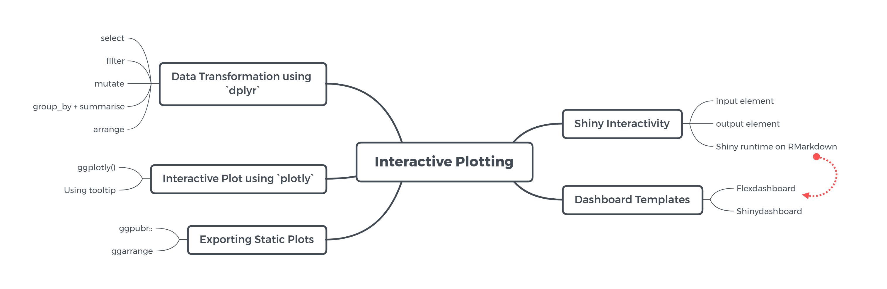
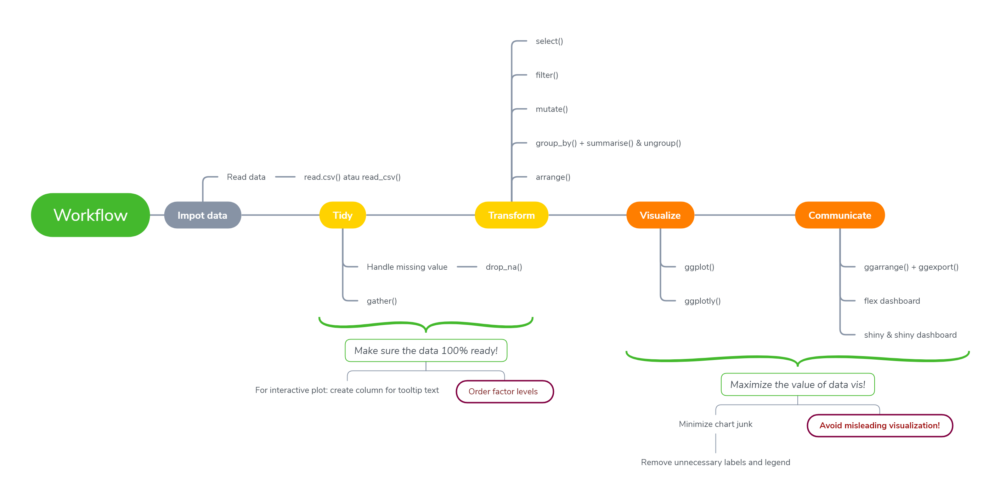

```{r setup, include=FALSE}
knitr::opts_chunk$set(echo = TRUE,
                      warning = FALSE,
                      message = FALSE,
                      comment = "#>")


```
# Training Objective

```{r workflow, eval=FALSE}

```

Dalam melakukan visualisasi yang siap untuk publikasi, hal-hal yang harus dilakukan adalah:

```{r workflow, eval=FALSE}

```

# Data Wrangling pada Package `dplyr`

Beberapa wrangling data sudah pernah kita pelajari menggunakan fungsi base R yaitu :

* seleksi kolom
* seleksi baris
* agregasi data
* mengurutkan value dari kolom
* membuat kolom baru
* mengubah tipe data pada suatu kolom

Pada eksplorasi kali ini, akan digunakan satu package bernama [tidyverse](https://www.tidyverse.org/), yang mengusung konsep tidy dalam transformasi data. Adapun di dalam `tidyverse`, terdapat package-package yang umum digunakan untuk transformasi data, yakni `ggplot2`, `dplyr`, `tidyr`, `readr`, `purrr`, `tibble`, `stringr`, dan `forcats`.

```{r}
# install.packages("tidyverse")
library(tidyverse)
library(glue)
library(plotly)
```

Data transformasi dan data wrangling adalah suatu hal yang cukup krusial dalam melakukan persiapan data untuk dibuat suatu visualisasi atau analisis lanjutan. Salah satu *package* yang cukup useful dan akan kita gunakan saat ini adalah `dplyr`; yang juga masuk dalam environment yang besar `tidyverse`.

## Read Data

Cara untuk melakukan read data kita akan menggunakan `read_csv` dari package `readr`. Keunggulannya adalah:
1. Kelas datanya sudah disesuaikan dengan sendirinya, terutama yang memiliki tipe data `date`.   
2. Saat membaca datanya, kita memperoleh beberapa informasi dari beberapa kolom yang ada pada data kita beserta dengan kelas datanya.   

Kali ini, kita akan menggunakan dataset dari [#tidytuesday](https://github.com/rfordatascience/tidytuesday/tree/master/data/2019/2019-03-05), yakni "Women in the workplace" dari biro statistik tenaga kerja dan biro sensus.

```{r eval=FALSE} 
# read data menggunakan `read.csv()` dan melihat struktur data
workers <- read.csv("data_input/jobs_gender.csv")
```

```{r, message=TRUE, warning=TRUE}

# read data menggunakan `read_csv()`
library(readr)
workers <- read_csv("data_input/jobs_gender.csv")
head(workers)
```
Setelah membaca data, agar data siap untuk digunakan untuk visualisasi data terkadang beberapa hal ini sering dilakukan:
* cek tipe data -> `glimpse()`
* mengganti tipe data dan menambahkan kolom -> `mutate()`
* subsetting kolom -> `select()`
* filtering baris -> `filter()`
* melakukan agregasi data -> `group_by()` - `summarise()` - `ungroup()`
* mengurutkan data -> `arrange()`

Beberapa dari fungsi diatas akan kita coba untuk membiasakan diri melakuan wrangling data menggunakan fungsi-fungsi dari package `dplyr`.

## Melihat Struktur Data Menggunakan `glimpse()`

Jika sebelumnya untuk melihat struktur data menggunakan `str()` pada base R.
```{r}
# dplyr
glimpse(workers)
```

Deskripsi variabel:
- `year`: Tahun
- `occupation`: Posisi/pekerjaan tertentu 
- `major_category`: Departemen/divisi
- `minor_category`: Sub-departemen/sub-divisi
- `total_workers`: Total pekerja (full time, di atas 16 tahun)
- `workers_male`: Total pekerja pria (full time, di atas 16 tahun)
- `workers_female`: Total pekerja wanita (full time, di atas 16 tahun)
- `percent_female`: Persentasi (proporsi) pekerja wanita untuk setiap posisi/pekerjaan tertentu
- `total_earnings`: Median pendapatan setiap pekerja (full time, di atas 16 tahun)
- `total_earnings_male`: Median pendapatan setiap pekerja pria (full time, di atas 16 tahun)
- `total_earnings_female`: Median pendapatan setiap pekerja wanita (full time, di atas 16 tahun)
- `wage_percent_of_male`: Rasio persentase pendapatan wanita dengan pria, bernilai NA untuk posisi/pekerjaan yang ukuran sampelnya kecil. 


## Subsetting Columns Menggunakan `select()`

Coba subset data `workers` berdasarkan kolom `year`, `occupation`, dan `total_workers`.

* untuk subsetting column pada fungsi base R bisa menggunakan `["baris","kolom"]`
```{r}
# subset base R
workers[ ,c("year","occupation","total_workers")] 
```

* `select()` : untuk subsetting column
```{r}
# subset dplyr
select(.data = workers, year, occupation, total_workers)
```

Misal kita ingin membuang kolom `major_category`, dan `wage_percent_of_male`
```{r}
# cara 1
select(.data = workers, -major_category, -wage_percent_of_male)
# cara 2
select(.data = workers, -c(major_category, wage_percent_of_male))
```


## Subsetting Row Menggunakan`filter()`

Coba subset data pekerja yang ada pada tahun 2015 saja. 

```{r}
# subset row base R
workers[workers$year == 2015, ]
```

* `filter()` : melakukan subsetting berdasarkan baris
```{r}
# subset row dplyr
filter(.data = workers, year == 2015)
```

Misalkan kita ingin melakukan subsetting berdasarkan pekerja pada tahun 2015 dan yang memiliki median pendapatan lebih (`total_earnings`) dari 30000.

```{r}
# Bu Atika
filter(.data = workers, year == 2015 & total_earnings > 30000) 

# Pak Didi & Pak Dading
filter(.data = workers, year==2015, total_earnings > 30000) 
```

Pada fungsi `filter()` :
* `,` sama dengan notasi AND (`&`)
* `|` sama dengan notasi OR (`|`)

Keunggulan menggunakan `filter()` adalah mengurangi penulisan ulang nama object data dan penggunaan `$`. 


## Konsep Piping ( %>% )

Tidying data menggunakan `dplyr` terdapat satu fungsi yang digunakan untuk mempermudah dalam melakukan tidying data yaitu piping ( `%>%` ). Analogi dari piping seperti ini:

Misal saya dari bangun tidur ingin pergi ke suatu tempat, kegiatan apa saja yang saya lakukan?

1. bangun
2. mandi
3. ganti baju
4. makan
5. siap-siap pergi
6. pergi


Jika kita terapkan dalam sebuah fungsi dan code, anggap beberapa fungsi yang kita miliki adalah:

* bangun()
* mandi()
* ganti_baju()
* makan()
* siap_pergi()
* pergi()

Maka jika kita ingin pergi dan mengaplikasikan dari beberapa fungsi serta step diatas:

* tanpa piping
```{r eval=FALSE}
pergi(siap_pergi(makan(ganti_baju(mandi(bangun(saya))))))
```

Jika kita menggunakan piping ( `%>%` ):

* shortcut untuk membuat piping ( `%>%` ) -> ctrl+shift+m / command + shift + m

```{r eval=FALSE}
saya %>% 
  bangun() %>% 
  mandi() %>% 
  ganti_baju() %>% 
  makan() %>% 
  siap_pergi() %>% 
  pergi()
```

Misalkan dari data `workers` kita ingin pilih kolom `year`, `major_category`, `total_workers`, dan `total_earnings`, dengan kondisi total pendapatan diatas 10,000 dan ditahun 2014-2015. 

- filter kondisi tahun : 2014-2015 dan total pendapatan > 10000
- memilih kolom-kolomnya

```{r}
workers %>% 
  filter(year %in% c(2014,2015), total_earnings > 10000) %>% 
  select(year, major_category, total_workers, total_earnings)
```
```{r}
glimpse(workers)
```


## Data Manipulation Menggunakan `mutate()`

Dalam melakukan data manipulation, kita bisa melakukan manipulasi terhadap class dari kolom atau menambahkan kolom baru pada data.

Pada data `workers` kolom `occupation` masih tersimpan dalam tipe data karakter. Kita akan mengubah tipe data kolom tersebut kedalam factor.

```{r}
# base R
workers_base <- workers
workers_base$occupation <- as.factor(workers_base$occupation)
glimpse(workers_base)
```

* `mutate()` : untuk melakukan manipulasi data pada kolom atau menambahkan kolom baru (menggantikan penggunaan `$` pada code base)
```{r}
# dplyr
workers_dplyr <- workers %>% 
  mutate(occupation = as.factor(occupation))
glimpse(workers_dplyr)
```
`%>%` (piping) : digunakan untuk menyambungkan fungsi secara berurut pada suatu data frame
`%in%` : digunakan untuk pemilihan suatu nilai yang isinya lebih dari satu saat melakukan filtering

---

**Latihan**

*Est. waktu 3-5 menit

Silahkan lakukan praproses data pada data `workers` dengan beberapa fungsi `dplyr` yang sudah dipelajari.
1. Mengubah kolom yang bertipe character menjadi factor
2. Mengubah tipe data kolom `year` menjadi factor
3. Melakukan pengambilan data pekerja yang memiliki `major_category` "Computer, Engineering, and Science"
4. Sajikan data frame tersebut dengan 5 kolom diantaranya `year`, `occupation`, `minor_category`, `workers_female`, dan `workers_male`

```{r}
# your code here
workers %>% 
  mutate(occupation = as.factor(occupation),
         year = as.factor(year),
         major_category = as.factor(major_category),
         minor_category = as.factor(minor_category)) %>% 
  filter(major_category == "Computer, Engineering, and Science") %>% 
  select(year, occupation, minor_category, workers_female, workers_male)
```
```{r}
workers %>% 
  mutate_at(.vars = c("year", "occupation", "major_category", "minor_category"), 
            .funs = as.factor) %>%  # mengganti beberapa kolom agar diubah kedalam tipe factor secara serentak
  filter(major_category == "Computer, Engineering, and Science") %>% 
  select(year, occupation, minor_category, workers_female, workers_male)
```

```{r}
workers %>% 
  mutate_if(is.character, as.factor) %>% # mengganti tipe data kolom dengan kondisi tipe data yang sama kedalam tipe data factor secara serentak
  mutate(year = as.factor(year)) %>% 
  filter(major_category == "Computer, Engineering, and Science") %>% 
  select(year, occupation, minor_category, workers_female, workers_male)
```

---

Untuk kebutuhan analisis, kita akan melakukan wrangling data seperti diatas namun tanpa melakukan filtering maupun selecting kolom. 

```{r}
workers_clean <- workers %>% 
  mutate(occupation = as.factor(occupation),
         year = as.factor(year),
         major_category = as.factor(major_category),
         minor_category = as.factor(minor_category))
glimpse(workers_clean)
```

**!!!** Untuk menyimpan perubahan jangan lupa di assign ke dalam sebuah object.

**!!!** Tips, jangan menyimpan hasil cleansing data pada nama objek yang sama supaya apabila ingin melakukan perubahan yang lainnya, maka tidak perlu mengulang dari import data.

## Agregasi Data

Dalam melakukan agregasi data, kita bisa menggunakan `aggregate()`, tujuannya untuk melakukan hasil summary data berdasarkan nilai dari kolom tertentu.

Coba berikan summary nilai rata-rata pendapatan (`total_earnings`) berdasarkan masing-masing divisinya (`major_category`).

```{r}
# base
aggregate(formula = total_earnings~major_category, data = workers_clean, FUN = mean)
```

Menggunakan `dplyr` kita akan memanfaatkan beberapa fungsi berikut ini:

* `group_by()`, `summaries()`, & `ungroup()` : fungsi yang sama untuk melakukan aggregate data
* `group_by()` : untuk melakukan grouping data berdasarkan kolom tertentu
* `summarise()` : untuk menghasilkan summary dari data setelah group_by atatu tanpa group_by
* `ungroup()` : untuk unsetting `group_by()` / melepas efek `group_by()` (bisa dilakukan bisa tidak)

```{r}
# dplyr
mean_earn <- workers_clean %>% 
  group_by(major_category) %>% 
  summarise(mean_earnings = mean(total_earnings)) %>% 
  ungroup()
mean_earn
```

### Reorder Data Menggunakan `arrange()`

Dari hasil agregasi data diatas dirutukan berdasarkan rata-rata pendapatan tertinggi ke terendah

```{r}
# base R
mean_earn[order(mean_earn$mean_earnings, decreasing = T), ]
```


```{r}
# dplyr
workers_clean %>% 
  group_by(major_category) %>% 
  summarise(mean_earnings = mean(total_earnings)) %>% 
  ungroup() %>% 
  arrange(desc(mean_earnings))
```

---
**Latihan**

*Est. waktu 3-5 menit

Dari beberapa `major_category` yang ada, Mbak Dwi ingin melakukan analisa terhadap pendapatan tertinggi dari masing-masing divisi pada pekerja di tahun 2016. Divisi manakah yang memiliki pendapatan tertinggi? 

- filter year == 2016
- group_by berdasarkan major_category
- summarise dari max total_earning
- arrange berdasarkan max total_earning

```{r}
# your code here
workers_clean %>% 
  filter(year == 2016) %>% 
  group_by(major_category) %>% 
  summarise(max_earning = max(total_earnings)) %>% 
  ungroup() %>% 
  arrange(desc(max_earning)) %>% 
  slice(1) # mengambil baris pertama
```

---

Keunggulan dari `group_by()`, `summaries()`, & `ungroup()` :

* bisa membuat summary data dari suatu kolom tertentu tanpa membuat kolom baru pada data asli kita
* fungsi `ungroup()` harus disertakan ketika kita ingin melakukan perhitungan ulang tanpa terpengaruh efek dari `group_by()` nya

### Why Using `ungroup()`

Contoh: 

Misal dari data `workers_clean`, kita ingin menambahkan 1 kolom berisi informasi rata-rata dari jumlah pendapatan(`total_earnings`) masing-masing divisi (`major_category`) dan ingin menambahkan satu kolom berisi informasi jumlah pekerja perempuan dari seluruh data yang ada.

* Jika tanpa `ungrop()`

```{r}
workers_clean %>% 
  group_by(major_category) %>% 
  mutate(mean_earn = mean(total_earnings)) %>% 
  mutate(tot_fwork = sum(workers_female)) %>% 
  select(major_category, mean_earn, tot_fwork)
```

* Jika menggunakan `ungroup()`

```{r}
# ini yang benar dari kebutuhan bisnis diatas
workers_clean %>% 
  group_by(major_category) %>% 
  mutate(mean_earn = mean(total_earnings)) %>% # membuat kolom rata-rata earning per major_category
  ungroup() %>% # melepas efek group_by dari major_category
  mutate(tot_fwork = sum(workers_female)) %>% # membuat kolom keseluruhan total pegawai perempuan 
  select(major_category, mean_earn, tot_fwork)
```

📌 **Key Point!!**

`ungroup()` berfungsi ntuk melepas grouping yang dilakukan, supaya tidak berpengaruh terhadap fungsi yang dilakukan selanjutnya. Seperti kedua output di atas terlihat bahwa jika tidak dilakukan `ungroup()` maka fungsi yang dilakukan selanjutnya dilakukan untuk setiap group.


**Note perbedaan `mutate()` dan `summarise()`**:

* `summarise()` : digunakan untuk membuat kolom baru yang berisi rangkuman dari pengelompokan suatu kolom. (outputnya berupa tabel/data baru)
* `mutate()` : digunakan untuk membuat kolom baru yang berisi masing-masing nilai per baris dari data. (outputnya berupa kolom baru dalam data yang sama)

## Cek Missing Value

Missing value merupakan suatu data yang kosong yang dapat disebabkan oleh data yang memang tidak ada atau kesalahan dalam inputasi data. Untuk melakukan pengecekan missing value kita dapat menggunakan `is.na()` atau `anyNA()`.

```{r}
anyNA(workers_clean)

# colSums(is.na(workers_clean))
workers_clean %>% 
  is.na() %>% 
  colSums()
```

### Handling Missing Values

Cara untuk mengatasi adanya missing values:

1. Full analysis, jika jumlah dari missing value < 5% observasi data, maka kita dapat membuang observasi tersebut. Untuk membuat observasi yang terdapat missing values dapat menggunakan fungsi `drop_na()` atau `na.omit()`.
2. Imputation, mengisi nilai NA menggunakan suatu pengukuran nilai, bisa mean, median, modus, atau lain sebagainya sesuai dengan pertimbangan bisnis.
3. Deletion, jika jumlah missing value > 50% pada suatu variabel, maka kita bisa menghapus variabel tersebut.

Pada case data `workers_clean` diatas, kita akan melakukan penghapusan observasi data dan penghapusan variabel yang terlalu banyak berisi missing values.

* hitung persentase missing values
```{r}
colSums(is.na(workers_clean))/nrow(workers_clean)
```

* menghapus kolom `wage_percent_of male`
```{r}
workers_clean <- workers_clean %>% 
  select(-wage_percent_of_male)
```

* menghapus baris yang NA
```{r}
workers_clean <- workers_clean %>% 
  drop_na(total_earnings_male, total_earnings_female) # isi dengan kolom-kolom yang terindikasi NA
anyNA(workers_clean)
```

### 🧠 Dive Deeper - PR

*Est. waktu 10-15 menit

1. Berdasarkan data `workers_clean`, berapakah rata-rata perbedaan pendapatan (gap earning) yang diperoleh oleh pegawai laki-laki dengan perempuan untuk masing-masing divisi di tahun 2016? Visualisasikan!

step by step:

- membuat kolom baru yang berisi gap_earning (selisih antara earning laki-laki dan perempuan)
- filter year == 2016
- group_by berdasarkan major_category
- summarise dari mean gap_earning
- ungroup 

2. Berapakah jumlah divisi yang didominasi oleh pegawai perempuan dibandingkan dengan pekerja laki-laki? 
3. Bagaimana distribusi pendapatan pegawai berdasarkan jenis kelaminnya pada tahun 2016?

```{r}
# your code here
workers_clean
```

## Knowledge Check dan Summary

Berikut ini terdapat beberapa nama fungsi untuk wrangling data dari package `tidyverse`

1. `filter()`
2. `glimpse()`
3. `drop_na()`
4. `read_csv()`
5. `select()`
6. `mutate()`
7. `arrange()`
8. `group_by()`
9. `ungroup()`
10. `summarise()`

Berikut ini kegunaan dari beberapa fungsi diatas

a. membaca data csv 
b. melakukan pemilihan kolom atau penghapusan kolom
c. melakukan penghapusan missing value berdasarkan kolom tertentu
d. melakukan agregasi dengan mengelompokkan data berdasarkan kelompok tertentu
e. membuat kolom baru berisi hasil agregasi data berdasarkan kolom tertentu
f. melihat struktur data
g. menghilangkan efek dari `group_by()`
h. mengurutkan nilai suatu data berdasarkan kolom tertentu
i. melakukan transformasi kolom atau membuat kolom baru
j. melakukan subseting data berdasarkan kondisi tertentu pada data

Manakah pasangan nama fungsi dan kegunaan fungsinya yang tepat?

JAWABAN:

1. `filter()` : j. melakukan subseting data berdasarkan kondisi tertentu pada data
2. `glimpse()` : f. melihat struktur data
3. `drop_na()` : c. melakukan penghapusan missing value berdasarkan kolom tertentu
4. `read_csv()` : a. membaca data csv 
5. `select()` : b. melakukan pemilihan kolom atau penghapusan kolom
6. `mutate()` : i. melakukan transformasi kolom atau membuat kolom baru
7. `arrange()` : h. mengurutkan nilai suatu data berdasarkan kolom tertentu
8. `group_by()` : d. melakukan agregasi dengan mengelompokkan data berdasarkan kelompok tertentu
9. `ungroup()` : g. menghilangkan efek dari `group_by()`
10. `summarise()` : e. membuat kolom baru berisi hasil agregasi data berdasarkan kolom tertentu

---
<center> **END OF DAY 1** </center>
---
<center> **START OF DAY 2** </center>
---

# Interactive Plot using `plotly`

```{r}
library(ggplot2) # pembuatan plot statis
library(plotly) # buat plot interaktif
library(glue) # utk setting tooltip
```

**Plot interaktif membolehkan user untuk berinteraksi dengan plot** dan menghasilkan visualisasi yang lebih **ringkas, namun tetap informatif dan menarik**. Kita dapat menggunakan library `plotly` untuk membuat plot interaktif di R.

Link Official [Plotly](https://plotly.com/r/)

Tahapan pembuatan interactive plot dengan mudah menggunakan `plotly`:

1. Business question
2. Siapkan data
3. Mmebuat ggplot
4. Ubah objek ggplot menjadi plotly menggunakan `ggplotly()`

Sebelumnya kita telah menyiapkan 3 business question. Mari visualisasikan 3 hasil business question tersebut menggunakan interactive plotting.

## Plot 1 : Gap Earning

**BQ** Berapakah rata-rata perbedaan pendapatan (gap earning) yang diperoleh oleh pegawai laki-laki dengan perempuan untuk masing-masing divisi di tahun 2016? 

Data yang akan digunakan.
```{r}

```

Membuat visualisasi ggplot.
```{r}

```

Membuat interactive plot menggunakan `ggplotly()`
```{r}

```

### Setting up Tooltip Text

Tooltip adalah text yang muncul ketika kita melakukan hover kursor pada plot visual kita. Terkadang tooltip yang dihasilkan belum terlalu rapi, sehingga perlu melakukan setting up tooltip text yang akan di inputkan.

Kita dapat mempersiapkan informasi yang ingin ditampilkan pada kolom baru di data, kemudian meng-embed nya pada fungsi `ggplotly()`. Berikut ini cara untuk melakukan setting up tooltip text:

* bisa dengan menambahkan kolom khusus untuk membuat tooltip text
* bisa membuatnya pada saat membuat visualisasi
 

Tahapan:

1. Mempersiapkan data: menambahkan kolom berisi informasi tooltip
2. Membuat ulang ggplot
3. Membuat ulang ggplotly

```{r}
# menambahkan kolom berisi informasi tooltip

```

```{r}
# buat ulang ggplot

```

```{r}
# buat ulang plotly

```


## Plot 2 : Women Major Category

Pada data yang sudah dipersiapkan kasus 2, silahkan buatlah visualisasi semenarik mungkin sesuai keinginan hati Anda! 

**BQ**: Berapakah jumlah divisi yang didominasi oleh pegawai perempuan dibandingkan dengan pekerja laki-laki? 

```{r}
# visualisasi

```

```{r}
# interactive visualisation

```


## Plot 3 : Worker Distribution

**BQ**: Bagaimana distribusi pendapatan pegawai berdasarkan jenis kelaminnya pada tahun 2016?

```{r}
# visualisasi

```

```{r}
# interactive visualisasi

```

# Exporting Plots with `ggpubr`

## `ggarrange()`

`ggarrange()` : menggabungkan beberapa plot kedalam satu frame

```{r}
# arrange plot
library(ggpubr)


```

## `ggexport()`

`ggexport()` : untuk menyimpan hasil visualisasi kedalam working directory

Beberapa visualisasi terkadang ingin kita simpan baik dalam bentuk gambar maupun file pdf.

```{r}
# export plot

```

# `subplot()`

Ada satu cara yang bisa digunakan ketika ingin melihat beberapa plot dalam satu frame namun dalam kondisi plot tersebut sudah interactive.

```{r}
# grouping interactive plot using subplot

```


# Reference

- [Tidyverse](https://www.tidyverse.org/)
- [Cheatsheets: data wrangling with dplyr](https://rstudio.com/wp-content/uploads/2015/02/data-wrangling-cheatsheet.pdf)
- [Plotly Configuration](https://plot.ly/r/configuration-options/)
- [Learn Flex Dashboard](https://rmarkdown.rstudio.com/flexdashboard/index.html)
- [Learn Story](https://rmarkdown.rstudio.com/flexdashboard/using.html#storyboards)
- [Shiny Dashboard](https://rstudio.github.io/shinydashboard/get_started.html)
- [Icon Dashboard](https://fontawesome.com/icons?d=gallery)


