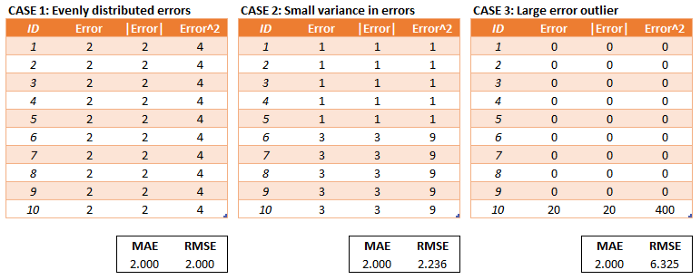

```{r setup, include=FALSE}
knitr::opts_chunk$set(echo = TRUE,
                      warning = FALSE,
                      message = FALSE)
```

# Import Library

```{r, warning=F, message=F}
library(dplyr)
```

**Knowledge Check**

Dalam business case di lapangan, pemilihan variabel target biasanya
dikaitkan dengan masalah bisnis yang ingin diselesaikan:

Kasus 1:

> Sebuah agen properti berusaha membangun sebuah model untuk menebak
> harga sebuah properti untuk digunakan sebagai acuan kontrol untuk
> menjaga harga pasar. Untuk itu, mereka mengembangkan sebuah model
> dengan:

-   Variabel target: Harga property
-   Variabel prediktor: Faktor-fator yang memperngaruhinya (luas tanah,
    lokasi, jumlah kamar, etc)

Kasus 2:

> Seorang pemilik restoran ingin menebak berapa banyak penjualan yang
> akan dihasilkan di bulan depan oleh restorannya. Untuk itu mereka
> mengembangkan sebuah model dengan kriteria:

Variabel target: Sales next month Variabel prediktor: menu, jumlah hari
kerja, libur, jumlah kunjungan ke restoran, lokasi, dll

# Supervised vs Unsupervised Machine Learning

1.  Supervised Learning: memiliki target variabel

    -   Regression: target variabelnya numerik

    -   Classification: target variabelnya kategorik

2.  Unsupervised Learning: tidak memiliki target variabel

    -   Clustering

    -   Dimensionality Reduction

# Exploratory Data Analysis

Baca data `copiers`

```{r}
copiers <- read.csv("data_input/copiers.csv")
```

Copiers adalah online retailer yang fokus menjual alat tulis kantor
(ATK).

Mari lakukan investigasi data untuk melihat kolom/variable yang terdapat
pada data tersebut.

```{r}
head(copiers)
```

```{r}
str(copiers)
```

Pada kasus ini kita ingin memprediksi profit dari data copiers:

-   Variabel Target: profit
-   Variabel Prediktor: variabel2 yang mempengaruhi profit
    (faktor-faktor yang mempengaruhi profit)

Sebelum melakukan analisa lebih lanjut, eksplorasi data perlu dilakukan
terlebih dahulu. Salah satu teknik eksplorasi data awal adalah
menggunakan histogram atau boxplot.

Misal kita ingin cek sebaran data profit copiers

```{r}
hist(copiers$Profit)
```

Kemudian, kita ingin cek sebaran data dari sales kita

```{r}
hist(copiers$Sales)
```

Dari dua histogram di atas, dapat kita simpulkan bahwa terdapat
pencilan/outliers pada variabel sales dan profit

Cek data-data oulier untuk variabel Profit

```{r}
boxplot(copiers$Profit, graph = F)$out

```

Cek data-data outlier untuk variabel Sales

```{r}
boxplot(copiers$Sales, graph = F)$out
```

Bagaimana hubungan antara variable Profit dan Sales? Gunakan plot untuk
melihat sebaran dari kedua variable tersebut, apakah ada insight yang
bisa diambil?

```{r}
plot(copiers$Profit, copiers$Sales)
```

Insight dari plot: - Korelasi/hubungan yang kuat antara sales dan
profit. - Profit dipengaruhi sales. Semakin tinggi sales, semakin tinggi
profit. - ketika kita memiliki dua variabel yang saling berhubungan
erat, dapat dikatakan kedua variabel tersebut memiliki indikasi pasangan
variabel target dan variabel prediktor yang baik. - Indikasi variabel
prediktor dan target yang baik dapat dilihat dari nilai korelasi yang
tinggi.

```{r}
cor(copiers$Profit, copiers$Sales)
```

# Modelling

## Create Simple Linear Regression

Simple linear regression = regresi dengan 1 variabel prediktor

Formula dari simple linear regression:

<center>

$$\hat{y} = \beta_0 + \beta_1*x1$$

</center>

Keterangan :\
$\hat{y}$ = target variabel yang ingin dipredisi\
$\beta_0$ = intercept/constanta\
$\beta_1$ = slope/gradient/coefficient/kemiringan\
$x_1$ = variabel prediktor

## \[Optional\] Ordinary Least Square

Objective: Berusaha mencari nilai parameter b0 (intercept) dan b1
(slope) untuk mendapatkan error/residual terkecil

## Residual

Residual atau error merupakan selisih dari nilai prediksi dengan nilai
actual.

-   Nilai prediksi:

$$\hat{y} = \beta_0 + \beta_1*x $$

-   residual:

$$error = y - \hat{y}$$ Nilai error yang ingin diminimalkan dengan
Ordinary Least Square adalah Sum of Squared Error (SSE). Disebut dengan
Least Square karena ingin mendapatkan nilai kuadrat error (squared
error) yang paling kecil/minimal.

$$\sum^n_{i=1}(y_i - \hat{y}_i)^2$$

Pertama-tama, mari kita cek untuk memprediksi Profit dengan dirinya
sendiri (tanpa prediktor) `lm(formula = ..., data = ...)`

```{r}
lm(formula = Profit ~ 1, data = copiers)
```

Notes: target \~ prediktor, ketika kita tanpa menggunakan prediktor,
maka digunakan target \~ 1 Bandingkan dengan mean profitnya

```{r}
mean(copiers$Profit)
```

Kesimpulan: ketika membuat model tanpa prediktor, model menghasilkan
rata-rata dari variabel target.

Dalam Simple Linear Regression, hanya digunakan **1 variabel
prediktor**. `lm(formula = target~prediktor, data = ...)`

Misal kita ingin memprediksi Profit (y) berdasarkan Salesnya (x)

```{r}
model_ps <- lm(formula = Profit ~ Sales, data = copiers)
model_ps
```

Dari model di atas, didapat bahwa `intercept = -114.0625` dan koefisien
`Sales = 0.4229`, sehingga model_ps menghasilkan formula

<center>

$$\hat{y} = \beta_0 + \beta_1*x1$$

$$Profit =  -114.0625+ 0.4229*Sales$$

</center>

Dari formula di atas, apa kesimpulan yang bisa kita dapatkan?

1.  Model regresi yang dihasilkan dapat digunakan untuk memprediksi
    profit.
2.  ketika salesnya 0 maka profitnya negatif atau rugi.
3.  ketika sales bertambah satu satuan, maka profit bertambah 0.4229
    dollar (sesuai dengan coefficient).

Buatlah plot untuk melihat sebaran data berdasarkan model persamaan
regresi yang dihasilkan

```{r}
plot(copiers$Sales, copiers$Profit)
abline(model_ps, col = "red")
```

Salah satu metric untuk mengevaluasi model dari **simple linear
regression**, dilihat **multiple r.squarednya** yang bisa diperoleh dari
`summary(model)`

```{r}
summary(model_ps)
```

Multiple R-squared = 0.88 artinya Sales (variable prediktor) mampu
menjelaskan 88% untuk variabel Profit (variabel target), sisanya
dijelaskan oleh variabel lain yang tidak dimasukkan ke dalam model.

```{r}
1-0.8828
```

> Nilai p-value dari variable yang masuk ke dalam model biasanya
> berhubungan dengan r-squared yang dihasilkan. Secara umum, jika
> r-squared yang dihasilkan tinggi maka variabel prediktornya
> signifikan.

Multiple R-Squared = Metric yang melihat seberapa baik variabel
prediktor menangkap variansi dari variabel target.

Adapun Multiple R2 adalah kuadrat dari nilai korelasi antara prediktor
dan target

```{r}
cor(copiers$Sales, copiers$Profit)
cor(copiers$Sales, copiers$Profit)^2
```

## Interpretation

-   Residuals = Error (nilai prediksi - nilai aktual)
-   Intercept = -114 artinya, ketika salesnya 0, maka profit = -114
    (rugi)
-   Coef. Sales = 0.428 artinya, ketika sales naik 1, maka berkontribusi
    sebanyak 0.428 terhadap profit

**Key Points** - model umum regresi linear - dapat melakukan
interpretasi terhadap multiple r-squared yang dihasilkan - interpretasi

## Predicting new data

Prediksilah data Sales yang baru menggunakan model_ps. Misal saya
memiliki Sales 2000, berapakah hasil prediksi Profit saya?

```{r}
-114.0625 + 0.4229*2000
```

Berapakah Profit ketika sales = 300?

```{r}
-114.0625 + 0.4229*300
```

Fungsi predict, untuk memprediksi variabel prediktor (Sales) secara
otomatis `predict(model, newdata)`

Memprediksi nilai-nilai Sales yang terdapat pada objek `transaksi`

```{r}
transaksi <- data.frame(Sales = c(2000, 300, 1500, 4500, 270, 3000))
```

Memprediksi nilai-nilai Sales pada data copiers, agar mendapatkan hasil
**prediksi yang akan dibandingkan dengan nilai actual**

```{r}
prediksi <- predict(model_ps, newdata = transaksi)
prediksi
```

ketika salesnya 3000 maka berapa profit yang dihasilkan 1154.513

-   R-squared

**Notice**

Hati-hati dalam menulis nama variable. Karena r bersifat case sensitive
maka perlu diperhatikan dalam menulis huruf besar/kecil nama variable.
Profit dan Discount menggunakan huruf kapital.

### \*\*Dive Deeper\*

1.  Buat model_pd (model yang memprediksi profit berdasarkan variabel
    discount)

```{r}
model_pd <- lm(formula = Profit ~ Discount, data = copiers)
model_pd
```

Rangkuman dari model_pd

```{r}
summary(model_pd)
```

2.  Insight:

-   Variabel discount memiliki korelasi negatif dengan profit. Dengan
    kata lain semakin besar discount yang diberikan maka profit yang
    dihasilkan semakin kecil.

-   Intercept: 698.25 artinya ketika discount = 0 (tidak ada discount)
    maka profit yang dihasilkan sebesar 698.25

-   coefficient -1487.10 artinya ketika discount naik 1 satuan maka
    profit akan turun sebesar 1487.10

3.  Prediksi Profit berdasarkan variabel Discount untuk semua data di
    copiers.

```{r}
prediksi_d <- as.data.frame(predict(model_pd, newdata = copiers))
colnames(prediksi_d) <- "prediksi"

prediksi_d
```

4.  Berapakah nilai R-Squared yang terdapat dalam model?
    Interpretasikan!

Jawaban: Nilai R-Squared sebesar 0.1869 (kurang dari 20 persen) yang
artinya tidak bisa membuat model dengan hanya data discount sebagai
variabel prediktor

Dengan menggunakan variabel discount hanya mampu menjelaskan 18% untuk
variabel profit sementara sisanya dijelaskan oleh variabel lain yang
tidak dimasukkan dalam model.

Summary Day 1 Pembagian machine learning ada 2

Supervised machine learning dan Unsupervised Machine Learning

Supervised Machine Learning - Terdapat target variable Regression:
Target variabel yang ingin diprediksi adalah variabel numerik
classification: Target variabel yang ingin diprediksi adalah variabel
kategorik

Unsupervised Machine Learning - Tidak ada target variable

Penggunaan unsupervised machine learning dapat digunakan pada kasus
clustering, dimentionality reduction

Regression Analysis:

Terdapat 2 jenis variabel yang perlu diperhatikan 1. Variabel
Target/dependent variable: Variabel yang ingin diprediksi, variabel yang
difokuskan oleh user 2. Variabel prediktor: variabel tambahan untuk
memprediksi variabel target

R-Squared - Untuk melihat ukuran kebaikan model. - Nilai r-squared
disesuaikan dengan kasus bisnis yang ditemui. - Nilai r-squared
direpresentasikan dalam bentuk %.

Formula untuk membuat regression model lm(formula = variabel target \~
variabel prediktor, data )

Kita dapat menggunakan fungsi `predict` untuk melakukan prediksi/untuk
melihat nilai numerik yang belum ada di data.

--- End Day 1 ---

## Leverage vs Influence

Leverage adalah nilai yang jauh dari kerumunan datanya, sering disebut
sebagai **outlier**. Nilai leverage dapat mempengaruhi model linier
regresi atau pun tidak.

Nilai leverage bisa mempengaruhi model secara signifikan atau pun
tidak.\
\* Ketika leverage mempengaruhi model secara signifikan : high influence
\* Ketika leverage tidak mempengaruhi model secara signifikan : low
influence

Nilai leverage ketika berpengaruh baik dalam artian meningkatkan nilai
R-squared atau Adjusted R-square maka sebaiknya outlier tersebut kita
pakai dalam pemodelan. Ketika nilai leverage berpangaruh buruk dalam
artian menurun nilai R-squared atau Adjusted R-squared maka sebaiknya
leverage tersebut kita buang.

Untuk melakukan pengecekan leverage :

-   `hist()`
-   `boxplot()`

Buatlah model regresi dengan menghilangkan nilai outlier pada variabel
Sales.

-   Melakukan pengecekan outlier pada variabel Sales

> Fokus deteksi influence pada kasus high leverage adalah pada variabel
> prediktor (x) terhadap variabel target (y)

```{r}
#Boxplot sales
boxplot(copiers$Sales)$out
```

-   Subset data copiers tanpa melibatkan nilai outlier pada variabel
    Sales

```{r}
#Base R
copiers_no <- copiers[copiers$Sales < 4000, ]
copiers_no

library(dplyr)
copiers_no <- copiers %>% 
  filter(Sales < 4000)
```

Buat model linier regression tanpa outlier

```{r}
model_profit_no <- lm(formula = Profit ~ Sales, data = copiers_no)
model_profit_no$coefficients
```

Formula model outlier: Profit = -83.5481 + 0.3944 \* Sales

Bandingkan garis regresi yang dibentuk dari model_ols dan model_no,
apakah data outlier tersebut akan menghasilkan output yang jauh berbeda?

```{r}
plot(copiers$Sales, copiers$Profit)
abline(model_ps, col = "red")
abline(model_profit_no, col = "blue")
```

**Kesimpulan:** Model Profit dengan outlier dan tanpa outlier memiliki
kondisi **high leverage low influece** karena nilai slope pada model dg
outlier dan tanpa outlier tidak berbeda jauh, begitu juga garis
regresinya.

cek coefficient

```{r}
model_ps$coefficients
```

```{r}
model_profit_no$coefficients
```

Selain melihat berdasarka visualisasi dan perbedaan nilai slope, kita
bisa mengetahui apakah leverage yang kita miliki low/high influence
dengan melihat niali r-squared

```{r}
summary(model_ps)$r.squared
summary(model_profit_no)$r.squared
```

-   Bagaimana menentukan model yang memiliki outlier vs tidak?

-   apabila nilai r-squared pada model yang memiliki outlier lebih baik
    tanpa outlier maka pilih model yang menggunakan outlier karena bisa
    saja titik tersebut merupakan nilai asli di data kita namun
    besarannya cenderung lebih besar dibandingkan data lainnya.

## \[Optional\] Beta Coefficient formula

$$\beta = Cor(x,y)\frac{Sd(y)}{Sd(x)}$$

di mana :\
$\beta$ = beta coefficient $\beta_1, \beta_2, ..., \beta_n$\
$Cor(x,y)$ = Korelasi antara x dan y\
$Sd(y)$ = Standar Deviasi y\
$Sd(x)$ = Standar Deviasi x

Note: Beta coefficietnt dan korelasi sejalan, ketika beta coefficient
bernilai positif maka korelasinya juga positif, sedangkan ketika beta
coefficient bernilai negatif, maka korelasinya juga negatif.

# Multiple linear regression

adalah regressi linear dengan *lebih dari satu prediktor*
`lm(formula = target ~ Prediktor1 + prediktor 2 +... , data = ...)`

## Rumus Multiple Linear Regression

<center>

$$\hat{y} = \beta_0 + \beta_1*x_1 + \beta_2*x_2 + ... + \beta_n*x_n$$

</center>

Untuk mengevaluasi model dari multiple linear regression, digunakan
adjusted r.squared.

**Business Problem**

Menggunakan data `crime` yang kita miliki, buatlah model regresi untuk
memprediksi `inequality` dengan menggunakan seluruh prediktor yang ada.

-   read data

```{r}
library(dplyr)
crime <- read.csv("data_input/crime.csv", stringsAsFactors = F) %>% 
  dplyr::select(-X) # take out kolom X
head(crime)
```

```{r}
names(crime) <- c("percent_m", "is_south", "mean_education", "police_exp60", 
                  "police_exp59", "labour_participation", "m_per1000f", 
                  "state_pop", "nonwhites_per1000", "unemploy_m24", "unemploy_m39", 
                  "gdp", "inequality", "prob_prison", "time_prison", "crime_rate")
head(crime)
```

Glossary data `crime` :

-   `percent_m`: percentage of males aged 14-24

-   `is_south`: whether it is in a Southern state. 1 for Yes, 0 for No.\

-   `mean_education`: mean years of schooling\

-   `police_exp60`: police expenditure in 1960\

-   `police_exp59`: police expenditure in 1959

-   `labour_participation`: labour force participation rate\

-   `m_per1000f`: number of males per 1000 females\

-   `state_pop`: state population\

-   `nonwhites_per1000`: number of non-whites resident per 1000 people\

-   `unemploy_m24`: unemployment rate of urban males aged 14-24\

-   `unemploy_m39`: unemployment rate of urban males aged 35-39\

-   `gdp`: gross domestic product per head\

-   `inequality`: income inequality\

-   `prob_prison`: probability of imprisonment\

-   `time_prison`: avg time served in prisons\

-   `crime_rate`: crime rate in an unspecified category

-   cek struktur data

```{r}
str(crime)
```

ubah kolom is_south menjadi factor

```{r}
crime <- crime %>% 
  mutate(is_south = as.factor(is_south))
str(crime)
```

-   Tentukan variabel prediktor dan variabel target apabila kita ingin
    membuat model yang memprediksi `inequality` berdasarkan `gdp`

-   variabel target: inequality

-   variabel prediktor: gdp

-   Membuat model dengan 1 prediktor (gdp)

```{r}
model_ineq <- lm(formula = inequality ~ gdp, data = crime)
summary(model_ineq)
```

Insight

inequality = 386.03 - 0.36551 \* gdp

-   Makin besar gdp makin kecil inequality
-   Nilai koefisien variabel prediktor setara dengan korelasi variabel
    prediktor tersebut terhadap variabel targetnya
-   menggunakan gdp, model memiliki multiple r-squared sebesar 78.15%
    dengan menggunakan variabel gdp mampu menjelaskan variabel
    inequality sebesar 78.15% sedangkan sisanya dijelaskan oleh variabel
    lain yang tidak masuk ke dalam model.

**💡 Interpretasi `summary()` model**

-   **Nilai p-value** sebagai tolak ukur apakah variabel prediktor
    berpengaruh signifikan terhadap variabel target. Dikatakan
    signifikan ketika nilai p-value \< 0.05.

> Hipotesis : - H0 : Prediktor variabel tidak mempengaruhi target
> variabel - H1 : Prediktor variabel signifikan berpengaruh terhadap
> target variabel

p-value gdp \< 0.05 artinya \> Variabel gdp berpengaruh signifikan
terhadap variabel inequality

-   Membuat model dengan seluruh prediktor

```{r}
model_ineq_all <- lm(formula = inequality ~ . , data = crime)
summary(model_ineq_all)
```

jika kita ingin membuat model regresi menggunakan seluruh variabel
gunakan . (titik) setelah tilde.

-   Intrepretasi

-   Berdasarkan p-value variabel yang berpengaruh signifikan terhadap
    inequality adalah mean_education, gdp dan crime_rate

```{r fig.width=12}
library(GGally)
ggcorr(crime, label = T, label_size = 2.5, cex = 2.6)
```

## R-Squared vs Adjusted R-Squared

Ketika kita menggunakan lebih dari satu prediktor, R-Square akan selalu
bertambah seiring dengan bertambahnya variabel prediktor baru meskipun
belum tentu memiliki pengaruh terhadap model. Untuk mengatasi hal ini,
dibuat metrik baru bernama `Adjusted R-Square` yang menghitung nilai
R-Square tetapi juga mempertimbangkan jumlah variabel yang digunakan
sehingga nilai R-Square yang ditampilkan lebih tepat.

$$
Adjusted\ R^2 = 1 - \frac{(1-R^2)(n-1)}{n-k-1}
$$

Keterangan:

-   n: Jumlah data
-   k: Jumlah variabel prediktor
-   $R^2$: Nilai $R^2$

Bandingkan beberapa r-squared

```{r}
model_ineq2 <- lm(formula = inequality ~ gdp + state_pop + police_exp59, data = crime)
```

```{r}
summary(model_ineq)$r.squared # 1 prediktor
summary(model_ineq2)$r.squared # 3 prediktor
summary(model_ineq_all)$r.squared # seluruh prediktor
```

> Note: Nilai r-squared ketika ditambahkan prediktor semakin banyak, mau
> prediktor tersebut signifikan/tidak signifikan, nilainya akan selalu
> bertambah secara signifikan. Namun, nilai adj r-squared ketika
> ditambahkan prediktor tapi jika prediktornya tidak signifikan, maka
> nilainya tidak akan naik secara signifikan.

```{r}
summary(model_ineq)$adj.r.squared
summary(model_ineq2)$adj.r.squared
summary(model_ineq_all)$adj.r.squared
```

> Ketika ingin menilai suatu model yang memrtimbangkan banyak variabel
> prediktor, gunakan adusted r squared.

Secara tidak langsung, model yang kita buat sudah menyimpan sebuah nilai
prediksi yang tersimpan dalam `model$fitted.values`

```{r}
prediksi <- model_ineq_all$fitted.values
crime$prediksi <- prediksi
head(crime)
```

# Model Evaluation

Tujuan dari suatu pemodelan prediktif adalah melakukan prediksi untuk
data yang belum dimiliki. Setelah melakukan prediksi dari data, kita
harus mengetahui apakah model machine learning yang sudah dibuat dapat
menghasilkan prediksi dengan error yang paling kecil. Untuk melakukan
model evaluation pada regression model ada beberapa cara :

-   menggunakan nilai R-Squared dan Adj R-Squared

    -   untuk menentukan seberapa baik model dalam menjelaskan variansi
        dari target variabel

-   menggunakan nilai error

    -   untuk melihat apakah prediksi yang dibuat menghasilkan nilai
        error terkecil

Beberapa nilai error yang ada :

-   Sum of Squared Error (SSE)
-   Mean Squared Error (MSE)
-   Root Mean Squared Error (RMSE)
-   Mean Absolute Error (MAE)
-   Mean Absolute Percentage Error (MAPE)

## Error/Residual

Error/residual adalah selisih antara hasil prediksi dengan nilai aktual.

$$
Error/residual = prediction - actual = \hat y - y
$$

## Mean Absolute Error

Mean Absolute Error (MAE) menunjukkan rata-rata dari nilai absolut
error. MAE bisa diinterpretasikan sebagai seberapa besar penyimpangan
hasil prediksi terhadap nilai aktualnya.

$$
MAE = \frac{\sum |\hat y - y|}{n}
$$

```{r}
# Menghitung error secara manual
model_ineq_all$fitted.values - crime$inequality

```

```{r}
sum(abs(model_ineq_all$fitted.values - crime$inequality))/nrow(crime)

```

```{r}
summary(crime)
```

> Bisa menggunakan summary(data) untuk melihat range dari variabel
> target

MAE 9.9 menunjukkan bahwa model kita secara rata-rata hasil prediksinya
akan menyimpang sebesar nilai MAE tersebut (9.9) (baik positif maupun
negatif).

> Notes: untuk menentukan apakah nilai MAE yang kita miliki besar/kecil,
> kita bisa bandingkan dengan range data asli kita

rentang 1000 - 2000, MAE = 9.9 -> kecil 10 - 20, MAE = 9.9 -> besar

Kelebihan: - mudah diinterpretasi

Kekurangan: - harus cek range data untuk menentukan tingkat toleransi
error

Cek MAE berdasarkan library MLmetrics

```{r}
library(MLmetrics)
MAE(y_pred = model_ineq_all$fitted.values, y_true = crime$inequality)
```

## Mean Absolute Percentage Error (MAPE)

MAPE menunjukkan seberapa besar penyimpangannya dalam bentuk persentase.

$$
MAPE = \frac{1}{n} \sum\frac{|\hat y - y|}{y} 
$$

```{r warning=FALSE}
# install.packages("MLmetrics")
library(MLmetrics)
MAPE(y_pred = model_ineq_all$fitted.values, y_true = crime$inequality)*100
```

> MAPE range nya dalam persen, semakin kecil nilai MAPE, semakin bagus
> model yang kita miliki.

MAPE artinya model kita secara rata-rata menyimpang sebesar nilai MAPE
dari nilai aktualnya. MAE dan MAPE adalah metrik yang baik untuk
interpretasi karena mudah dipahami.

Kelebihan: - Mudah diinterpretasi

Kekurangan: - Tidak bisa digunakan ketika *data actual ada yang bernilai
0*

## Mean Squared Error (MSE)

MSE menghitung berapa selisih kuadrat dari hasil prediksinya kemudian
dirata-rata. MSE sensitif terhadap perubahan atau selisih hasil prediksi
yang besar sehingga meskipun sulit diinterpretasikan tetapi menjadi
lebih baik dalam mendeteksi selisih yang besar.

$$
MSE = \frac{1}{n} \sum (\hat y - y)^2
$$

## Root Mean Squared Error (RMSE)

RMSE adalah bentuk akar kuadrat dari MSE. Karena sudah diakarkan, maka
interpretasinya kurang lebih sama dengan MAE. RMSE dapat digunakan jika
kita lebih concern dengan error yang sangat besar.

$$
RMSE = \sqrt{\frac{1}{n} \sum (\hat y - y)^2}
$$

```{r}
RMSE(y_pred = model_ineq_all$fitted.values, y_true = crime$inequality)
```

Perbedaan MAE dengan RMSE, RMSE sensitive terhadap error yang cukup
besar/kecil.

```{r echo=FALSE, fig.width=12}

```

## Dive Deeper

**Business Problem**

Sebagai seorang penjual properti, kita ingin membuat model yang mana
dapat memprediksi harga properti berdasarkan beberapa informasi yang ada
pada data.

Tentukan variabel:

-   target: price

-   prediktor: semua variabel kecuali price

-   Import data `house_data.csv`

```{r}
house <- read.csv("data_input/house_data.csv")
head(house)
```

-   cek struktur data

```{r}
str(house)
```

-   cek hubungan variable target dan prediktor

```{r, fig.width=12}
library(GGally)
ggcorr(house, label = T)
```

-   buat model dengan keseluruhan variable

```{r}
model_hp <- lm(formula = price ~ ., data = house)
summary(model_hp)
```

-   Intrepretasi model

-   variabel prediktor yang signifikan?

1.  Semua variabel signifikan
2.  Variable yang berbanding lurus dengan harga bathrooms, waterfront,
    grade
3.  Variabel yang berbanding terbalik dengan harga adalah bedrooms,
    yr_built

-   goodness of fit (adj r-quared)

```{r}
summary(model_hp)$adj.r.squared
```

Adj R squared 64%

Berdasarkan variabel prediktor yang masuk ke dalam model, mampu
menjelaskan variabel harga sebesar 64% sisanya dijelaskan oleh variabel
lain yang tidak masuk ke dalam model.

Lakukan model evaluasi berdasarkan hasil prediksi model menggunakan
nilai RMSE. Cek range datanya!

```{r}
RMSE(y_pred = model_hp$fitted.values, y_true = house$price)
```

```{r}
summary(house$price)
```

Gunakan histogram untuk melihat sebaran data

```{r}
hist(house$price, breaks = 100)
```

Bagaimana kesimpulan yang diperoleh?

-   Berdasarkan range data yang ada pada skala jutaan, MAE yang
    didapatkan berada di skala ribuan maka bisa dikatakan model tidak
    terlalu buruk.

-   Summary Day 2

High leverage biasanya disebut outlier. - High influence - Low influence

Untuk melihat apakah outlier tersebut masuk sebagai high influence atau
low influence bisa dilihat berdasarkan 1. koefisien 2. r-squared

ketika nilainya berbeda jauh, outlier tersebut dapat dikatakan high
influence

-   multiple linear regression

Ketika ingin menambahkan varible prediktor bisa dimasukan ke dalam
paramater formula dengan +

Ketika ingin mengambil semua prediktor dapat menggunakan . (titik)
setelah \~

-   Model evaluation

Untuk menilai kebaikan model berdasarkan error yang dihasilkan. Error =
prediksi berdasarkan model - nilai aktual variabel target

MAE - mudah diinterpretasikan, absolut dari error dibagi dengan jumlah
data MAPE - mudah diinterpretasikan, hasilnya dalam bentuk persentasi

Ketika kita ingin melihat seberapa jauh penyimpangan/error dari model
prediksi dapat dicek kembali range/retang dari datanya

RMSE - Digunakan ketika kita concern terhadap error yang cukup besar -
Intrepretasi dari RMSE mirip seperti MAE. Bisa cek range dari variabel
target yang dimiliki apakah besar atau kecil

--- End Day 2 ---

Kembali lagi pada hasil summary `model_ineq_all`, perhatikan, variabel
prediktor mana saja yang tidak signifikan?

```{r}
summary(model_ineq_all)
```

variabel yang signifikan terhadap `inequality`:

-   mean_education
-   gdp
-   crime_rate

Untuk melakukan evaluasi prediktor yang tidak signifikan:

1.  bisnis, jika secara bisnis signifikan, maka gunakanlah variabel
    prediktor tersebut
2.  melihat nilai p-value prediktor yang p-valuenya paling besar, kita
    take out terlebih dahulu dari model

Bagaimana jika terdapat variabel prediktor yang tidak signifikan?

> dihapus dari pembuatan model, dimulai dari p-value yang paling besar
> secara satu per satu.

Hapus variable dengan p-value terbesar

```{r}
crime2 <- crime %>%
  select(-police_exp59, -nonwhites_per1000, -prediksi)

model_crime2 <- lm(formula = inequality ~ . , data = crime2)

summary(model_crime2)
```

# Feature Selection (Step-wise Regression) {.tabset}

Feature selection merupakan tahapan dalam memilih variabel yang akan
digunakan

Mengevaluasi model stepwise menggunakan nilai AIC (Akaike Information
Criterion/ Information Loss). AIC menunjukkan banyak informasi yang
hilang pada model.

-   **backward elimination**: Dari keseluruhan predictor yang digunakan,
    kemudian dievaluasi model dengan cara mengurangi variabel prediktor
    sehingga diperoleh model AIC (Akaike Information Criterion)
    terkecil.
-   **forward selection**: Dari model tanpa predictor, kemudian
    dievaluasi model dengan cara menambahkan variabel prediktor sehingga
    diperoleh model dengan AIC terkecil.
-   **both**: Dari model yang dibuat, bisa melakukan evaluasi model
    dengan cara menambahkan atau mengurangi variabel prediktor sehingga
    diperoleh model dengan AIC terkecil.

# Cek kebersihan data

```{r}
crime <- crime %>% 
  select(-prediksi)

head(crime)
```

# cek missing value

```{r}
colSums(is.na(crime))
```

```{r}
# model tanpa prediktor
model_ineq_non <- lm(formula = inequality ~ 1, crime)
# model dengan semua prediktor
model_ineq_all <- lm(formula = inequality ~ . , data = crime)
```

## Backward

Dari keseluruhan predictor yang digunakan, kemudian dievaluasi model
dengan cara mengurangi variabel prediktor sehingga diperoleh model AIC
terkecil.

1.  Menggunakan model dengan seluruh variabel
2.  Memilih variabel yang ketika dihilangkan, menghasilkan AIC terbaik
3.  Menghilangkan variabel yang dipilih dari tahap kedua
4.  Mengulangi step 2 dan step 3 hingga nilai AIC terbaik dihasilkan
    ketika tidak menghilangkan variabel apapun.

```{r}
#model backward
model_backward <- step(object = model_ineq_all, direction = "backward", trace = 0)
```

Summary model

```{r}
summary(model_backward)
```

> Notes: Dalam stepwise dengan metode backward, prosesnya akan mencoba
> mengevaluasi prediktor dengan cara menghapus variabel prediktor yang
> bisa menurunkan AIC paling kecil. Prosesnya akan berhenti ketika tidak
> lagi prediktor yang akan dihapus (<none>).

## Forward

Dari model tanpa predictor, kemudian dievaluasi model dengan cara
menambahkan variabel prediktor sehingga diperoleh model dengan AIC
terkecil.

1.  Tidak menggunakan variabel apapun
2.  Memilih variabel yang ketika ditambahkan menghasilkan AIC terbaik
3.  Menambahkan variabel yang dipilih dari tahap kedua
4.  Mengulangi step 2 dan 3 hingga nilai AIC terbaik dihasilkan ketika
    tidak menambahkan variabel

```{r}
#model forward
model_forward <- step(object = model_ineq_non, direction = "forward", scope = list(lower = model_ineq_non, upper = model_ineq_all))

```

Summary Model

```{r}
summary(model_forward)
```

> Note: Pada stepwise forward yang dilakukan adalah dari model yang
> tidak memiliki prediktor apapun akan coba ditambahkan prediktor satu
> persatu hingga menghasil AIC terkecil dalam penambahan prediktor
> tersebut. Prosesnya akan berhenti ketika tidak ada lagi prediktor yang
> ditambahkan (<none>), karena jika ditambahkan maka akan memperbesar
> nilai AIC.

## Both

Gabungan backward dan forward

1.  Menggunakan model tanpa prediktor/model dengan keseluruhan
    prediktor.

2.  Memilih penambahan variabel atau pengurangan variabel yang
    menghasilkan AIC terbaik.

3.  Menambahkan atau mengurangi variabel yang dipilih dari tahap kedua

4.  Meneruskan step 2 dan 3 hingga nilai AIC terbaik dihasilkan ketika
    tidak menambahkan variabel apa-apa.

```{r}
#model both
model_both <- step(object = model_ineq_non, direction = "both", scope = list(lower = model_ineq_non, upper = model_ineq_all))
```

Summary model

```{r}
summary(model_both)
```

> Note: Dalam stepwise direction both, prosesnya dalam pengyeleksian
> variabel prediktor bisa dengan menambahkan atau mengurangi variabel
> prediktor. Prosesnya akan berhenti ketika tidak ada lagi prediktor
> yang akan ditambah/dikurangi hingga AIC nya terkecil.

Perbandingan nilai adjusted r-squared pada ketiga model yang sudah
dibuat

Perbandingan RMSE

```{r}
prediksi_backward <- predict(model_backward, newdata = crime)
prediksi_forward <- predict(model_forward, newdata = crime)
prediksi_both <- predict(model_both, newdata = crime)
```

```{r}
RMSE(y_pred = prediksi_backward, y_true = crime$inequality)
RMSE(y_pred = prediksi_forward, y_true = crime$inequality)
RMSE(y_pred = prediksi_both, y_true = crime$inequality)
```

```{r}
library(performance)
#install.packages("performance")
compare_performance(model_backward, model_forward, model_both)
```

Model terbaik berdasarkan adjusted r-squared terbesar, AIC terkecil dan
RMSE terkecil adalah `model_backward`

Melakukan prediksi data crime berdasarkan model terbaik (model_backward)

```{r}
hasil_prediksi <- predict(object = model_backward, newdata = crime)

crime$hasil_prediksi <- hasil_prediksi

head(crime)
```

**Hal yang bisa dilakukan untuk improve model:**

1.  Menggunakan variabel prediktor yang signifikan
2.  Menambahkan data
3.  menggunakan model lain (random forest, decision tree, dll)

Prediksi data crime berdasarkan model backward

```{r}
head(crime)
```

cek 5 data teratas

```{r}
head(crime, 5)
crime$hasil_prediksi[1:5]
```

# Confidence Interval

Dalam melakukan prediksi, biasanya kita tidak selalu melihat nilai fix
prediksinya, namun terkadang membutuhkan nilai range tebakannya. Nilai
range dari suatu tebakan bisa kita sebut sebagai *confidence interval*.
Confidence level yang biasa diguanakan = 90%, 95%, 99% Mencari hasil
prediksi dengan confidence interval 95%

```{r}
# cek confidence interval 95%
predict(object = model_backward, newdata = crime, interval = "prediction", level = 0.95)[1:5,]

head(crime)
```

```{r}
# cek confidence interval 100%
predict(object = model_backward, newdata = crime, interval = 
          "prediction", level = 1)[1:5,]
```

```{r}
# cek confidence interval 0%
predict(object = model_backward, newdata = crime, interval = 
          "prediction", level = 0)[1:5,]
```

> Kesimpulan: semakin tinggi confidence interval (tingkat kepercayaan)
> kita dalam memprediksi semakin lebar/besar pula range tebakan yang
> dihasilkan. Begitu pula semakin rendah confidence intervalnya maka
> akan semakin sempit/kecil range tebakan yang dihasilkan.

Tujuan dari melihat convidence interval : mengetahui range dari hasil
prediksi agar ketika ingin menggeser hasil tebakan/prediksi kita tahu
batas bawah dan atas dari prediksinya.

```{r fig.width=8}
library(ggplot2)
# install.packages("ggplot2")
ggplot(crime, aes(x = gdp, y = inequality))+
  geom_point()+
  geom_smooth(method = "lm", level = 0.95)+
  labs(title = "Linear Regression of Inequality by GDP")+
  theme_minimal()
```

#Dari Pak Daniel;

Misal CI nya 95%, brarti kita hanya memberikan 5% toleransi error. Jadi
kalau CI nya 0%, brarti kita hanya mentolelir 0% error, jadinya rentang
nya juga 0

# Limitasi dan Asumsi linear regression {.tabset}

Limitasi:

-   Baik untuk data yang target dan prediktornya memiliki hubungan
    linear / berkorelasi kuat
-   Outlier dapat mempengaruhi performa model

Selain limitasi di atas, terdapat beberapa **asumsi** yang diterapkan
oleh model. Regresi linear memiliki beberapa asumsi yang perlu dipenuhi
agar interpretasi yang didapatkan tidak bersifat bias. Asumsi ini hanya
perlu dipenuhi jika tujuan membuat model regresi linear adalah
menginginkan interpretasi atau melihat efek dari setiap prediktor
terhadap nilai target variabel. Jika hanya ingin menggunakan regresi
linear untuk melakukan prediksi, maka asumsi model tidak wajib dipenuhi.

## Linearity

**Dilakukan sebelum membuat model**. Untuk menguji apakah variabel
target dan prediktor memiliki hubungan linear. Dapat dilihat dengan
nilai korelasi menggunakan function `ggcorr()` atau dapat menggunakan
uji statistik `cor.test()`. (ingin mendapatkan p-value \< alpha agar
tolak $H_0$)

Linearity artinya target variabel dengan prediktornya memiliki hubungan
yang linear atau hubungannya bersifat garis lurus. Selain itu, efek atau
nilai koefisien antar variabel bersifat additive. Jika linearity ini
tidak terpenuhi, maka otomatis semua nilai koefisien yang kita dapatkan
tidak valid karena model berasumsi bahwa pola yang akan kita buat adalah
linear.

Linearity hypothesis test:

$$
H_0: korelasi\ tidak\ signifikan\\
H_1: korelasi\ signifikan
$$

-   Melakukan pengecekan berdasarkan nilai korelasi

```{r fig.width=8}
crime <- crime %>% 
  dplyr::select(-hasil_prediksi)

ggcorr(crime, label = T, label_size = 3, hjust = 1)
```

-   Melakukan pengecekan asumsi linearity menggunakan correlation test

```{r}
#gunakan cor.test 
cor.test(crime$gdp, crime$inequality)
cor.test(crime$mean_education, crime$inequality)
cor.test(crime$time_prison, crime$inequality)
```

Cara handling untuk case asumsi linearity, ketika ada variable prediktor
yang tidak linear terhadap target variable :

1.  bisa di take out dari pemodelan
2.  bisa ganti model dengan tipe regresi yang lain

## Normality of Residual (Residual Normal)

Harapannya ketika membuat model linear regression, error yang dihasilkan
berdistribusi normal. Artinya error banyak berkumpul disekitar angka 0.
Untuk menguji asumsi ini dapat dilakukan:

1.  Visualisasi histogram residual, dengan menggunakan fungsi `hist()`.

```{r}
hist(model_backward$residuals)
```

2.  Uji statistik menggunakan `shapiro.test()`. (harapannya pvalue >
    alpha agar keputusan yang diambil adalah gagal tolak H0)

H0: error berdistribusi normal H1: error tidak berdistribusi normal

harapannya p-value \> 0.05

Shapiro-Wilk hypothesis test:

```{r}
# Shapiro Test
shapiro.test(model_backward$residuals)
```

Kesimpulan: residual/error pada hasil prediksi sudah berdistribusi
normal, yang mana artinya dari hasil prediksi yang diperoleh model
lumayan akurat karena errornya banyak yang mengumpul di titik 0.

Jika asumsi normalitas tidak terpenuhi, maka hasil uji signifikansi
serta nilai standard error dari intercept dan slope setiap prediktor
yang dihasilkan bersifat bias atau tidak mencerminkan nilai sebenarnya.
Jika residual memiliki distribusi yang tidak normal, bisa **lakukan
transformasi data pada target variabel** atau **menambahkan sample
data**.

Cara untuk transformasi data:

Fokus dari transformasi data adalah pada variabel targetnya

1.  min-max transformation

```{r}
df <- c(23,24,13,5)
df/max(df)
```

2.  log transformation

```{r}
log(crime$inequality)
```

3.  sqrt transformation

```{r}
sqrt(crime$inequality)
```

4.  z-score standarization

```{r}
scale(crime$inequality)[1:5]
```

Transformasi data

Pros: Dapat mengecek variabel prediktor dalam model sudah signifikan
secara valid terhadap variabel target dan menghasilkan prediksi yang
tidak bias.

Cons: karena tranformasi sifatnya merubah data dari data asli, maka
koefisien regresi yang didapatkan tidak bisa diinterpretasi secara
langsung.

Summary Day 3

Stepwise Regression/Feature Selection

-   Dapat menghasilkan model terbaik berdasarkan nilai AIC yang
    diperoleh dengan algoritma:
-   Backward -> model dengan seluruh variabel prediktor -> eliminasi
-   Forward -> model tanpa variabel prediktor -> penambahan
-   Both -> teknik gabungan antara backward dan forward

Stepwise Regression: Greedy Algorithm - Model terbaik dicari secara
cepat namun tidak optimal - Harus dikombinasikan dengan subject matter
expertise

Confidence Interval dari model regresi - Pembuktiannya dapat dilakukan
menggunakan visualisasi - Semakin tinggi confidence interval yang
digunakan maka semakin lebar rentang prediksi yang dihasilkan (dilihat
dari upper, lower)

Uji Asumsi

-Linearitas -Normalitas - Shapiro.test - Visualisasi dengan histogram,
ketika errornya berada di sekitar 0 maka model tersebut mengikuti
sebaran normal -> bentuk visualisasi menyerupai lonceng -
Homoskedastisitas - Multikolinearity

--- End Day 3 ---

## Homoscedasticity of Residual

Homocesdasticity menunjukkan bahwa residual atau error bersifat konstan
atau tidak membentuk pola tertentu. Jika error membentuk pola tertentu
seperti garis linear atau mengerucut, maka kita sebut dengan
`Heterocesdasticity` dan akan berpengaruh pada nilai standard error pada
estimate/koefisien prediktor yang bias (terlalu sempit atau terlalu
lebar).

Homocesdasticity bisa dicek secara visual dengan melihat apakah ada pola
antara hasil prediksi dari data dengan nilai residualnya. Pada plot
berikut terlihat bahwa tidak terdapat pola tertentu sehingga kita bisa
menyimpulkan bahwa model sudah memiliki error yang konstan.

Berikut adalah beberapa pola yang dapat terbentuk dan menyebabkan
`Heteroscesdasticity`.

```{r echo=FALSE}
knitr::include_graphics("assets/heteroscedasticity.png")
```

Untuk menguji asumsi ini dapat dilakukan:

1.  Visualisasi dengan scatterplot antara nilai prediksi(fitted values)
    dengan nilai error

```{r}
# plot model.fitted dengan residuals
plot(x = model_backward$fitted.values, y = model_backward$residuals)
abline(h = 0, col="red", lty = 2)
```

2.  Uji statistika dengan Breusch-Pagan dari package `lmtest`

Breusch-Pagan hypothesis test: (harapannya p-value \> alpha agar gagal
tolak H0)

$$
H_0: Variansi\ error\ menyebar\ konstan\ (Homoscedasticity)\\
H_1: Variansi\ error\ menyebar\ tidak\ konstan\ membentuk\ pola\ (Heteroscedasticity)
$$

```{r}
# install.packages("lmtest")
library(lmtest)
bptest(model_backward)
```

Kesimpulan: Karena p-value \> alpha, artinya variansi error menyebar
secara acak atau konstan (homoscedasticity)

Handling asumsi homoscedasticity yang tidak terpenuhi yaitu dengan
melakukan **transformasi pada variabel prediktor**.

z-score = x - mean(x)/sd(x)

```{r}
#keluarkan variabel target dan variabel kategorik
prediktor <- crime %>% 
  select(-inequality, -is_south)

scale(prediktor)[1:5, ]
```

## No Multicolinearity

Harapannya pada model linear regression, tidak terjadi
multikolinearitas. Multikolinearitas terjadi ketika antar variabel
prediktor yang digunakan pada model memiliki hubungan yang kuat. Ada
atau tidak multikolinearitas dapat dilihat dari nilai VIF(Variance
Inflation Factor):

Ketika nilai VIF lebih dari 10 artinya terjadi multikolinearitas.
Harapannya mendapatkan VIF \< 10

```{r}
# install.packages("car")
library(car)
vif(model_backward)
```

> Apabila memiliki model yang terindikasi multiko dimana terdapat
> prediktor yang memiliki vif \> 10, maka kita bisa membuat model
> kembali **menggunakan salah satu prediktor** yang terindikasi multiko
> atau **tidak menggunakan prediktor-prediktor** tersebut atau
> **melakukan feature engineering** dengan membuat variabel baru yang
> berisi rata-rata dari kedua variabel yang terindikasi multiko.

> Notes: Ketika muncul varibale prediktor memiliki nilai VIF \> 10, dan
> kita harus memilih menggunakan variabel prediktor yang mana diantara
> keduanya (yang terindikasi multiko) maka kita bisa:
>
> -   memilih prediktor secara acak (bebas)
> -   memilih berdasarkan nilai p-value pada model mana variabel yang
>     memiliki p-value lebih kecil

#### **\[Optional\]** Mengubah Variabel Categorical menjadi Numerik

Pada kasus regresi, ketika kita mempunyai variabel prediktor bertipe
kategorikal, variabel tersebut harus diubah menjadi numerik terlebih
dahulu yang disebut dengan dummy variabel.

Mengapa mengubah variabel bertipe categorical penting? Karena kalau kita
mengeliminasi variabel categorical padahal variabel tersebut cukup
berpengaruh, kita akan kehilangan banyak informasi.

Dalam *dummy variabel*, setiap variabel kategori diubah ke bentuk kolom
biner (1/0).

*dummy variabel* = Ketika variabel categorical mempunyai n levels, akan
diubah menjadi (0/1) sebanyak n-1 variabel baru

```{r}
unique(copiers$Ship.Mode)
```

buat model lm profit berdasarkan sales dan ship.mode

```{r}
model_dummy <- lm(formula = Profit ~ Sales + Ship.Mode, data = copiers)
summary(model_dummy)
```

cek performa model

```{r}
prediksi_dummy <- predict(object = model_dummy, newdata = copiers)
RMSE(y_pred = prediksi_dummy, y_true = copiers$Profit)
```

# Dive Deeper

**Study Case**

Sebagai seorang karyawan pada perusahaan asuransi, Anda diminta untuk
melakukan prediksi premi asuransi yang harus dibayarkan oleh seorang
pelanggan yang akan melakukan pemilihan asuransi.

1.  Silahkan import terlebih dahulu data `train_insurance.csv`

```{r}
train_ins <- read.csv("data_input/train_insurance.csv")
train_ins
```

Deskripsi variabel:

-   `age`: usia/umur
-   `sex`: gender (male or female)\
-   `bmi`: body mass index\
-   `children`: jumlah anak\
-   `smoker`: perokok/bukan
-   `region`: wilayah tempat tinggal\
-   `charges`: cost medical (dolar)

2.  Lakukanlah Exploratory Data Analysis sebelum membuat pemodelan

3.  Periksalah struktur data `train_ins`

```{r}
str(train_ins)
```

b.  Ubahlah tipe data yang belum sesuai

Data yang belum sesuai:

-   Sex -> factor

-   Smoker -> factor

-   Region -> factor

```{r}
train_ins <- train_ins %>% 
  mutate(sex = as.factor(sex),
         smoker = as.factor(smoker),
         region = as.factor(region))
```

c.  Periksalah apakah terdapat missing value pada dataset

```{r}
colSums(is.na(train_ins))
```

d.  Sebelum melakukan analisis regresi, periksalah korelasi antara
    variabel **target** yaitu `charges` dan \*\*prediktor\*

```{r}
library(GGally)
ggcorr(train_ins, label = T, label_size = 3, hjust = 1)
```

Berdasarkan output korelasi diatas, variabel prediktor apakah yang
memiliki korelasi terkecil?

> Fitur `children` memiliki korelasi yang paling rendah dengan variabel
> target kita.

Asumsi awal apa yang bisa Anda berikan terkait korelasi tersebut?

> Dari nilai-nilai korelasi diatas, bisa dilihat kalau korelasi antar
> variabel predictor itu tidak memiliki korelasi yang kuat. Sehingga,
> saya bisa berasumsi kalau data tersebut telah lulus uji
> `multicolinearity`.

3.  Buatlah sebuah model

<!-- -->

a.  Membuat model dengan semua prediktor

```{r}
model_insurance <- lm(formula = charges ~ ., data = train_ins)
```

b.  Menggunakan stepwise regression dengan direction backward untuk
    mengetahui variabel apa saja yang signifikan berpengaruh terhadap
    `charges`

```{r}
model_insurance_backward <- step(object = model_insurance, direction = "backward")
```

Berdasarkan kedua model diperoleh, apabila dilihat dari nilai adjusted
R-Squared-nya, manakah model yang lebih baik?

```{r}
print(summary(model_insurance)$adj.r.squared)
print(summary(model_insurance_backward)$adj.r.squared)
```

Model insurance tanpa stepwise regression memiliki `r-squared` yang
lebih baik. Namun, kita perlu juga melihat juga dari nilai-nilai yan
lain seperti RMSE, AIC, dll.

```{r}
# Compare performance
compare_performance(model_insurance, model_insurance_backward)
```

Dari hasil performance diatas ternyata nilai AIC, R-Squared, dan RMSE
model reguler (tanpa stepwise ) yang lebih baik. Jadi kita akan
menggunakan model reguler ini untuk seterusnya.

4.  Lakukanlah uji asumsi untuk model yang dibuat (pilih salah satu
    model yang memiliki performance yang baik)

```{=html}
<!-- -->
```
a.  Linearity

Uji asumsi untuk linearity dengan `cor.test()`

H0 : Tidak Linear

H1 : Linear

```{r}
# str(train_ins)
# summary(model_insurance)
cor.test(train_ins$charges, train_ins$age)
cor.test(train_ins$charges, train_ins$bmi)
cor.test(train_ins$charges, train_ins$children)
```

b.  Normality of Residual

Uji Statistik dengan `shapiro.test()`

H0: residual berdistribusi normal

H1: residual tidak berdistribusi normal

```{r}
shapiro.test(model_insurance$residuals)
```

c.  Homoscedasticity

H0: model homoscedasticity

H1: model heteroscedasticity

```{r}
bptest(model_insurance)
```

d.  No Multicollinearity

-   Uji No Multicollinearity dengan `vif()`. Periksalah apakah terdapat
    variabel yang memiliki nilai VIF > 10

```{r}
vif(model_insurance)
```

Berdasarkan uji asumsi di atas, asumsi apa yang dilanggar?

> Berdasarkan uji-uji diatas, asumsi yang dilanggar adalah asumsi
> `Homoscedasticity`, `Normality of Residual`

Karena asumsi ini dilanggar, kita akan melakukan penanganan.

```{r}
# Handle homoscedasticity
prediktor <- train_ins %>% 
  select(-charges, -region, -smoker, -sex)
prediktor

prediktor$charges <- train_ins$charges
prediktor <- scale(prediktor)
new_data<- prediktor
new_data <- as.data.frame(new_data)
new_data <- new_data %>% 
  mutate(region = train_ins$region,
         smoker = train_ins$smoker,
         sex = train_ins$sex)

model_insurance_new <- lm(formula = charges ~ ., data = new_data)
summary(model_insurance_new)
```

5.  Berdasarkan model linear regression yang sudah dibuat, prediksilah
    data test yang ada menggunakan model terbaik yang telah dibuat

<!-- -->

a.  Import data `test_insurance.csv` dan lakukan data wrangling seperti
    yang dilakukan pada data train

```{r}
test <- read.csv("data_input/test_insurance.csv", stringsAsFactors = T)
test
```

b.  Prediksi data test menggunakan model yang telah dibuat

```{r}
prediksi_insurance <- predict(model_insurance_new, newdata = new_data)
```

7.  Periksa error (MAPE) dari hasil prediksi data test

```{r}
MAPE(y_pred = model_insurance$fitted.values, y_true = train_ins$charges)*100
MAPE(y_pred = model_insurance_new$fitted.values, y_true = new_data$charges)*100
```

8.  Kesimpulan

Workflow Analisis Regresi Linear :

1.  Import data
2.  Data wrangling / EDA

-   cek tipe data
-   cek missing value
-   cek korelasi antar variabel
-   cek outlier

3.  Pembuatan model

-   cek summary model untuk mengintrepretasikan modelnya
-   cek signifikansi prediktor variabel (p-value)
-   cek r-squared(simple linear regression) atau adj r-squared (multiple
    linear regression)

4.  Tunning model (feature selection) -> stepwise
5.  Prediksi terhadap new data
6.  Model evaluation dengan mengecek nilai error

-   RMSE
-   MAE
-   MAPE

7.  Cek asumsi

-   linearity
-   normality of residual
-   homoscedasticity
-   no multicolinearity
